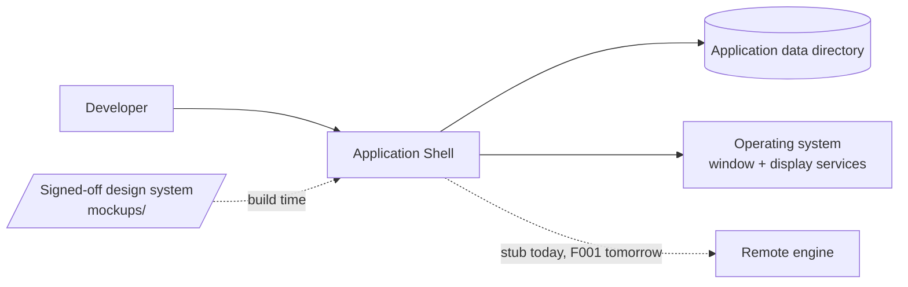
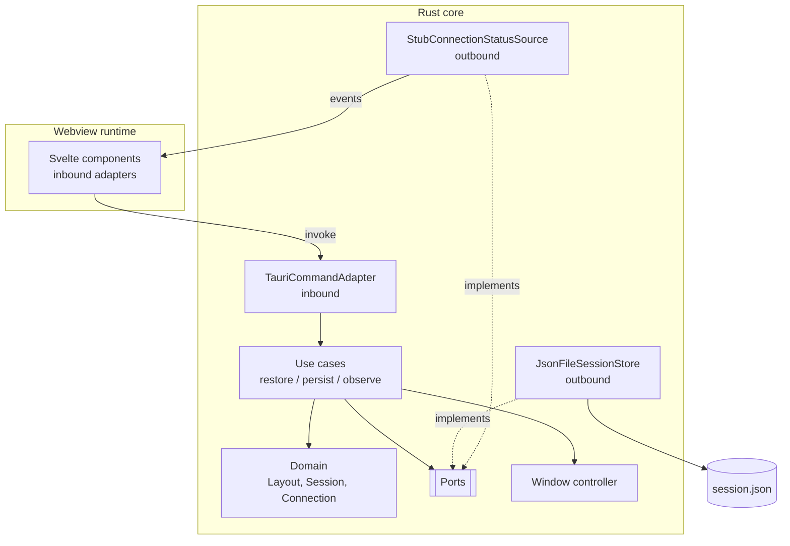
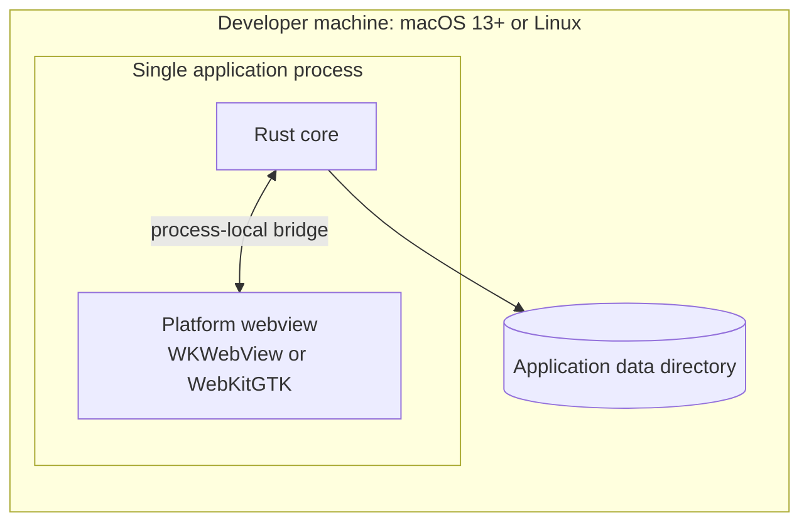
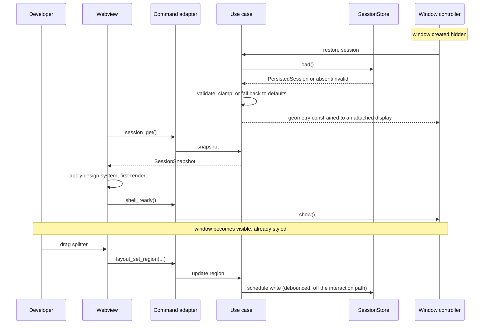

# Architecture: Application Shell

**Branch**: `001-app-shell` | **Date**: 2026-09-21 | **Plan**: [plan.md](./plan.md)

**Input**: Implementation plan from `/specs/001-app-shell/plan.md`

## Architectural Overview

The shell is one operating-system process containing two runtimes: a Rust core that owns
state, persistence and window management, and a platform webview that renders the interface.
They communicate over the process-local bridge, which is the only boundary in this feature —
there is no network and no second process.

The idea a reader most needs to hold is that **the core owns truth and the webview owns
pixels**. Session state, geometry validation and persistence live in the core; the webview
holds no authoritative state and is free to be reloaded or replaced without loss. This is what
allows the same interface layer to serve a stubbed connection now and a real transport in
F001: the swap happens behind a port in the core, and the webview never learns of it.

Window visibility is gated on a readiness signal from the webview, which is what makes "no
unstyled frame" a structural property rather than a race.

## System Context

The remote engine is drawn to show where it will attach. In this feature the connection
status source is a stub and nothing crosses that edge at runtime.

## Component Architecture

| Component | Responsibility | Entities owned |
|-----------|----------------|----------------|
| Svelte components | Render the frame; translate user gestures into commands | none |
| TauriCommandAdapter | Validate and translate bridge calls into use-case input | none |
| Use cases | Orchestrate restore, persist and connection observation | none |
| Domain | Layout rules, ordering rules, geometry validation | Layout, RegionState, OpenDocumentReference, WorkspaceReference, WindowGeometry |
| JsonFileSessionStore | Read and write persisted state; discard invalid state | PersistedSession (serialised form) |
| StubConnectionStatusSource | Emit connection transitions for development and test | ConnectionState |
| Window controller | Create, position, constrain and show the native window | SessionLifecycle |

## Deployment Topology

One process, two runtimes, no network boundary. The packaged artifacts are a `.dmg` and a
`.deb`, produced by F011; this feature runs from a development build.

## Data Flow

## Cross-Cutting Concerns

| Concern | Approach |
|---------|----------|
| Authentication / authorization | N/A - no network surface, no multi-user model, and no privileged operation in this feature. The first authentication surface arrives with the transport in F001. |
| Error handling | Two classes, deliberately separated. *Invalid persisted state* is not an error: it is discarded and defaults are applied silently (FR-008). *Command errors* return a typed `ShellError` to the caller. `PersistenceFailed` is reported but never blocks the interaction that triggered it, so a failed write degrades persistence rather than usability. |
| Observability | Structured logging to a file in the application data directory, at a level configurable at launch. No telemetry, no metric emission: `[OPEN: OBS]` in the system specification has not defined metric names, transport or retention, and Principle IV forbids inventing them here. The performance measurement required by Principle V writes to the test harness, not to a telemetry pipeline. |
| Configuration | Three sources, none overlapping. `tauri.conf.json` fixes window defaults, background colour and the capability set at build time. The design system is copied from `mockups/` at build time and is not configurable at runtime by design. `session.json` holds user-mutable state only. |

## Architectural Decisions

| Decision | Recorded in |
|----------|-------------|
| Session state in a JSON file, separate from the workspace cache | research.md, "Layout persistence mechanism" |
| End-to-end coverage on Linux; smoke check on macOS | research.md, "End-to-end testing on macOS" |
| Window hidden until an explicit readiness signal | research.md, "Preventing a light or unstyled first frame" |
| Hand-rolled CSS Grid regions rather than a docking framework | research.md, "Region layout implementation" |
| Scrolling tab strip with an overflow list | research.md, "Tab overflow handling" |
| Design system copied from `mockups/` at build time | research.md, "Design system integration" |
| Adherence lint ported to the interface toolchain and required in CI | research.md, "Design adherence lint" |
| Restored geometry intersected against attached displays | research.md, "Window geometry restoration across displays" |
| Webview rendering over a native renderer | project-apex-predator.md, Appendix A, A-UI |
| Tauri v2 | project-apex-predator.md, Appendix A, A-B7 |

## Phase 1 Reconciliation

| Conflict with data-model.md or contracts/ | Action taken |
|-------------------------------------------|--------------|
| `contracts/shell-commands.md` has `session_get()` returning `SessionSnapshot`, while `data-model.md` defines only `PersistedSession`. The two were being used interchangeably. | Architecture adjusted and the distinction made explicit: `PersistedSession` is the on-disk shape and carries `schema_version`; `SessionSnapshot` is what crosses the bridge and omits it, because a storage format version is meaningless to the interface layer and exposing it would invite the webview to branch on it. `design.md` carries both types. No change to the schema. |
| `data-model.md` states `ConnectionState` is never persisted, but did not say how the interface layer first learns it. | No artifact changed; the gap was in the architecture, now closed in Data Flow and the contract's Events section: `workspace:changed` and `connection:changed` are both emitted once at startup, so the interface layer never has to poll for an initial value. |
| The contract requires `PersistenceFailed` not to block the triggering interaction, which implies writes are asynchronous — neither Phase 1 artifact said so. | Architecture made it explicit: persistence is debounced and runs off the interaction path (Data Flow). This is also what Principle V requires, since a synchronous write on every splitter drag would put disk latency inside the interaction budget. |
| `data-model.md` clamps out-of-range `extent` on load, while `contracts/shell-commands.md` *rejects* out-of-range `extent` with `ExtentBelowMinimum`. | Intentional, and now stated rather than left to inference: loading tolerates and repairs, because a stale file should not cost the user their session; a live command rejects, because it indicates an interface-layer defect that should surface loudly. Recorded here so the asymmetry is not later "fixed" into consistency. |
