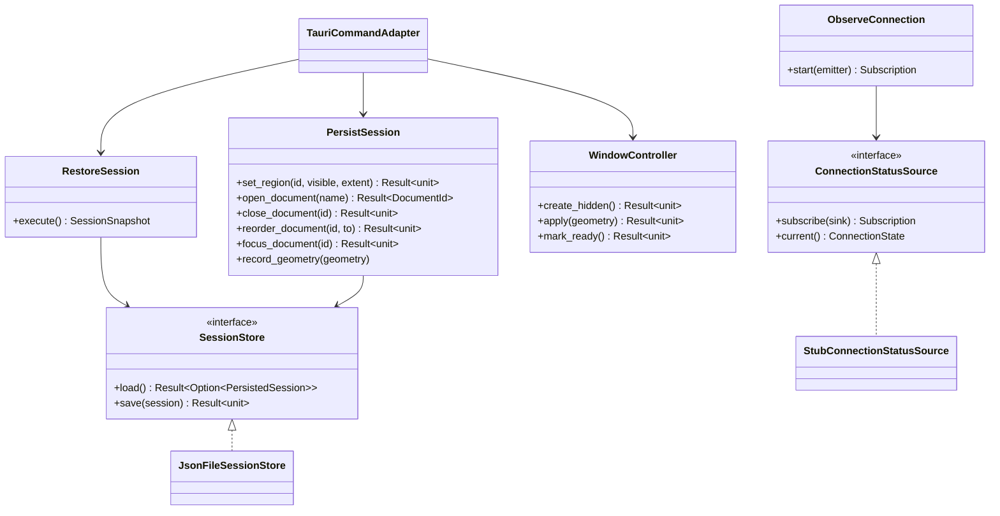
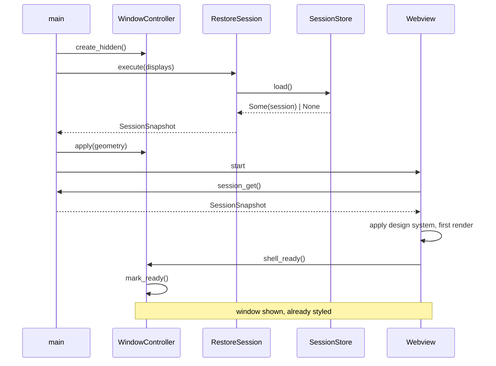
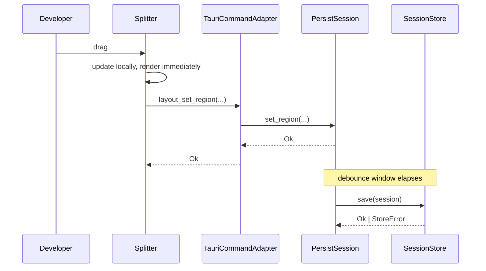
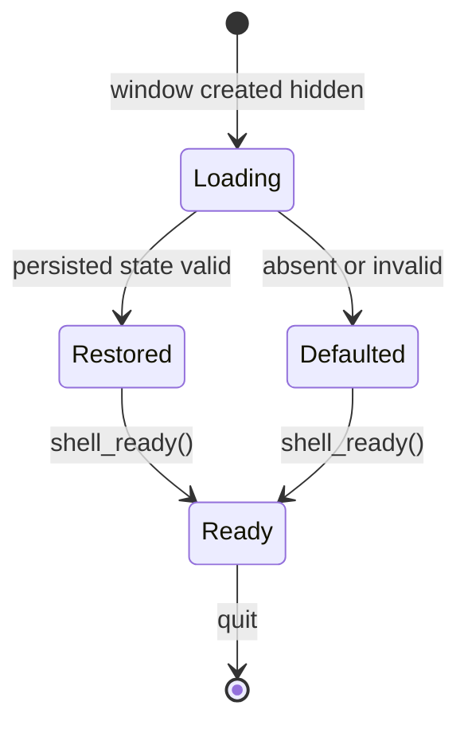
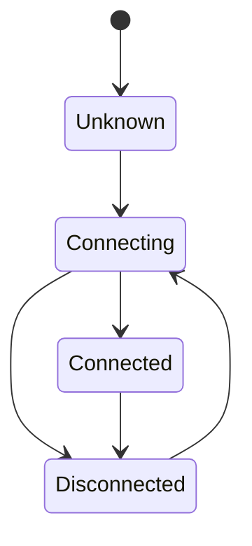

# Design: Application Shell

**Branch**: `001-app-shell` | **Date**: 2026-09-21 | **Plan**: [plan.md](./plan.md)

**Input**: Implementation plan from `/specs/001-app-shell/plan.md` and system shape from
`/specs/001-app-shell/architecture.md`

Language and versions come from the Technical Context in `plan.md`: Rust 1.75+ for the core,
TypeScript 5.x for the interface layer. Entity fields and validation rules live in
[data-model.md](./data-model.md) and are referenced, never copied.

## Module & File Layout

Matches the Structure Decision in [plan.md](./plan.md).

```text
src-tauri/
├── src/
│   ├── main.rs                          # Entry point; creates the window hidden
│   ├── composition.rs                   # Composition root; the only place adapters are bound
│   ├── domain/
│   │   ├── layout.rs                    # Layout, RegionState, RegionId, minimum-size rules
│   │   ├── session.rs                   # PersistedSession, SessionSnapshot, document ordering
│   │   ├── geometry.rs                  # WindowGeometry, display-intersection rule
│   │   └── connection.rs                # ConnectionState
│   ├── application/
│   │   ├── ports/
│   │   │   ├── session_store.rs         # SessionStore
│   │   │   └── connection.rs            # ConnectionStatusSource
│   │   ├── use_cases/
│   │   │   ├── restore_session.rs
│   │   │   ├── persist_session.rs
│   │   │   └── observe_connection.rs
│   │   └── error.rs                     # ShellError
│   ├── adapters/
│   │   ├── inbound/
│   │   │   └── tauri_commands.rs        # ShellCommands surface
│   │   └── outbound/
│   │       ├── json_session_store.rs
│   │       └── stub_connection.rs
│   └── window/
│       └── controller.rs                # Creation, display constraint, readiness gate
├── tests/
│   ├── session_store.rs
│   └── display_geometry.rs
├── capabilities/
│   └── default.json                     # Least-privilege capability set
└── tauri.conf.json

src/
├── main.ts
├── app.css                              # Imports the copied design system; defines nothing
└── lib/
    ├── shell/
    │   ├── Window.svelte
    │   ├── Region.svelte
    │   └── Splitter.svelte
    ├── tabs/
    │   ├── TabStrip.svelte
    │   └── TabOverflow.svelte
    ├── statusbar/
    │   └── StatusBar.svelte
    ├── ipc.ts                           # Typed wrapper over the command surface
    └── ds/                              # Populated by `npm run ds:sync`; not hand-authored

tests/
├── unit/
└── e2e/
```

## Class & Interface Model



| Type | Kind | Responsibility |
|------|------|----------------|
| `SessionStore` | trait (outbound port) | Load and persist session state |
| `ConnectionStatusSource` | trait (outbound port) | Supply connection state and its transitions |
| `JsonFileSessionStore` | struct (adapter) | `SessionStore` over a JSON file; discards invalid content |
| `StubConnectionStatusSource` | struct (adapter) | `ConnectionStatusSource` driven by a development control |
| `RestoreSession` | struct (use case) | Load, validate, clamp, or fall back to defaults |
| `PersistSession` | struct (use case) | Apply a mutation and schedule a debounced write |
| `ObserveConnection` | struct (use case) | Bridge source transitions to interface events |
| `TauriCommandAdapter` | module (inbound adapter) | Validate bridge input; translate to and from use cases |
| `WindowController` | struct | Window creation, display constraint, readiness gate |
| `PersistedSession` | record (domain) | On-disk shape; carries `schema_version` |
| `SessionSnapshot` | record (domain) | Bridge shape; omits `schema_version` |
| `ShellError` | enum | The typed error surface of the command boundary |

`PersistedSession` and `SessionSnapshot` are separate types on purpose — see the Phase 1
Reconciliation table in [architecture.md](./architecture.md).

## Interface Contracts

Signatures only. The formal command surface is
[contracts/shell-commands.md](./contracts/shell-commands.md); the on-disk format is
[contracts/session-state.schema.json](./contracts/session-state.schema.json).

```rust
// Outbound ports

trait SessionStore: Send + Sync {
    fn load(&self) -> Result<Option<PersistedSession>, StoreError>;
    //   precondition:  none
    //   postcondition: Ok(None) for absent OR unreadable OR invalid content;
    //                  invalidity is not an error, it is absence
    //   raises:        StoreError only for conditions a retry might fix

    fn save(&self, session: &PersistedSession) -> Result<(), StoreError>;
    //   precondition:  session satisfies the invariants in data-model.md
    //   postcondition: durable, or StoreError; never a partially written file
    //   raises:        StoreError
}

trait ConnectionStatusSource: Send + Sync {
    fn current(&self) -> ConnectionState;
    fn subscribe(&self, sink: Box<dyn Fn(ConnectionState) + Send>) -> Subscription;
    //   postcondition: sink is invoked once with the current state, then on every transition
    //                  — so a subscriber never has to poll for its initial value
}

// Use cases

impl RestoreSession {
    fn execute(&self, displays: &[DisplayBounds]) -> SessionSnapshot;
    //   precondition:  none
    //   postcondition: always returns a usable snapshot; geometry intersects a display
    //   raises:        none — falling back to defaults is a normal path
}

impl PersistSession {
    fn set_region(&self, id: RegionId, visible: bool, extent: u32) -> Result<(), ShellError>;
    fn open_document(&self, display_name: &str) -> Result<DocumentId, ShellError>;
    fn close_document(&self, id: &DocumentId) -> Result<(), ShellError>;
    fn reorder_document(&self, id: &DocumentId, to_order: u32) -> Result<(), ShellError>;
    fn focus_document(&self, id: &DocumentId) -> Result<(), ShellError>;
    fn record_geometry(&self, geometry: WindowGeometry);
    //   postcondition: in-memory state updated; write scheduled, not awaited
    //   raises:        validation variants of ShellError; never PersistenceFailed,
    //                  because the write has not happened yet when this returns
}

// Window

impl WindowController {
    fn create_hidden(&self) -> Result<(), WindowError>;
    fn apply(&self, geometry: &WindowGeometry) -> Result<(), WindowError>;
    fn mark_ready(&self) -> Result<(), WindowError>;
    //   precondition:  none — idempotent
    //   postcondition: lifecycle is Ready and the window is visible
}
```

```typescript
// Interface layer: typed wrapper over the bridge (src/lib/ipc.ts)

export function shellReady(): Promise<void>;
export function sessionGet(): Promise<SessionSnapshot>;
export function layoutSetRegion(region: RegionId, visible: boolean, extent: number): Promise<void>;
export function documentsOpen(displayName: string): Promise<DocumentId>;
export function documentsClose(id: DocumentId): Promise<void>;
export function documentsReorder(id: DocumentId, toOrder: number): Promise<void>;
export function documentsFocus(id: DocumentId): Promise<void>;

export function onConnectionChanged(handler: (s: ConnectionState) => void): Unsubscribe;
export function onWorkspaceChanged(handler: (w: WorkspaceReference | null) => void): Unsubscribe;
```

## Sequence Diagrams

### Launch to visible window



### Region resize with debounced persistence



The interface renders the drag from its own state and does not await the command. A slow or
failed write cannot stall the gesture, which is what keeps SC-004 achievable.

## State Model

Two lifecycles, both defined in [data-model.md](./data-model.md).





## Error Handling & Validation

| Condition | Behavior | Surfaced where |
|-----------|----------|----------------|
| Persisted file absent | Apply defaults | Nowhere — a normal first launch |
| Persisted file unreadable, malformed, or a future `schema_version` | Discard in full, apply defaults, overwrite on next save | Log only; never a user-facing error (FR-008) |
| `extent` below minimum **on load** | Clamp to minimum | Log only |
| `extent` below minimum **on command** | Reject with `ExtentBelowMinimum` | Returned to caller; indicates an interface-layer defect |
| Attempt to hide the document area | Reject with `DocumentAreaNotHideable` | Returned to caller |
| Unknown `DocumentId` | Reject with `UnknownDocument` | Returned to caller |
| `to_order` outside the tab count | Reject with `OrderOutOfRange` | Returned to caller |
| `display_name` empty or over 255 characters | Reject with `InvalidDisplayName` | Returned to caller |
| Saved geometry on a detached display | Substitute default geometry on the primary display | Log only (FR-009) |
| Write fails | Report `PersistenceFailed`; interaction already completed | Log, plus a non-blocking status indication; never blocks the gesture |
| `shell_ready()` called twice | No-op | Nowhere — idempotent by design |

The load/command asymmetry on `extent` is deliberate and is recorded in the Phase 1
Reconciliation table so it is not later "corrected" into uniformity.

## Persistence Mapping

| Entity (see [data-model.md](./data-model.md)) | Owning type | Notes |
|-----------------------------------------------|-------------|-------|
| PersistedSession | `JsonFileSessionStore` | Serialised whole; one file per installation |
| SessionSnapshot | `RestoreSession` | Derived, never stored |
| WorkspaceReference | `PersistedSession` | Nullable; one per session |
| WindowGeometry | `PersistedSession` | One per session; validated against displays on load |
| Layout | `PersistedSession` | One per session; composes exactly three RegionState |
| RegionState | `Layout` | Three, keyed by `RegionId`; not independently addressable |
| OpenDocumentReference | `PersistedSession` | Zero or more, ordered contiguously |
| ConnectionState | `StubConnectionStatusSource` | Runtime only; deliberately absent from the file |
| SessionLifecycle | `WindowController` | Runtime only |
