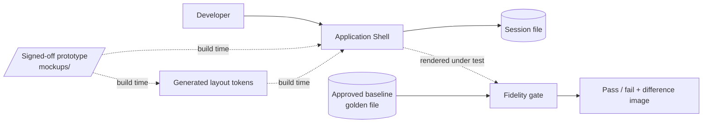
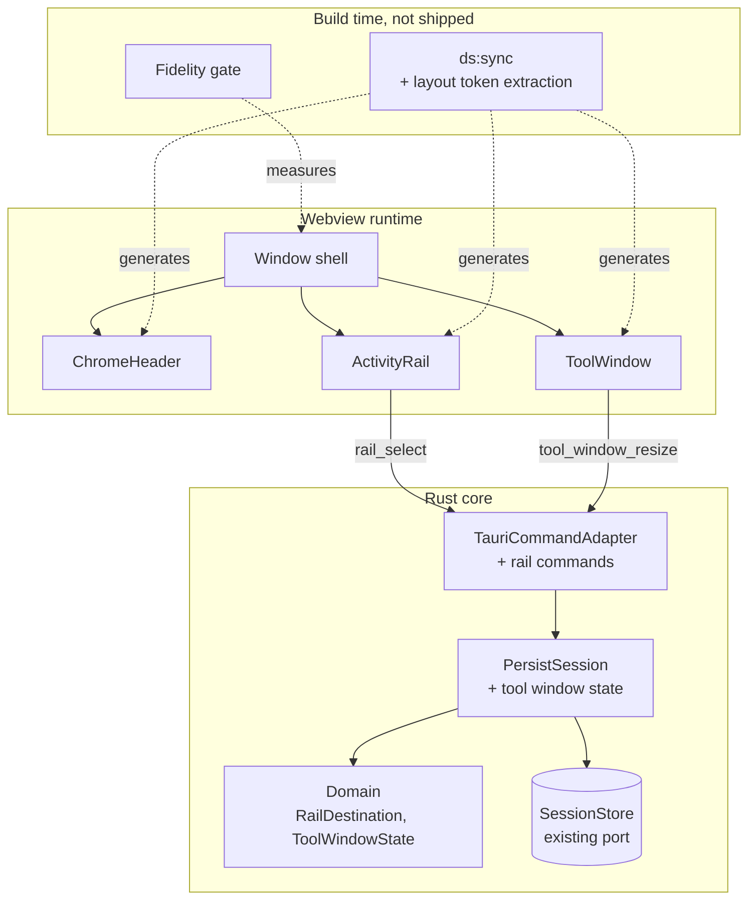
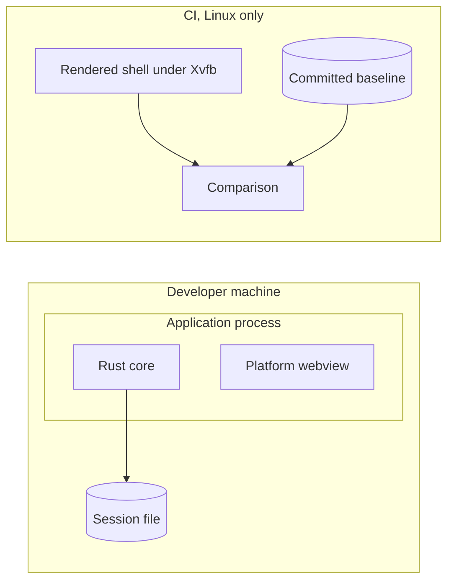
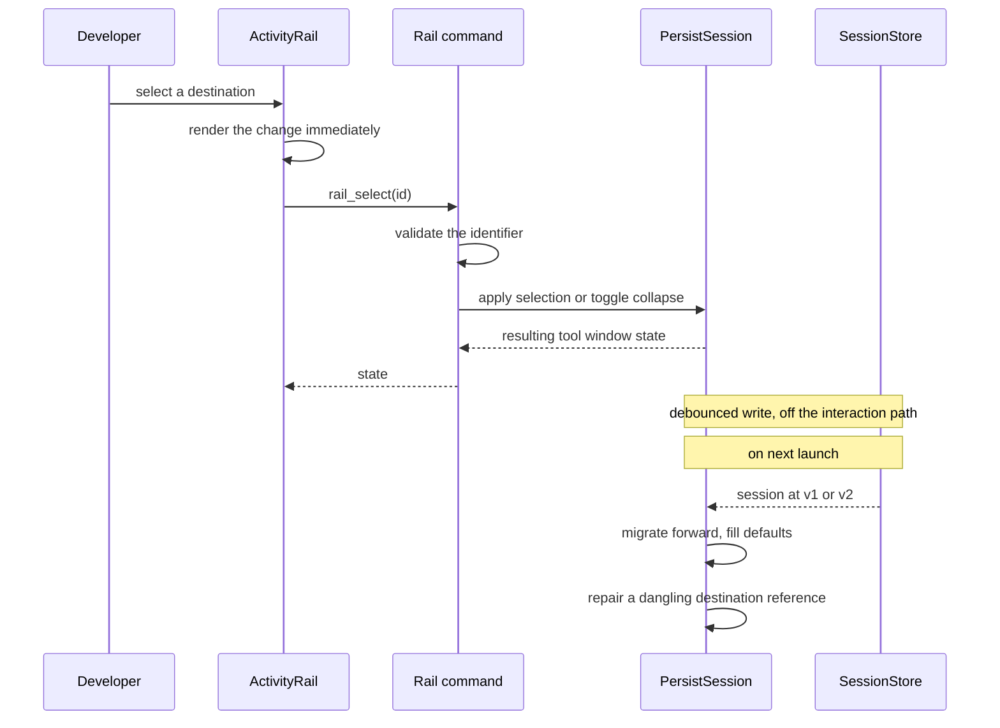

# Architecture: Shell Chrome Fidelity

**Branch**: `002-shell-chrome-fidelity` | **Date**: 2026-09-21 | **Plan**: [plan.md](./plan.md)

**Input**: Implementation plan from `/specs/002-shell-chrome-fidelity/plan.md`

## Architectural Overview

Two things sit side by side here, and keeping them apart is the idea worth holding.

The first is ordinary application work: three chrome surfaces rendered in the interface
layer, a small amount of rail state in the core, and one added command. It introduces no new
port, because tool window state rides the session store F000 already built — a feature that
fits behind an existing boundary is evidence the boundary was drawn correctly.

The second is a **build-time gate that lives outside the application entirely**. It renders
the shell, measures it, compares it against a committed golden file, and fails the build when
they diverge. It is not a component of the product; it is a judge of the product, and it
never ships.

## System Context

The prototype reaches the application only through generated artifacts. Nothing reads it at
runtime, and nothing hand-copies from it.

## Component Architecture

| Component | Responsibility | Entities owned |
|-----------|----------------|----------------|
| ChromeHeader | Product mark and active project, at the prototype's dimensions | none |
| ActivityRail | Render destinations, report selection, show availability and active state | none |
| ToolWindow | Header row, frame, collapse, resize | none |
| Rail commands | Validate destination identifiers at the boundary; translate to use cases | none |
| PersistSession (extended) | Apply rail and tool window mutations; schedule persistence | ToolWindowState |
| Domain | Destination identity, ordering, availability; collapse and width rules | RailDestination, ToolWindowState |
| Layout token extraction | Derive the prototype's dimensions into tokens on every build | none |
| Fidelity gate | Measure surfaces, compare against the baseline, report what moved | FidelityBaseline, SurfaceGeometry |

## Deployment Topology

Unchanged from F000 at runtime: one process, two runtimes, no network. The only addition is a
CI-side gate, which runs on Linux because it needs a rendered window — the same platform
constraint recorded in Appendix A, A-E2E.

## Data Flow

## Cross-Cutting Concerns

| Concern | Approach |
|---------|----------|
| Authentication / authorization | N/A - no network surface and no privileged operation; unchanged from F000. |
| Error handling | Two classes, as F000 established. A stale *file* is repaired: a width below the minimum is clamped, and a dangling destination reference falls back to the first available destination. A bad *live command* is rejected with a typed error, because it indicates an interface-layer defect. The asymmetry is deliberate and recorded. |
| Observability | Structured file logging, unchanged. The fidelity gate writes its verdict and a difference image to a run directory that is gitignored; its output is for a human reading a failed build, not telemetry. `[OPEN: OBS]` remains untouched — no metric names are invented here. |
| Configuration | Layout tokens are generated from the prototype at build time and are not runtime-configurable by design. The baseline is a committed golden file updated by an explicit command. Neither is a setting. |

## Architectural Decisions

| Decision | Recorded in |
|----------|-------------|
| Migrate older sessions forward rather than discarding them | research.md, "Extending the persisted session without discarding it" |
| Generate the prototype's layout dimensions as tokens at build time | research.md, "Where the prototype's layout dimensions live" |
| Measure fidelity by geometry and pixels together, not either alone | research.md, "How fidelity is measured" |
| Baseline is a committed golden file, never written by the comparison | research.md, "Capturing and updating the baseline" |
| Rail destinations are a static list including unavailable ones | research.md, "Where the rail's destinations come from" |
| Selecting the active destination toggles collapse; width is retained | research.md, "Collapse behaviour and remembered width" |

## Phase 1 Reconciliation

| Conflict with data-model.md or contracts/ | Action taken |
|-------------------------------------------|--------------|
| `data-model.md` says the rail's destination list is "derived from the prototype", and `research.md` decides that layout *dimensions* are generated from the prototype at build time. Read together these imply the destination list is generated too, which it is not. | Architecture makes the split explicit: **dimensions** are generated, **destinations** are hand-authored in the core. A destination is behaviour — an identity, a label, an availability state — not a measurement, and generating behaviour from markup would be fragile. What keeps the hand-authored list honest is the fidelity gate: a missing or extra destination changes the rail's geometry and fails the geometry check. No artifact changed; the ambiguity was in the architecture's absence. |
| `contracts/rail-commands.md` defines no behaviour for a dangling `active_destination_id`, while `data-model.md` requires it to be repaired by falling back to the first available destination. | No artifact changed. The repair belongs on the load path, not the command path, and the Data Flow section now shows it there. A command can never produce a dangling reference because it validates the identifier first; only an older or edited file can. |
| `session-state-v2.schema.json` permits `width: 0`, while `data-model.md` requires `width ≥ MIN_TOOL_WINDOW_WIDTH` when not collapsed. | Intentional and left as is. The schema describes what is *parseable*; the coherence rules describe what is *valid*, and a width of zero from a collapsed panel is legitimately parseable. This mirrors how F000 separated schema validity from the constraints listed under `x-constraints-not-expressible-in-json-schema`, and the schema records it there. |
| Neither Phase 1 artifact states where the fidelity gate sits relative to the application. | Architecture places it outside the application boundary entirely — a build-time judge that never ships. Stated because the `FidelityBaseline` and `SurfaceGeometry` entities appear in `data-model.md` beside runtime entities, which could suggest the application owns them. It does not. |
