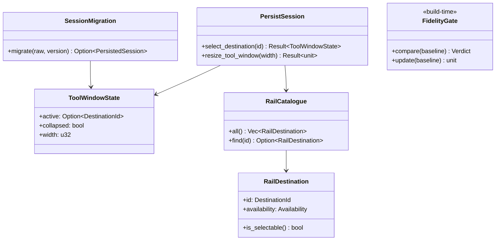
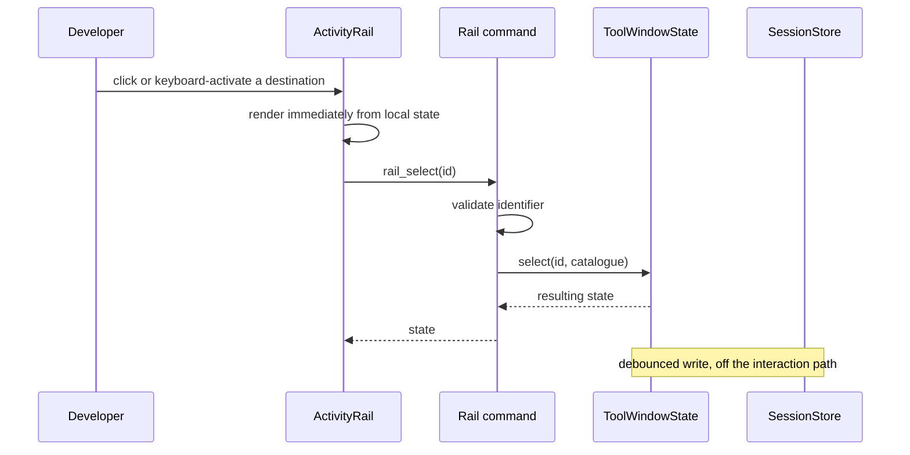
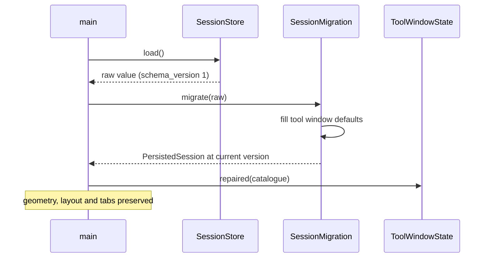
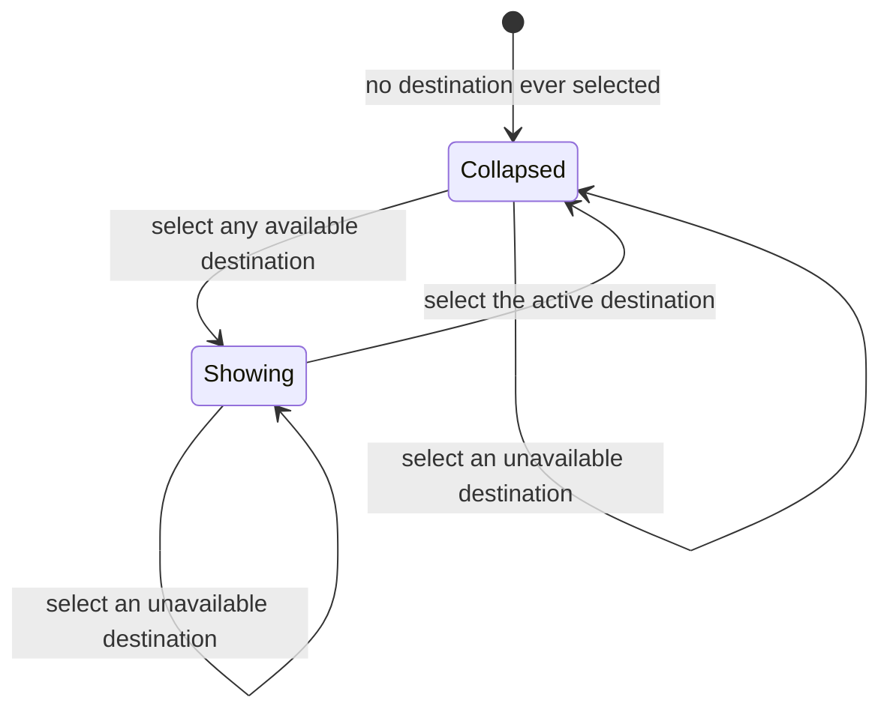

# Design: Shell Chrome Fidelity

**Branch**: `002-shell-chrome-fidelity` | **Date**: 2026-09-21 | **Plan**: [plan.md](./plan.md)

**Input**: Implementation plan from `/specs/002-shell-chrome-fidelity/plan.md` and system
shape from `/specs/002-shell-chrome-fidelity/architecture.md`

Language and versions come from the Technical Context in `plan.md`: Rust 1.75+ for the core,
TypeScript 5.x for the interface layer. Entity fields and validation rules live in
[data-model.md](./data-model.md) and are referenced, never copied.

## Module & File Layout

Matches the Structure Decision in [plan.md](./plan.md). Existing files are marked; everything
else is new.

```text
src-tauri/
├── src/
│   ├── domain/
│   │   ├── rail.rs                      # RailDestination, availability, ordering
│   │   └── session.rs                   # EXISTING — gains ToolWindowState and the migration
│   ├── application/use_cases/
│   │   └── persist_session.rs           # EXISTING — gains rail selection and resize
│   └── adapters/inbound/
│       └── tauri_commands.rs            # EXISTING — gains three rail commands
└── tests/
    └── session_migration.rs             # A v1 session survives the upgrade

src/
├── app.css                              # EXISTING — imports the generated layout tokens
└── lib/
    ├── ds/layout-tokens.css             # GENERATED from the prototype by ds:sync
    ├── chrome/
    │   ├── ChromeHeader.svelte
    │   ├── ActivityRail.svelte
    │   ├── RailButton.svelte            # One destination: icon, active and unavailable states
    │   └── ToolWindow.svelte
    ├── rail.ts                          # Ordering and navigation helpers, testable in isolation
    ├── ipc.ts                           # EXISTING — gains the rail command wrappers
    └── shell/Window.svelte              # EXISTING — composes chrome, rail, tool window

scripts/
└── ds-sync.mjs                          # EXISTING — gains layout token extraction

tools/gate-fidelity/
├── compare.mjs                          # Measure, diff, report
├── update.mjs                           # Write the baseline; separate command by design
├── gate.test.mjs                        # The gate's own self-tests
└── reference/                           # shell.json + shell.png, committed golden files,
                                         #   plus derivation.md recording their provenance

tests/
├── unit/rail.test.ts
└── e2e/chrome-fidelity.spec.ts
```

## Class & Interface Model



| Type | Kind | Responsibility |
|------|------|----------------|
| `RailDestination` | record (domain) | One destination's identity, label, icon, availability, order |
| `Availability` | enum (domain) | Available or unavailable; unavailable destinations still render |
| `ToolWindowState` | record (domain) | Active destination, collapsed flag, width |
| `RailCatalogue` | struct (domain) | The static destination set and lookup over it |
| `SessionMigration` | module (domain) | Version dispatch and forward migration on load |
| `PersistSession` | struct (use case) | **Extended**: rail selection, collapse toggle, resize |
| `FidelityGate` | build tool | Outside the application boundary; never shipped |

`FidelityGate` appears here because `data-model.md` defines its entities, not because the
application owns it — see the Phase 1 Reconciliation note in
[architecture.md](./architecture.md).

## Interface Contracts

Signatures only. The command surface is
[contracts/rail-commands.md](./contracts/rail-commands.md); the persisted and baseline
formats are the two schemas beside it.

```rust
// Domain

impl RailCatalogue {
    fn all(&self) -> &[RailDestination];
    fn find(&self, id: &DestinationId) -> Option<&RailDestination>;
    fn first_available(&self) -> Option<&RailDestination>;
    //   used to repair a dangling active destination on load
}

impl ToolWindowState {
    fn select(&mut self, id: &DestinationId, catalogue: &RailCatalogue) -> Result<(), RailError>;
    //   precondition:  id names a known destination
    //   postcondition: selecting the ACTIVE destination toggles `collapsed`; selecting an
    //                  unavailable one changes nothing and is not an error
    //   raises:        RailError::UnknownDestination

    fn resize(&mut self, width: u32) -> Result<(), RailError>;
    //   precondition:  width >= MIN_TOOL_WINDOW_WIDTH
    //   postcondition: width recorded; retained across collapse
    //   raises:        RailError::WidthBelowMinimum

    fn repaired(self, catalogue: &RailCatalogue) -> Self;
    //   postcondition: a dangling active destination falls back to the first available one;
    //                  a sub-minimum width is clamped. Load path only — never a command.
}

// Migration

fn migrate(value: serde_json::Value) -> Option<PersistedSession>;
//   postcondition: Some(_) for any version up to the current one, with missing fields
//                  defaulted; None for a version above it, which this build cannot interpret
//   raises:        none — an unreadable file is absence, per the existing store contract
```

```typescript
// Interface layer (src/lib/ipc.ts additions)

export function railSelect(destinationId: string): Promise<ToolWindowState>;
export function toolWindowResize(width: number): Promise<void>;
export function railDestinations(): Promise<RailDestination[]>;
```

```text
// Fidelity gate (tools/gate-fidelity), build time only

compare(baselineDir) -> Verdict
    precondition:  a readable baseline whose reference size matches the current constant
    postcondition: pass when every surface is within the position tolerance AND the pixel
                   difference is within the area tolerance; otherwise fail, naming each
                   surface that moved and writing a difference image
    raises:        error (never a pass) when the baseline is absent, unreadable, or captured
                   at a different reference size

update(baselineDir) -> unit
    postcondition: writes the baseline. A separate command by design: a comparison that
                   regenerates what it judges against passes unconditionally
```

## Sequence Diagrams

### Selecting a destination



### Launching with an older session



## State Model



Width is not a state. It persists across every transition, which is what makes restoring a
collapsed panel return it to the size the user chose.

## Error Handling & Validation

| Condition | Behavior | Surfaced where |
|-----------|----------|----------------|
| Unknown destination on a command | Reject with `UnknownDestination` | Returned to caller; an interface-layer defect |
| Unavailable destination selected | No change, no error | Nowhere — the rail already shows it as unavailable |
| Width below minimum **on a command** | Reject with `WidthBelowMinimum` | Returned to caller |
| Width below minimum **on load** | Clamp | Log only |
| Dangling active destination on load | Fall back to the first available destination | Log only; the session is not discarded |
| Session at an older version | Migrate forward, fill defaults | Log only — a normal upgrade, not an error |
| Session at a newer version | Discard, apply defaults | Log only; this build cannot interpret it |
| Baseline absent or unreadable | Error, non-zero exit | Build output; never a pass |
| Baseline captured at a different reference size | Error, non-zero exit | Build output |
| Surfaces differ beyond tolerance | Fail, name each surface, write a difference image | Build output |

## Persistence Mapping

| Entity (see [data-model.md](./data-model.md)) | Owning type | Notes |
|-----------------------------------------------|-------------|-------|
| ToolWindowState | `PersistedSession` | One per session; added by this feature |
| RailDestination | `RailCatalogue` | Static; not persisted — only the active id is |
| PersistedSession (v2) | `JsonFileSessionStore` | Unchanged adapter; the entity gained a field |
| FidelityBaseline | `tools/gate-fidelity/reference/` | Committed golden file, outside the application |
| SurfaceGeometry | `FidelityBaseline` | One per measured surface |
