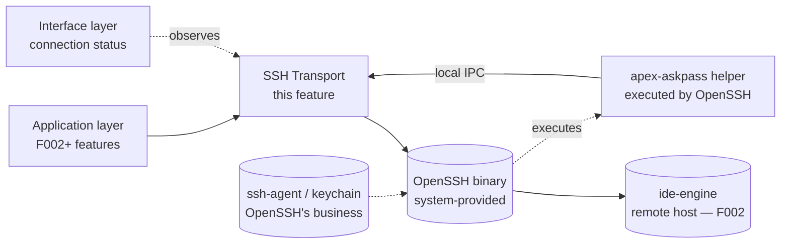
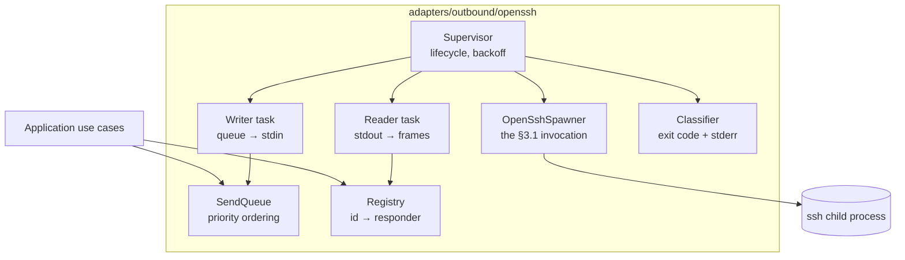
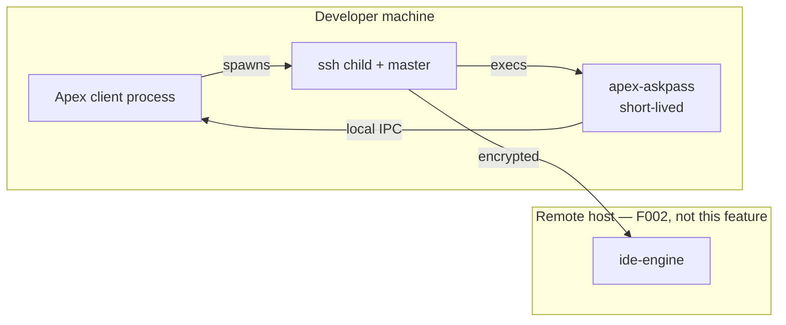

# Architecture: SSH Transport Core

**Branch**: `feature/F001-ssh-transport-core` | **Date**: 2026-09-22 | **Plan**: [plan.md](./plan.md)

**Input**: Implementation plan from `/specs/003-ssh-transport-core/plan.md`

## Architectural Overview

A supervisor owns a child `ssh` process and everything that depends on it. Inside that
child's lifetime, three long-lived tasks divide the work: a reader that turns the child's
stdout into frames, a writer that drains a priority-ordered queue into its stdin, and a
registry that holds the awaiting side of every in-flight request. Application code never sees
any of them — it holds a `RequestTransport` handle and calls `send`.

The one idea to hold: **the connection is a resource with a lifetime, and everything keyed to
it dies with it.** When the child exits, the reader ends, the writer ends, and the registry
resolves every outstanding request as `ConnectionLost` before the supervisor starts a new
attempt. Nothing survives a reconnect. That is what makes recovery simple enough to reason
about — there is no partially-valid state to reconcile, because there is no carried state.

The second idea: the child process boundary is a trust boundary. Its stdout is untrusted
input, and the reader is the only component that touches it.

## System Context



The remote engine is dashed-adjacent deliberately: this feature never speaks to it. It speaks
to `ssh`, which carries bytes to whatever is on the other end — the mock, in every test this
feature ships.

## Component Architecture



| Component      | Responsibility                                                                          | Entities owned                            |
| -------------- | --------------------------------------------------------------------------------------- | ----------------------------------------- |
| Supervisor     | Start, watch and restart the child; own the backoff schedule; publish `ConnectionState` | ConnectionState, ConnectionAttempt        |
| OpenSshSpawner | Build and run the §3.1 invocation; the single place those flags appear                  | none                                      |
| Reader task    | Decode frames from untrusted stdout; hand replies to the registry                       | none                                      |
| Writer task    | Serialise frames to stdin, one at a time, drawn by priority                             | none                                      |
| SendQueue      | Order outbound work: `Interactive` before `Background`, FIFO within                     | Priority                                  |
| Registry       | Mint ids; hold responders; resolve exactly once; expire on deadline                     | RequestId, PendingRequest, RequestOutcome |
| Classifier     | Map exit code plus bounded stderr to a `FailureCondition`                               | FailureCondition                          |

**Why the reader and writer are separate tasks**: they have independent failure modes and
independent backpressure. A blocked writer — the child not draining stdin — must not stop
replies being read, or a full pipe would deadlock both directions at once.

## Deployment Topology



Three processes on the developer's machine, one of them momentary. The master connection
outlives the `ssh` child by design (`ControlPersist=1h`), which is why `ssh -O exit` on quit
is normative (§3.1) and why SC-003 checks for survivors.

## Data Flow

```mermaid
sequenceDiagram
    participant C as Caller
    participant R as Registry
    participant Q as SendQueue
    participant W as Writer
    participant Rd as Reader
    participant Ch as ssh child

    C->>R: register(priority, deadline)
    R-->>C: RequestId + awaiting receiver
    Note over R: registered BEFORE any byte is written (FR-011)
    R->>Q: enqueue(frame, priority)
    Q->>W: next frame by priority
    W->>Ch: write header + body as one unit
    Ch-->>Rd: bytes
    Rd->>Rd: decode; refuse oversized or malformed
    Rd->>R: resolve(id, outcome)
    R-->>C: outcome (exactly once)
```

Connection loss cuts across this flow rather than appearing in it: the supervisor resolves
every entry the registry holds as `ConnectionLost`, and the caller above is released wherever
it was waiting.

## Cross-Cutting Concerns

| Concern                        | Approach                                                                                                                                                                                                                                                                                   |
| ------------------------------ | ------------------------------------------------------------------------------------------------------------------------------------------------------------------------------------------------------------------------------------------------------------------------------------------ |
| Authentication / authorization | Delegated entirely to OpenSSH (A-B1). This feature owns only the _sequence_ — silent, assisted, picker (§3.3) — and never implements an authentication method. The passphrase crosses a process boundary and is zeroed after use (FR-008).                                                 |
| Error handling                 | Every failure classifies into the closed set in data-model.md, or into `Unknown`, which is surfaced verbatim rather than guessed at. Per-request failures resolve that request; connection failures resolve all of them.                                                                   |
| Observability                  | Logging only, to the file sink F000 established. `[OPEN: OBS]` has defined no metric names, transport or retention, and Principle IV forbids inventing them — so no counters, no timers, no spans. The latency measurement SC-011 needs lives in the test harness, not in production code. |
| Configuration                  | The host and user come from the workspace the user opened. Everything else about the connection is the §3.1 invocation, which is normative and not configurable. No settings surface is added.                                                                                             |

## Architectural Decisions

| Decision                                                              | Recorded in                                                            |
| --------------------------------------------------------------------- | ---------------------------------------------------------------------- |
| Constants live in §4 and are expressed once in code                   | research.md, "Where the protocol's constants live"                     |
| Exponential backoff with jitter; nothing carried across a reconnect   | research.md, "Connection supervision and backoff"                      |
| Two priority classes, stated by the caller                            | research.md, "Priority classification of outbound traffic"             |
| Ordering applies between frames, not within one                       | research.md, "Head-of-line blocking within a frame"                    |
| A `ProcessSpawner` port so failures are testable without a real `ssh` | research.md, "Testing failure classification without a real `ssh`"     |
| The mock implements framing and nothing above it                      | research.md, "What the mock daemon is, and is not"                     |
| Delay and loss simulated per frame, not via the network stack         | research.md, "Latency and loss simulation"                             |
| No passphrase cache                                                   | research.md, "Where the passphrase lives, and for how long"            |
| Keepalive and EOF are both required to detect loss                    | research.md, "Detecting a dead connection"                             |
| Stderr retention is bounded; unmatched patterns yield `Unknown`       | research.md, "Stderr discipline and why classification can be trusted" |

## Phase 1 Reconciliation

Checked against data-model.md and contracts/ as written earlier in this planning run.

| Conflict with data-model.md or contracts/                                                                                                                                  | Action taken                                                                                                                                                                                                                |
| -------------------------------------------------------------------------------------------------------------------------------------------------------------------------- | --------------------------------------------------------------------------------------------------------------------------------------------------------------------------------------------------------------------------- |
| data-model.md describes the registry as owning `PendingRequest` and minting `RequestId`, while the first draft of this component table gave id generation to the SendQueue | Architecture adjusted. The registry mints ids, because uniqueness is a property of the thing that detects collisions.                                                                                                       |
| contracts/transport.md guarantees a send while disconnected fails immediately, but the component diagram implied the SendQueue buffers unconditionally                     | Architecture adjusted: the queue is only reachable while connected; the supervisor's state gates entry. Buffering into a dead connection would violate the contract's "never queue for a connection that may never return". |
| contracts/framing.md requires one writer on stdin, which the original diagram left implicit by drawing the SendQueue writing directly                                      | Architecture adjusted to name a distinct Writer task as the sole holder of stdin, with the queue as its source.                                                                                                             |
| data-model.md's `ConnectionState::Retrying` carries attempt and next-attempt time; the Supervisor's responsibility line did not mention publishing it                      | Architecture adjusted: the supervisor owns publication, since it owns the schedule those fields describe.                                                                                                                   |
