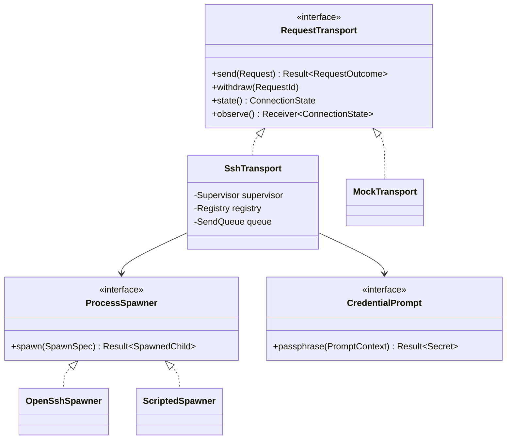
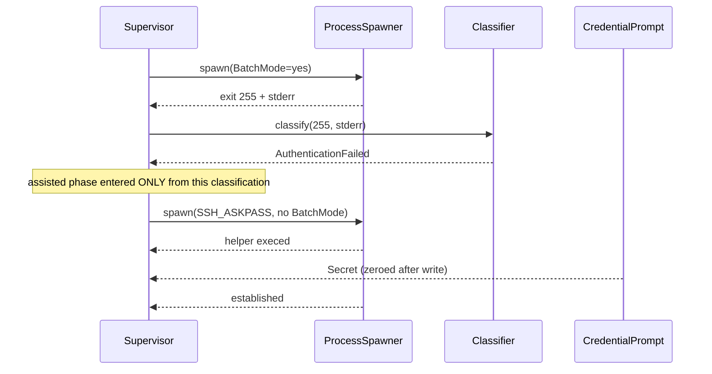
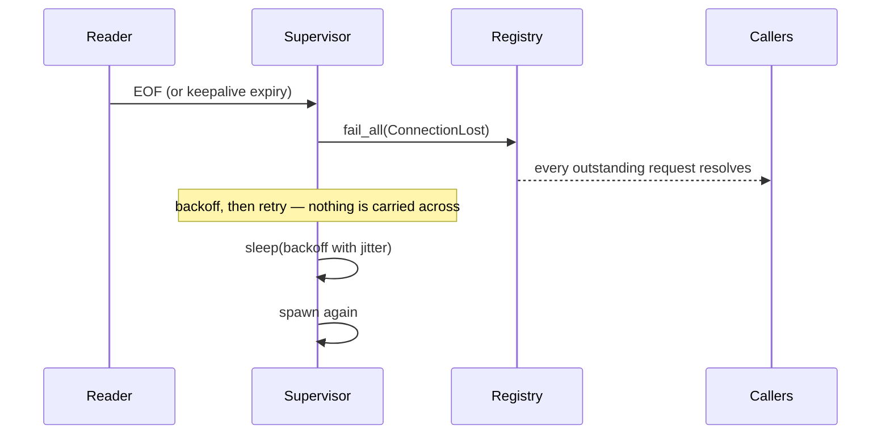
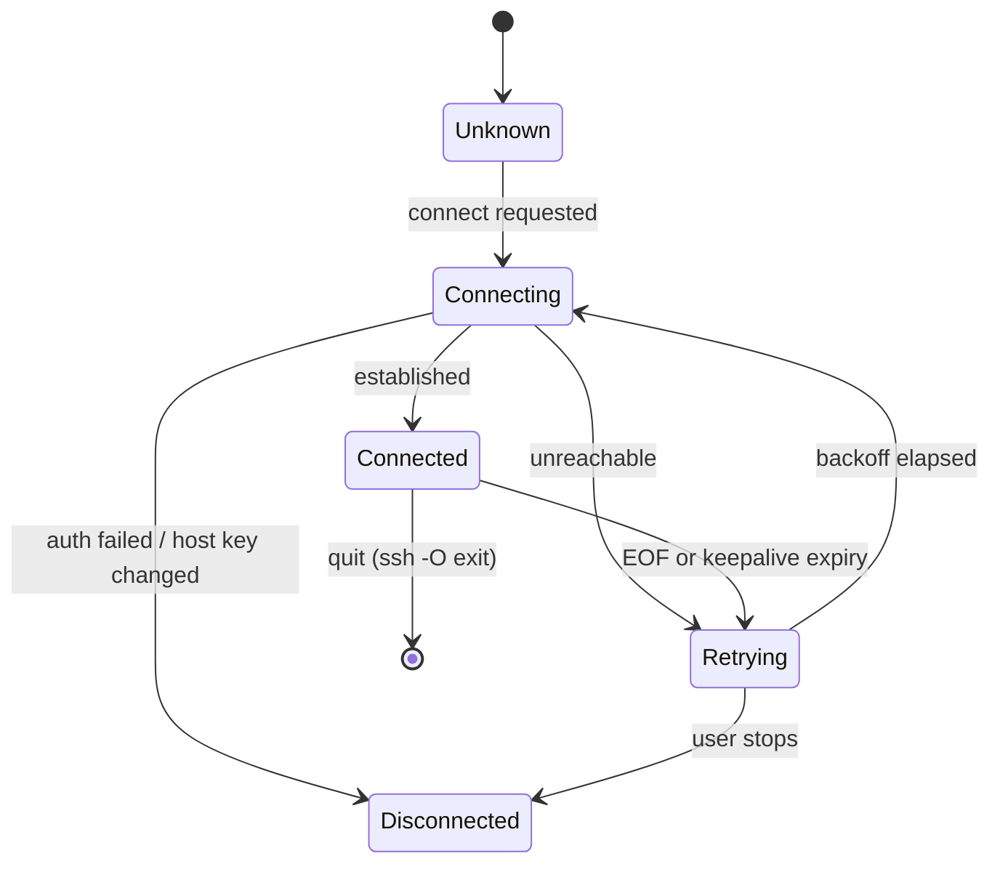

# Design: SSH Transport Core

**Branch**: `feature/F001-ssh-transport-core` | **Date**: 2026-09-22 | **Plan**: [plan.md](./plan.md)

**Input**: Implementation plan from `/specs/003-ssh-transport-core/plan.md` and system shape
from `/specs/003-ssh-transport-core/architecture.md`

Signatures only. Entity fields and validation rules live in
[data-model.md](./data-model.md); port guarantees in
[contracts/transport.md](./contracts/transport.md). Language is Rust 1.75+, from plan.md's
Technical Context.

## Module & File Layout

Matches the Structure Decision in plan.md.

```text
src-tauri/
├── src/
│   ├── domain/
│   │   ├── connection.rs           # EXISTING — ConnectionState gains Retrying
│   │   ├── request.rs              # RequestId, Priority, RequestOutcome, Secret
│   │   └── failure.rs              # FailureCondition + classification rules
│   ├── application/
│   │   ├── ports/
│   │   │   ├── connection.rs       # EXISTING — ConnectionStatusSource
│   │   │   ├── transport.rs        # RequestTransport
│   │   │   ├── credential.rs       # CredentialPrompt
│   │   │   └── spawner.rs          # ProcessSpawner, SpawnedChild
│   │   └── use_cases/
│   │       ├── connect.rs          # Two-phase connect, identity fallback
│   │       ├── exchange.rs         # Send, correlate, expire, withdraw
│   │       └── supervise.rs        # Loss detection, backoff, re-establish
│   └── adapters/outbound/
│       ├── openssh/
│       │   ├── mod.rs              # SshTransport — composition of the below
│       │   ├── spawner.rs          # OpenSshSpawner — the §3.1 invocation
│       │   ├── framing.rs          # FrameCodec
│       │   ├── registry.rs         # Registry
│       │   ├── sendq.rs            # SendQueue
│       │   └── classify.rs         # classify()
│       └── askpass/ipc.rs          # AskpassChannel
├── bin/apex-askpass.rs             # The helper OpenSSH execs
└── tests/
    ├── mock_daemon/                # Framing-only mock, scriptable
    ├── transport_exchange.rs
    ├── transport_failures.rs
    └── transport_recovery.rs
```

## Class & Interface Model



| Type               | Kind   | Responsibility                                                |
| ------------------ | ------ | ------------------------------------------------------------- |
| `RequestTransport` | trait  | What every later feature depends on                           |
| `ProcessSpawner`   | trait  | Start a child; the seam that makes failures testable          |
| `CredentialPrompt` | trait  | Reach the interface layer for a passphrase                    |
| `SshTransport`     | struct | The real implementation; composes supervisor, registry, queue |
| `MockTransport`    | struct | Test double satisfying the same contract                      |
| `Supervisor`       | struct | Child lifetime, backoff schedule, state publication           |
| `Registry`         | struct | Mint ids, hold responders, resolve once, expire               |
| `SendQueue`        | struct | Priority ordering of outbound frames                          |
| `FrameCodec`       | struct | Encode and decode frames from untrusted bytes                 |
| `Secret`           | struct | A passphrase; zeroes its buffer on drop, redacts on `Debug`   |

`Secret` is a type rather than a `String` because FR-008 is a property that must hold
everywhere the value goes, and the only way to guarantee that is to make leaking it require
deliberate effort. A `String` passphrase is one `{:?}` away from a log line.

## Interface Contracts

```text
Rust

trait RequestTransport
    async fn send(&self, request: Request) -> RequestOutcome
        precondition:  request.payload does not exceed the frame cap
        postcondition: exactly one outcome; registry retains nothing for it
        raises:        never panics; failure is an outcome, not an error

    fn withdraw(&self, id: RequestId)
        precondition:  none — an unknown id is a no-op
        postcondition: if in flight, resolves as Withdrawn and a cancellation is sent
        raises:        none

    fn state(&self) -> ConnectionState
        postcondition: returns immediately; never blocks

    fn observe(&self) -> Receiver<ConnectionState>
        postcondition: every change wakes subscribers, and the value they then read is the
                       transport's current state — never a stale one. Intermediate states
                       may coalesce; see contracts/transport.md, which owns this guarantee

trait ProcessSpawner
    fn spawn(&self, spec: SpawnSpec) -> Result<SpawnedChild, SpawnError>
        postcondition: on Ok, stdin/stdout/stderr are owned by the caller
        raises:        SpawnError when the binary is absent or not executable

trait CredentialPrompt
    async fn passphrase(&self, ctx: PromptContext) -> Result<Secret, PromptError>
        precondition:  called only after an AuthenticationFailed classification
        postcondition: the returned Secret zeroes on drop
        raises:        PromptError::Cancelled when the user dismisses the prompt

struct Registry
    fn register(&self, priority: Priority, deadline: Instant) -> (RequestId, Awaiting)
        postcondition: the id is unique for the session and resolvable before any write

    fn resolve(&self, id: RequestId, outcome: RequestOutcome) -> bool
        postcondition: returns false if the id is unknown or already resolved;
                       the entry is removed on every true

    fn fail_all(&self, outcome: RequestOutcome)
        postcondition: every outstanding entry resolves and the registry is empty

struct FrameCodec
    fn decode(&mut self, buf: &mut BytesMut) -> Result<Option<Frame>, FrameError>
        precondition:  buf may hold a partial frame, several frames, or garbage
        postcondition: on Ok(None) more bytes are needed; on Ok(Some) the buffer is
                       positioned at the next frame boundary
        raises:        FrameError::TooLarge before allocating; FrameError::Malformed
                       without losing stream alignment
```

## Sequence Diagrams

**Two-phase connect (User Story 2)**



**Loss and recovery (User Story 1)**



## State Model

The connection's lifecycle. Per-request lifecycle is in data-model.md.



`HostKeyChanged` goes to `Disconnected`, never `Retrying`. Retrying a possible
machine-in-the-middle is worse than failing.

## Error Handling & Validation

| Condition                            | Behavior                                       | Surfaced where                          |
| ------------------------------------ | ---------------------------------------------- | --------------------------------------- |
| Payload over the frame cap           | Refuse before writing any byte                 | Caller, as `Failed` with §4's cap code  |
| Declared length over the cap         | Refuse before allocating                       | Log; connection closed                  |
| Malformed body                       | Discard that frame only; stay aligned          | Log                                     |
| Reply id unknown or already resolved | Discard silently                               | Nowhere — this is normal                |
| Duplicate outbound id                | Refuse at registration                         | Caller; treated as a defect             |
| Deadline passed                      | Resolve `TimedOut`, remove entry               | Caller                                  |
| Connection lost                      | `fail_all(ConnectionLost)`; supervisor retries | Caller, and `ConnectionState` observers |
| `ssh` absent or too old              | Refuse at startup with the version found       | Startup message (FR-005)                |
| Host key changed                     | Refuse; do not retry                           | Explicit warning; `Disconnected`        |
| Engine missing (exit 127)            | Classify; hand to F002                         | Caller; no retry                        |
| Passphrase prompt cancelled          | End the attempt cleanly                        | `Disconnected`                          |
| Unclassifiable failure               | `Unknown`, stderr verbatim, no retry           | Log and caller                          |

## Persistence Mapping

N/A — this feature persists nothing. Connection state is in memory and dies with the process;
credentials belong to OpenSSH's agent and the platform keychain, which this feature reads
through neither. See plan.md, Technical Context: Storage.

| Entity (see [data-model.md](./data-model.md)) | Owning type  | Notes                                 |
| --------------------------------------------- | ------------ | ------------------------------------- |
| RequestId, PendingRequest, RequestOutcome     | `Registry`   | In memory; emptied on connection loss |
| Priority                                      | `SendQueue`  | Ordering key only                     |
| ConnectionState, ConnectionAttempt            | `Supervisor` | Published to observers; not stored    |
| FailureCondition                              | `classify()` | Computed per failure; never retained  |
