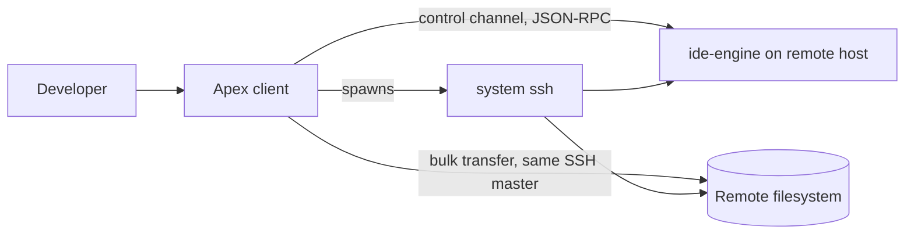
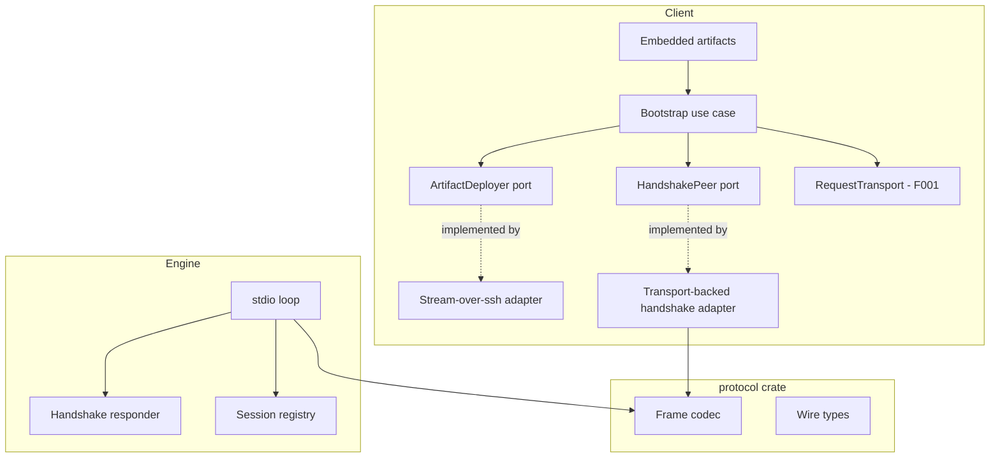
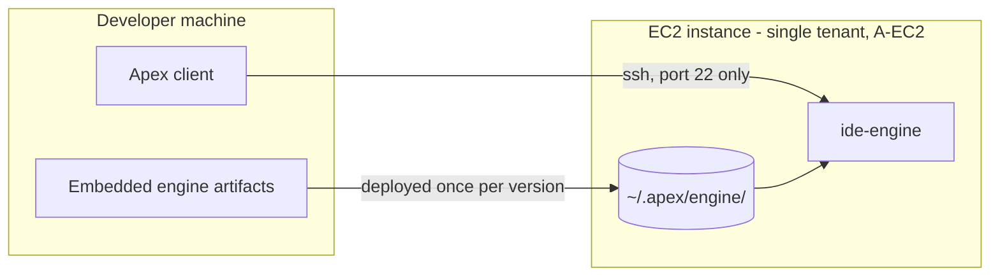
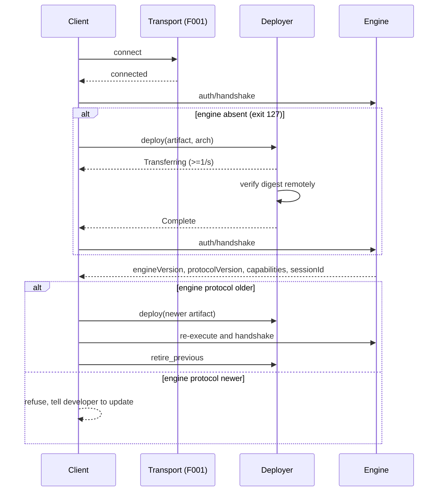

# Architecture: Daemon Bootstrap

**Branch**: `feature/F002-daemon-bootstrap` | **Date**: 2026-09-23 | **Plan**: [plan.md](./plan.md)

**Input**: Implementation plan from `/specs/004-daemon-bootstrap/plan.md`

## Architectural Overview

This feature adds a second process to the product. Until now everything ran on the developer's
machine and the far end of the connection was a mock; from here there is a real `ide-engine`
running on a remote host, and the two must agree about a wire format neither of them owns
alone.

That is the one idea to hold: **the protocol is a third thing.** It is extracted into a crate
both binaries depend on, rather than owned by the client and copied into the engine, because two
implementations of a format §4.1 defines exactly is the drift the mock daemon was deliberately
designed to prevent.

The second shape worth knowing is that **deployment runs beside the protocol, not through it.**
Putting an engine on a host happens when there is no engine to talk to, over a channel the
transport already holds open, and the bytes never become JSON-RPC frames.

## System Context

## Component Architecture

| Component | Responsibility | Entities owned |
|-----------|----------------|----------------|
| Bootstrap use case | The policy: decide whether to deploy, compare versions, order the handshake, retire the old engine | `VersionVerdict`, `BootstrapOutcome` |
| `ArtifactDeployer` port | Stage, verify, promote, retire — the operations, not the mechanism | `DeploymentState`, `DeploymentFailure` |
| Stream-over-ssh adapter | Moves bytes over F001's control master and counts them | none |
| `HandshakePeer` port | Exchange a handshake over an established session | `Handshake` |
| Embedded artifacts | The engine builds the client ships, and their digests | `EngineArtifact`, `Architecture`, `Digest` |
| `protocol` crate | The wire format both binaries obey | frame codec, wire types |
| Engine stdio loop | Read frames, dispatch, write replies | none |
| Handshake responder | Answer `auth/handshake`, advertise capabilities | `CapabilitySet` |
| Session registry | Mint identity, survive re-execution, report restarts | `SessionId`, `RestartNotice` |

## Deployment Topology

Two runtime units on two machines, one network boundary, and it is SSH port 22 in both
directions of use — the control channel and the bulk transfer share one master connection.

## Data Flow

## Cross-Cutting Concerns

| Concern | Approach |
|---------|----------|
| Authentication / authorization | SSH access is the authorization, per A-SEC. This feature adds no second credential and no token: the connection F001 authenticated is the whole of it. |
| Error handling | Every deployment failure resolves to one named `DeploymentFailure`; every handshake failure is distinguishable from a transport failure. No generic error exists, because the six failure causes need six different responses from the developer. |
| Observability | Local structured logs per A-OBS. Deployment publishes `DeploymentState` to the interface at least once per second while transferring. Nothing is transmitted. |
| Configuration | The remote engine path is derived, not configured: a per-user directory under the developer's own home. Host and user come from the composition root, as F001 established. |

## Architectural Decisions

| Decision | Recorded in |
|----------|-------------|
| A shared `protocol` crate rather than a copied codec | research.md, "Where the engine lives, and how the wire format is shared" |
| Stream over `ssh` rather than `sftp` or `scp` | research.md, "How the binary reaches the remote host" |
| SHA-256, computed remotely with `sha256sum` | research.md, "Which digest, and where it is computed" |
| Stage in the target directory, rename atomically | research.md, "How a partially transferred artifact is kept out of reach" |
| Version-qualified names; retire after handshake | research.md, "What the client keeps when it replaces an engine" |
| Add `session/onRestart` to §4.8 | research.md, "Adding a restart notification to the protocol" |
| Protocol version increments on breaking change only | research.md, "When the protocol version increments" |
| Capabilities as exact-match string tokens | research.md, "How capabilities are expressed" |
| CI builds every architecture; local builds one | research.md, "Building an engine for an architecture the developer does not have" |

## Phase 1 Reconciliation

| Conflict with data-model.md or contracts/ | Action taken |
|-------------------------------------------|--------------|
| `DeploymentState` reached `Complete` after promotion, while `contracts/deployment.md` guarantee 6 retires the previous engine only once a handshake succeeds. Both cannot be the deployer's job — the deployer cannot observe a handshake, so a deployer that retired the old engine on promotion would break the guarantee that a verified-but-unrunnable binary is survivable. | **Both artifacts revised.** `Complete` now explicitly means "the new artifact is in place", not "the replacement is finished", and a separate `retire_previous` operation was added to the contract with the obligation that it is called only after a successful handshake. The architecture places that call in the bootstrap use case, which is the only component that sees both. |
| No other conflicts found. The component boundaries match the ports named in the contracts, and every entity in `data-model.md` has exactly one owning component in the table above. | — |
