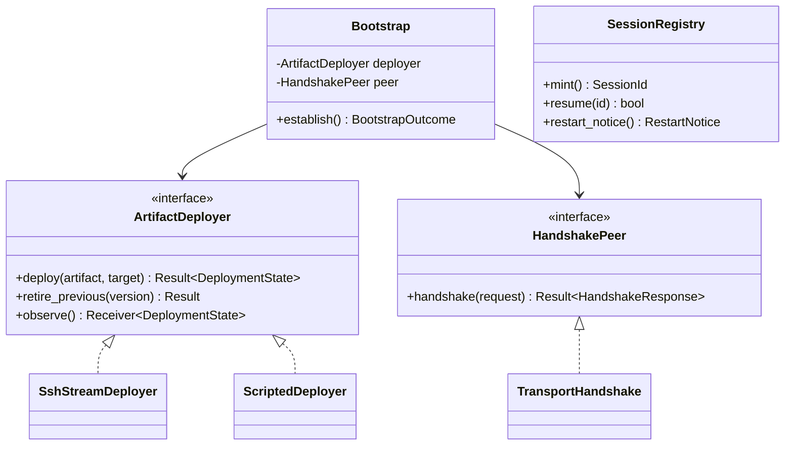
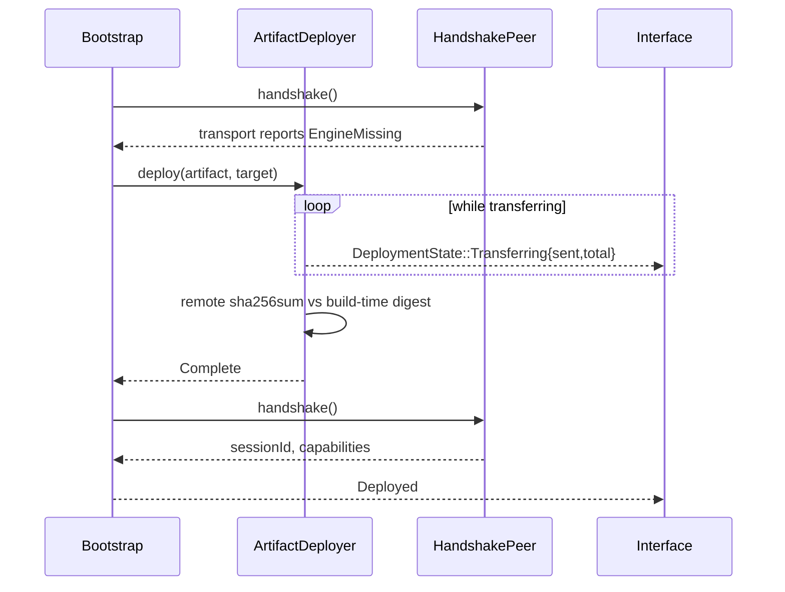
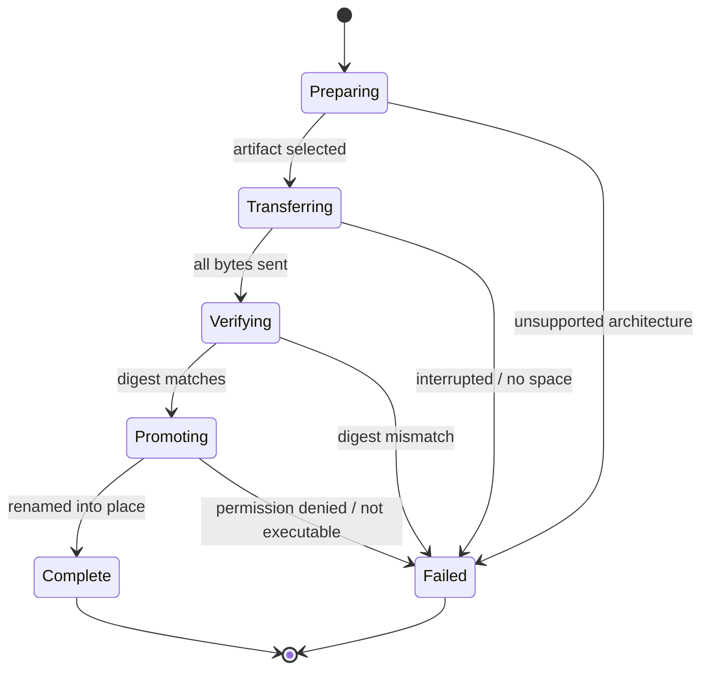

# Design: Daemon Bootstrap

**Branch**: `feature/F002-daemon-bootstrap` | **Date**: 2026-09-23 | **Plan**: [plan.md](./plan.md)

**Input**: Implementation plan from `/specs/004-daemon-bootstrap/plan.md` and system shape from
`/specs/004-daemon-bootstrap/architecture.md`

## Module & File Layout

```text
Cargo.toml                          # NEW — workspace root: protocol, engine, src-tauri

protocol/                           # NEW CRATE — the wire format both binaries obey
├── Cargo.toml
└── src/
    ├── lib.rs
    ├── framing.rs                  # MOVED from src-tauri openssh/framing.rs, tests included
    └── wire.rs                     # Handshake request/response, RestartNotice, PROTOCOL_VERSION

engine/                             # NEW CRATE — the first real ide-engine
├── Cargo.toml
└── src/
    ├── main.rs                     # stdio loop: read frames, dispatch, write replies
    ├── handshake.rs                # auth/handshake responder, capability advertisement
    └── session.rs                  # SessionRegistry: identity, resumption, restart notice

src-tauri/
├── src/
│   ├── domain/
│   │   └── artifact.rs             # NEW — EngineArtifact, Architecture, Digest
│   ├── application/
│   │   ├── ports/
│   │   │   ├── deployer.rs         # NEW — ArtifactDeployer
│   │   │   └── handshake.rs        # NEW — HandshakePeer
│   │   └── use_cases/
│   │       └── bootstrap.rs        # NEW — Bootstrap: the policy
│   └── adapters/outbound/
│       ├── openssh/
│       │   └── mod.rs              # EXTENDED — framing now re-exported from protocol
│       └── deploy/
│           ├── mod.rs              # NEW — SshStreamDeployer
│           └── embedded.rs         # NEW — artifacts embedded at build time
├── build.rs                        # EXTENDED — embed artifacts, compute digests
└── tests/
    ├── bootstrap_deploy.rs         # NEW — US1, SC-012
    ├── bootstrap_handshake.rs      # NEW — US2, US3
    ├── bootstrap_restart.rs        # NEW — US4, US5
    └── bootstrap_real_sshd.rs      # NEW — opt-in, the deployment path

src/lib/statusbar/
└── presentation.ts                 # EXTENDED — a deploying state with progress
```

## Class & Interface Model



| Type | Kind | Responsibility |
|------|------|----------------|
| `ArtifactDeployer` | interface | Stage, verify, promote and retire an artifact. Knows nothing of handshakes. |
| `SshStreamDeployer` | struct | Streams over F001's control master, counting bytes for progress. |
| `ScriptedDeployer` | struct (test) | Produces chosen failures without moving bytes. The seam that makes every failure path testable. |
| `HandshakePeer` | interface | One handshake exchange over an established session. |
| `TransportHandshake` | struct | Implements the above over F001's `RequestTransport`. |
| `Bootstrap` | struct | The policy. The only type that sees both ports, and therefore the only one that may retire a previous engine. |
| `SessionRegistry` | struct (engine) | Mints identity, honours resumption, composes the restart notice. |
| `FrameCodec` | struct (protocol) | Moved from F001 unchanged, tests and all. |

## Interface Contracts

```text
Rust 1.75, edition 2021

trait ArtifactDeployer
    fn deploy(&self, artifact: &EngineArtifact, target: &Target) -> Result<(), DeploymentFailure>
        precondition:  the transport holds an authenticated connection to `target`
        postcondition: on Ok, the artifact is present, verified and executable at its
                       version-qualified path; any previous engine is untouched
        raises:        DeploymentFailure, one named variant, never a generic error

    fn retire_previous(&self, version: &EngineVersion) -> Result<(), DeploymentFailure>
        precondition:  a handshake has succeeded against the replacement
        postcondition: the superseded artifact is absent; idempotent if already absent

    fn observe(&self) -> Receiver<DeploymentState>
        postcondition: publishes at least once per second while Transferring

trait HandshakePeer
    async fn handshake(&self, request: HandshakeRequest) -> Result<HandshakeResponse, HandshakeError>
        precondition:  no other request has been sent on this session
        postcondition: on Ok, the session is usable and its capabilities are known
        raises:        HandshakeError::TimedOut, distinguishable from a transport failure

struct Bootstrap
    async fn establish(&self) -> BootstrapOutcome
        postcondition: exactly one outcome; never panics; a newer engine always yields
                       RefusedNewerEngine and never a usable session

struct SessionRegistry            // engine side
    fn mint(&self) -> SessionId
    fn resume(&self, id: &SessionId) -> bool
        postcondition: false when unknown; the caller must report that rather than
                       silently presenting a new session as a resumed one
    fn restart_notice(&self) -> RestartNotice
        postcondition: `unpreserved` names everything that did not survive; empty asserts
                       that nothing was lost
```

## Sequence Diagrams

**First connect to a host with no engine (User Story 1)**



**Replacing an older engine (User Story 4)**

```mermaid
sequenceDiagram
    participant B as Bootstrap
    participant D as ArtifactDeployer
    participant P as HandshakePeer

    B->>P: handshake()
    P-->>B: protocolVersion older than ours
    B->>D: deploy(newer artifact)
    D-->>B: Complete (previous engine still present)
    B->>P: handshake() against the replacement
    alt handshake succeeds
        P-->>B: sessionId
        B->>D: retire_previous(old version)
    else replacement will not run
        P-->>B: failure
        Note over B,D: nothing retired; previous engine still serving
    end
```

## State Model



The session lifecycle is a separate machine and is drawn in
[data-model.md](./data-model.md#session-lifecycle); it is not repeated here.

## Error Handling & Validation

| Condition | Behavior | Surfaced where |
|-----------|----------|----------------|
| Architecture has no embedded artifact | Refuse before transferring anything | Interface, naming the architecture |
| Transfer interrupted | Fail; retry is a fresh deployment | Interface, stated as retryable |
| Remote disk full | Fail as `NoSpace` | Interface, naming the host as full |
| Digest mismatch | Abort without executing; report as failed deployment, never as tampering | Interface and log |
| Promoted artifact will not execute | Fail as `NotExecutable`; previous engine untouched | Interface, as a failed update |
| Handshake unanswered within its limit | Fail distinguishably from a transport failure | Interface and log |
| Engine protocol newer than client | Refuse the session, no override | Interface, naming both versions |
| Request for an unadvertised capability | Refused locally; no frame written | Caller, as unavailable functionality |
| Resumption refused | New session established and **said so** | Interface, as work no longer running |
| `retire_previous` fails | Logged; session continues | Log only — an orphaned binary costs disk, not correctness |

## Persistence Mapping

| Entity (see [data-model.md](./data-model.md)) | Owning type | Notes |
|-----------------------------------------------|-------------|-------|
| `EngineArtifact`, `Architecture`, `Digest` | `adapters::outbound::deploy::embedded` | Embedded at build time; digest computed by `build.rs` from the same bytes |
| `DeploymentState`, `DeploymentFailure` | `SshStreamDeployer` | Published through `observe()`; no storage |
| `Handshake` request and response | `protocol::wire` | Shared by both binaries; neither owns it alone |
| `VersionVerdict`, `BootstrapOutcome` | `Bootstrap` | Computed, never stored |
| `SessionId`, `RestartNotice` | `engine::session::SessionRegistry` | Engine memory only — which is why a session does not survive a crash |
| `CapabilitySet` | `engine::handshake` (advertised), `Bootstrap` (recorded) | Held for the life of the session; not persisted |

Nothing in this feature is written to disk on the client. The only persistent artifact is the
deployed engine binary on the remote host, which is a file rather than a record and is owned by
the deployer.
