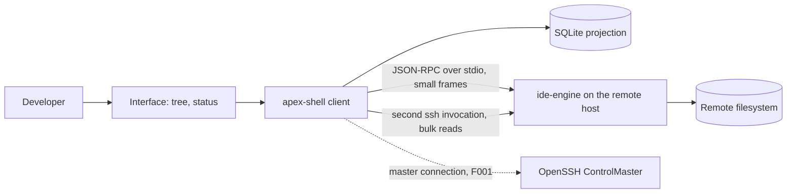
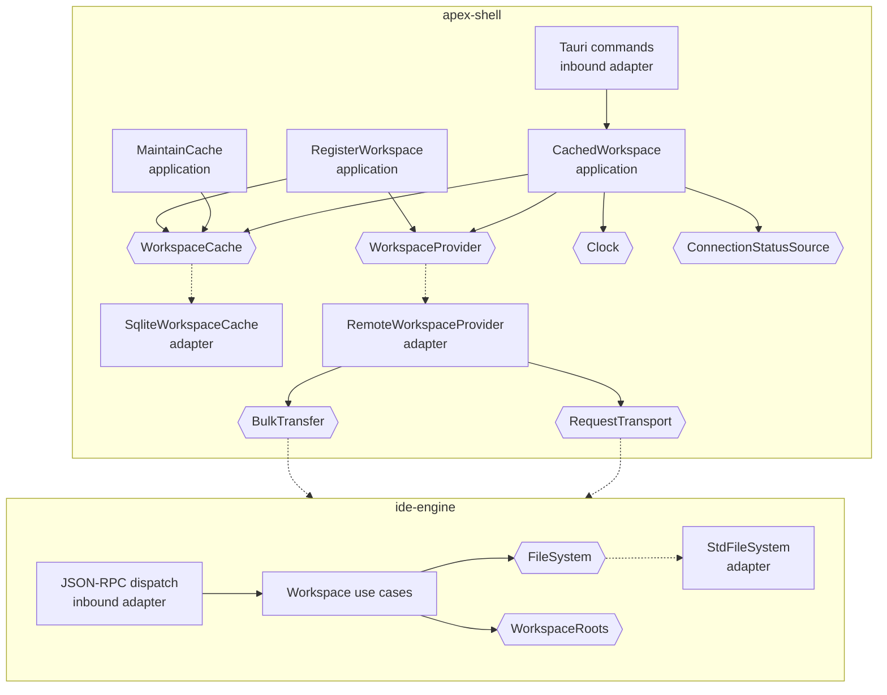
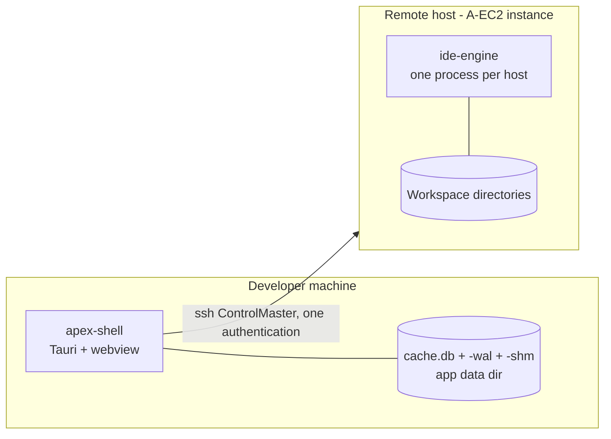
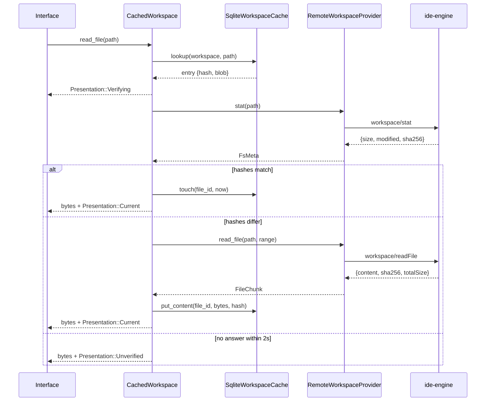

# Architecture: Workspace Cache

**Branch**: `feature/F003-workspace-cache` | **Date**: 2026-09-23 | **Plan**: [plan.md](./plan.md)

**Input**: Implementation plan from `/specs/005-workspace-cache/plan.md`

## Architectural Overview

One interface, three things behind it. The interface is `WorkspaceProvider` (§6.1), and every
consumer of workspace content — the tree, the editor F006 will add, the search F013 will add — sees
only that. Behind it sit a SQLite projection of what has already been seen, a remote provider that
turns a call into one JSON-RPC request, and a bulk path for content too large for the control
channel.

The one architectural idea to hold: **the thing that decides whether to use the cache is not the
cache and not the transport.** `CachedWorkspace` is an application-layer object that implements the
provider port and consumes three others, so every rule in FR-019 through FR-034 sits in one place,
depends on no technology, and is exercisable against fakes. The SQLite adapter knows nothing about
validity, and the remote adapter knows nothing about caching.

Across the wire, the engine acquires its first real logic and with it the hexagonal shape Principle
VIII requires: a `FileSystem` port, a `WorkspaceRoots` registry, three use cases, and a dispatch
adapter where F002 had a `match` in `main`.

## System Context

The two arrows to the engine are the architecture, not a drawing convenience: §4.6 makes one pipe
one queue, so bulk content takes its own invocation over the same authenticated master rather than
serialising ahead of interactive traffic (A-BULK).

## Component Architecture

Dashed edges are implementations of a port; solid edges are dependencies. Every arrow points
inward or sideways, never from application to adapter.

| Component | Responsibility | Entities owned |
|-----------|----------------|----------------|
| `CachedWorkspace` | Every rule about when cached content may be served, what the developer is told about it, and when an access is recorded | `Validity`, `Presentation` |
| `RegisterWorkspace` | Mint an identity, attach to an existing projection, register the root with the engine, delete | `Workspace`, `WorkspaceId` |
| `MaintainCache` | Migrate then evict, once, before anything opens; publish progress | `MaintenancePhase`, `RetentionWindow` |
| `SearchPaths` | Offline path search over the FTS index | none |
| `SqliteWorkspaceCache` | The §5.2 projection: schema, migrations, statements, compression | `CacheEntry` rows, `FileId` |
| `RemoteWorkspaceProvider` | One provider call becomes at most one protocol request; route oversize reads to bulk | none |
| `BulkTransfer` adapter | A second `ssh` invocation on the existing master, `ControlMaster=no` | none |
| Engine workspace use cases | Resolve, assert containment, list, stat, read | none |
| Engine `WorkspaceRoots` | `WorkspaceId → canonical AbsPath`, in memory, for the engine's lifetime | the registry |
| `StdFileSystem` | `std::fs`, synchronously | none |

## Deployment Topology

Two runtime units, unchanged in number from F002. What this feature adds is the database file
beside the client and the fact that the engine now touches the filesystem. The network boundary is
the same single authenticated SSH connection; the bulk path is a second *invocation* over it, not a
second connection (A-BULK, measured: seven invocations over one master authenticate once).

The engine remains a single binary with no runtime, deployed by F002 and embedded in the client —
which is why research.md declines to add tokio to it.

## Data Flow

Opening a cached file while connected. This is the flow the feature exists for and the one whose
ordering the requirements are strictest about.

`Verifying` is published before the stat is issued and no bytes reach the interface until one of
the three branches resolves. That ordering is FR-021a and FR-021b together, and it is the reason
the diagram shows the arrow to the interface *before* the arrow to the engine.

Two flows deliberately not drawn, because each is a straight line: expanding a folder is a cache
lookup and, on a miss, one request; startup maintenance is migrate-then-evict with a progress
publisher, and its ordering is stated in contracts/cache.md.

## Cross-Cutting Concerns

| Concern | Approach |
|---------|----------|
| Authentication / authorization | N/A for this feature — the SSH connection is authenticated once by F001 and every invocation attaches to that master (A-BULK). There is no per-request authorization model: under A-EC2 the instance is single-tenant and the developer's own. What this feature *does* enforce is containment, which is a trust boundary rather than an authorization one: the engine canonicalises and asserts descent independently of the client (FR-005, Principle VI), and refuses identically whether or not the escaped target exists (FR-007) |
| Error handling | Typed, never stringly. Four kinds a caller must distinguish: not-found (`-32003`), refused (`-32002`), unknown workspace (`-32001`) and unsupported (`-32601`, naming the feature that will implement it). Two failures are *swallowed by design* and both are recorded rather than incidental: a caching write that fails never fails the read that prompted it (FR-034), and a migration that fails discards and rebuilds rather than refusing to launch (FR-018b). Everything else propagates |
| Observability | Three signals, each tied to a criterion rather than added for completeness. A **request count** per provider call, which is what makes SC-002 measurable at all. The **two published states** (`Presentation`, `MaintenancePhase`), which are user-facing and therefore asserted end to end. And the **performance gate's measured values**, printed rather than compared (A-NFR), covering both §1.4 sidebar rows and the SC-010 compression ratio. Logging reuses F001's redacting logger; nothing here logs a path's contents |
| Configuration | The database path comes from the platform application-data directory, alongside F001's `session.json` — A-STATE keeps the two files separate for lifetime reasons, and this feature does not merge them. Four constants are decisions rather than settings, and none is user-configurable: the retention window (14 days, §5.5), the bulk threshold (512 KiB), the cache eligibility cap (8 MiB) and the confirmation limit (2 s). The last three are recorded in research.md and marked for promotion to Appendix A. Tests inject a `Clock` rather than a configured window, so retention is exercisable without waiting a fortnight |

## Architectural Decisions

| Decision | Recorded in |
|----------|-------------|
| `rusqlite`, bundled, with FTS5 | research.md, "The SQLite driver" |
| One connection behind a mutex, reached through `spawn_blocking` | research.md, "How the async provider reaches a synchronous database" |
| `async-trait` so `WorkspaceProvider` can be `dyn` | research.md, "Making `WorkspaceProvider` dynamically dispatchable" |
| Cache policy is an application-layer use case implementing the port | research.md, "Where cache policy lives" |
| Cursor-based directory pagination, ordering contractual, no version bump | research.md, "Directory pagination — and why it does not bump the protocol version" |
| Bulk threshold at 512 KiB raw | research.md, "The bulk threshold" |
| Cache eligibility cap at 8 MiB | research.md, "The cache eligibility cap" |
| Confirmation limit at 2 seconds | research.md, "The confirmation limit" |
| FTS5 external-content triggers added to §5.2 | research.md, "The FTS5 synchronisation gap in §5.2" |
| Schema version 1 is the whole of §5.2 | research.md, "What the first schema version contains" |
| Transactional migration, discard-and-rebuild on failure | research.md, "Migration atomicity, and why 'half-transformed' is impossible" |
| `sha2` on both ends; the build script's hand-rolled digest stays, with a test that they agree | research.md, "Hashing, and the second implementation that already exists" |
| The engine stays synchronous | research.md, "The engine stays synchronous" |
| Two-stage path check: lexical, then canonical | research.md, "Path containment, and not leaking existence" |

## Phase 1 Reconciliation

This architecture was authored after `data-model.md` and `contracts/`. Checking it against them
found three disagreements. None was absorbed silently.

| Conflict with data-model.md or contracts/ | Action taken |
|-------------------------------------------|--------------|
| **`data-model.md` gives the engine a `WorkspaceRoots` registry "canonicalised once at registration", but no registration method exists.** §4.8's catalogue has no `workspace/register`, so nothing in the protocol can populate that registry — while §15.4 step 3 says "Register the workspace with the engine" and §4.4 reserves `-32001` for a workspace "not found or **not registered**". The system specification presumes the method in two places and defines it nowhere, which makes every other workspace method unusable as specified | **Artifact revised, and a third amendment added.** `contracts/workspace-methods.md` now specifies `workspace/register` with its guarantees, and it is recorded in research.md's amendment ledger and plan.md's Constitution Check as owed to §4.8 before implementation. Adding a method does not increment `protocolVersion`, so the cost is a redeploy signal (`-32601`) rather than a fleet-wide break |
| **`contracts/workspace-methods.md` returned `-32002` for an unknown `workspaceId`.** §4.4 assigns `-32001` to exactly that condition and `-32002` to a path escape. Two distinct failures were being reported as one, which would have made a client unable to tell "you never registered this workspace" from "that path is outside the root" — and the second is a security signal | **Contract revised** to `-32001` for an unknown workspace and `-32003` for a path that is inside the root and absent, both citing §4.4. The architecture's Error handling row states all four codes so the set is visible in one place |
| **`contracts/provider.md` describes `CachedWorkspace` as holding four ports; the first Component Architecture sketch drew it as an adapter decorating the remote provider.** The two placements have different consequences under Principle VIII: an adapter may not hold business rules, and every rule this feature has lives in that object | **Architecture adjusted** to match the contract, which is the correct shape. `CachedWorkspace` sits in the application subgraph with its four port dependencies drawn, and plan.md's post-design re-evaluation records why a type that both implements and consumes a port is not a layering violation |

Nothing else disagreed. The entity set in `data-model.md`, the guarantees in all three contracts and
the component table above describe the same system.
