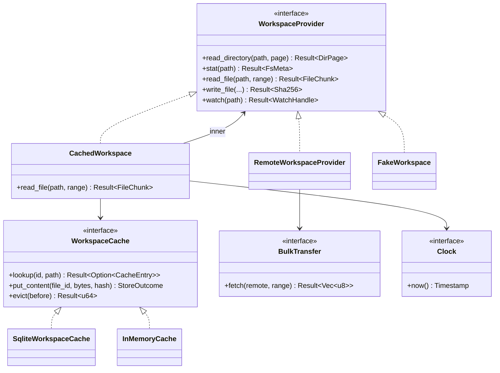
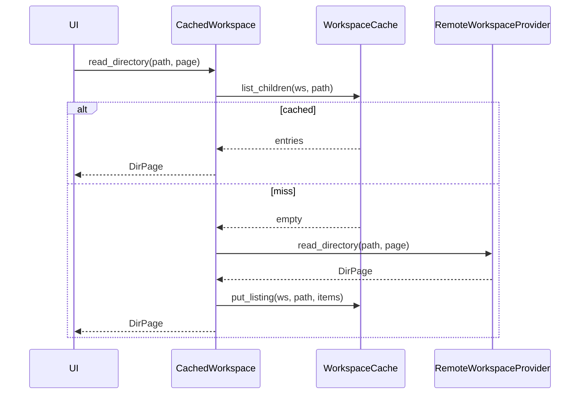
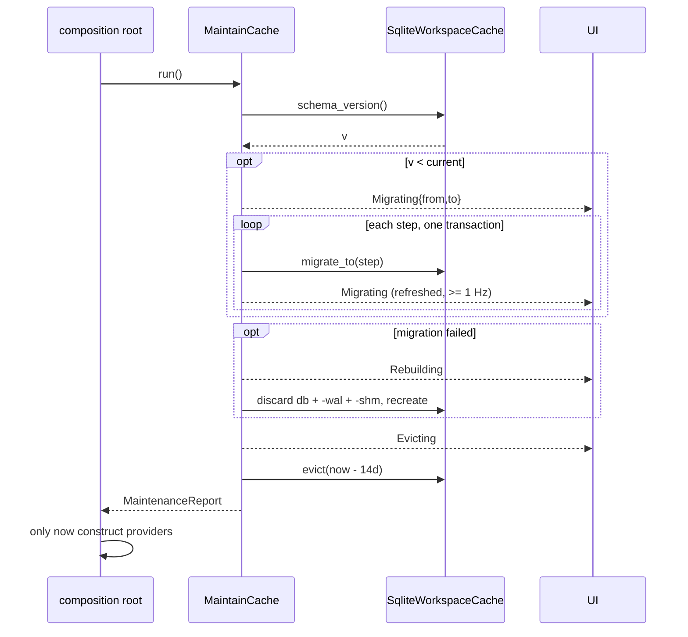
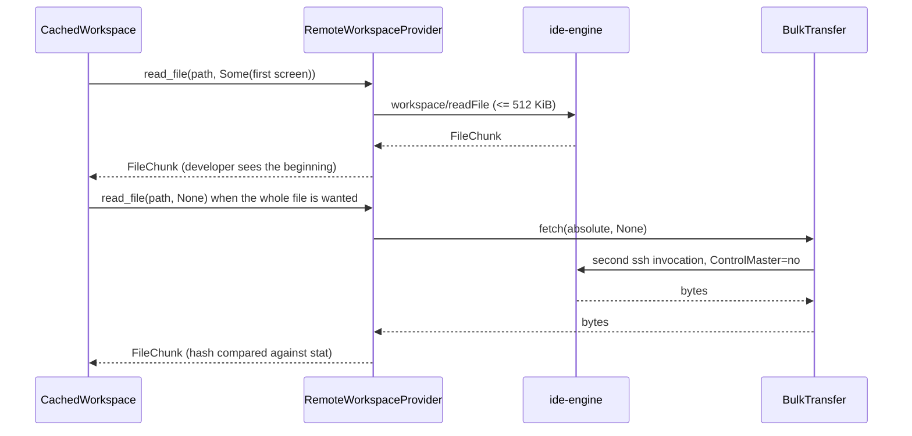
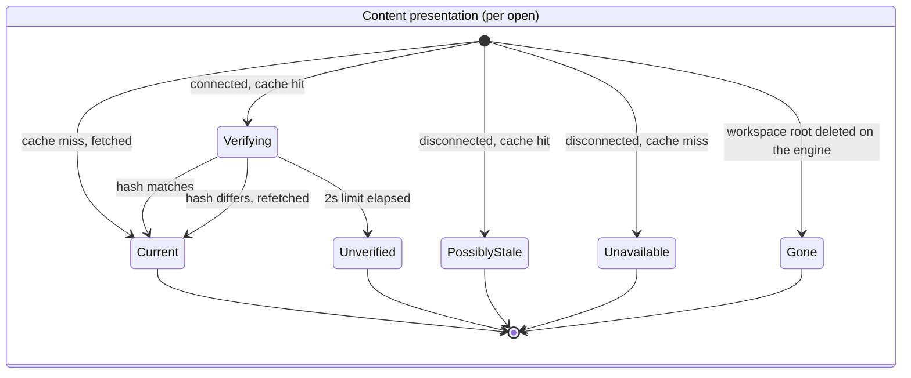
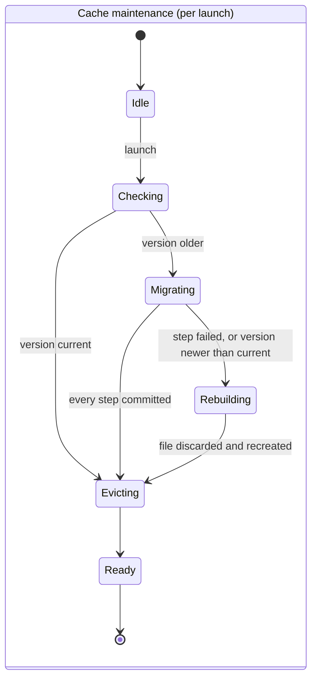

# Design: Workspace Cache

**Branch**: `feature/F003-workspace-cache` | **Date**: 2026-09-23 | **Plan**: [plan.md](./plan.md)

**Input**: Implementation plan from `/specs/005-workspace-cache/plan.md` and system shape from
`/specs/005-workspace-cache/architecture.md`

Signatures only. Entity fields and validation rules live in [data-model.md](./data-model.md);
guarantees live in [contracts/](./contracts/). Language and version come from plan.md's Technical
Context: Rust 1.75, edition 2021.

## Module & File Layout

Matches plan.md's Structure Decision. Where they disagree, one of the two is wrong.

```text
protocol/src/
└── wire.rs                              # EXTENDED — workspace params/results, shared by both ends

client/core/src/
├── domain/
│   ├── workspace.rs                     # WorkspaceId, Workspace, Location, RelPath, FsEntry,
│   │                                    #   FsMeta, ByteRange, FileChunk, Sha256, FileId
│   └── cache.rs                         # CacheEntry, Validity, Presentation, MaintenancePhase,
│                                        #   RetentionWindow
├── application/
│   ├── ports/
│   │   ├── workspace_provider.rs        # WorkspaceProvider (§6.1), ProviderError
│   │   ├── workspace_cache.rs           # WorkspaceCache, CacheError, StoreOutcome
│   │   ├── bulk_transfer.rs             # BulkTransfer
│   │   └── clock.rs                     # Clock
│   └── use_cases/
│       ├── cached_workspace.rs          # CachedWorkspace: implements WorkspaceProvider
│       ├── register_workspace.rs        # RegisterWorkspace
│       ├── maintain_cache.rs            # MaintainCache
│       └── search_paths.rs              # SearchPaths
├── adapters/
│   ├── inbound/tauri_commands.rs        # EXTENDED — workspace commands
│   └── outbound/
│       ├── sqlite/{mod.rs,schema.rs,migrate.rs}
│       ├── remote_workspace.rs
│       ├── bulk/mod.rs
│       └── system_clock.rs
└── composition.rs                       # EXTENDED — maintenance before any provider exists

engine/src/
├── main.rs                              # REDUCED — composition root and stdio loop
├── domain/path.rs                       # ResolvedPath, containment (§4.7)
├── application/
│   ├── ports/{file_system.rs,roots.rs}
│   └── use_cases/workspace.rs           # ReadDirectory, Stat, ReadFile, Register
└── adapters/
    ├── inbound/rpc.rs                   # dispatch — was a match in main.rs
    └── outbound/std_fs.rs

client/ui/lib/
├── statusbar/presentation.ts            # EXTENDED — verifying, maintaining states
└── workspace/{tree.svelte.ts,FileTree.svelte,VerifyBadge.svelte,MaintenanceBanner.svelte}
```

## Class & Interface Model



`CachedWorkspace` both implements `WorkspaceProvider` and holds one. That is the shape
contracts/provider.md specifies and plan.md's post-design re-evaluation defends.

| Type | Kind | Responsibility |
|------|------|----------------|
| `WorkspaceProvider` | trait (`#[async_trait]`, `dyn`) | The §6.1 interface; hides local from remote |
| `WorkspaceCache` | trait | The projection as a capability, not as SQLite |
| `BulkTransfer` | trait | Move bytes beside the channel (A-BULK) |
| `Clock` | trait | So retention is testable without waiting 14 days |
| `CachedWorkspace` | struct (application) | Every rule in FR-019 … FR-034 |
| `RegisterWorkspace` | struct (application) | Mint, attach, register with the engine, delete |
| `MaintainCache` | struct (application) | Migrate, then evict, once, before anything opens |
| `SearchPaths` | struct (application) | FTS query; never touches a provider |
| `RemoteWorkspaceProvider` | struct (adapter) | One call → at most one request; route oversize to bulk |
| `SqliteWorkspaceCache` | struct (adapter) | §5.2 schema, statements, Zstd, migrations |
| `FakeWorkspace` / `InMemoryCache` | struct (tests) | Failure on demand; see contracts |
| `ResolvedPath` (engine) | struct | Constructible **only** via a containment check |

## Interface Contracts

Signatures only. Behaviour is in [contracts/](./contracts/).

```rust
// application/ports/workspace_provider.rs

#[async_trait]
pub trait WorkspaceProvider: Send + Sync {
    async fn read_directory(&self, ws: &WorkspaceId, path: &RelPath, page: Page)
        -> Result<DirPage, ProviderError>;
    //   precondition:  path is workspace-relative and lexically contained
    //   postcondition: <= page.limit entries, ordered (dir DESC, name ASC);
    //                  next_cursor is Some iff more entries follow
    //   raises:        NotFound | Refused | UnknownWorkspace | WorkspaceGone | Offline | Transport
    //                  UnknownWorkspace and WorkspaceGone are distinct: the first means
    //                  re-register, the second means tell the developer and stop projecting.

    async fn stat(&self, ws: &WorkspaceId, path: &RelPath) -> Result<FsMeta, ProviderError>;
    //   postcondition: sha256 is Some for a file, None for a directory

    async fn read_file(&self, ws: &WorkspaceId, path: &RelPath, range: Option<ByteRange>)
        -> Result<FileChunk, ProviderError>;
    //   postcondition: chunk.sha256 is the WHOLE file's hash, never the range's;
    //                  bytes.len() <= range.length; a range past EOF yields zero bytes
    //   raises:        NotFound | Refused | WorkspaceGone | Offline | TooLarge | Transport

    async fn write_file(&self, ws: &WorkspaceId, path: &RelPath, content: &[u8],
                        base: &Sha256) -> Result<Sha256, ProviderError>;
    async fn create_file(&self, ws: &WorkspaceId, path: &RelPath) -> Result<Sha256, ProviderError>;
    async fn create_directory(&self, ws: &WorkspaceId, path: &RelPath) -> Result<(), ProviderError>;
    async fn rename(&self, ws: &WorkspaceId, from: &RelPath, to: &RelPath) -> Result<(), ProviderError>;
    async fn delete(&self, ws: &WorkspaceId, path: &RelPath, recursive: bool) -> Result<(), ProviderError>;
    async fn search(&self, ws: &WorkspaceId, q: &SearchQuery) -> Result<Vec<SearchMatch>, ProviderError>;
    async fn watch(&self, ws: &WorkspaceId, path: &RelPath) -> Result<WatchHandle, ProviderError>;
    //   the eight above: raises ProviderError::Unsupported { owner: FeatureId } — always.
    //   postcondition: no side effect of any kind. FR-004.
}

pub struct Page { pub cursor: Option<String>, pub limit: u32 }   // limit <= 1000
pub struct DirPage { pub items: Vec<FsEntry>, pub next_cursor: Option<String> }
```

```rust
// application/ports/workspace_cache.rs

pub trait WorkspaceCache: Send + Sync {
    fn register(&self, ws: &Workspace, now: Timestamp) -> Result<Attachment, CacheError>;
    fn forget(&self, ws: &WorkspaceId) -> Result<(), CacheError>;

    fn list_children(&self, ws: &WorkspaceId, parent: &RelPath) -> Result<Vec<FsEntry>, CacheError>;
    fn put_listing(&self, ws: &WorkspaceId, parent: &RelPath, entries: &[FsEntry])
        -> Result<(), CacheError>;
    //   postcondition: file_id is preserved for entries that survive; content survives with it

    fn lookup(&self, ws: &WorkspaceId, path: &RelPath) -> Result<Option<CacheEntry>, CacheError>;
    fn put_content(&self, file_id: &FileId, bytes: &[u8], hash: &Sha256, now: Timestamp)
        -> StoreOutcome;
    //   returns StoreOutcome, NOT Result: a caller must not be able to `?` a caching failure
    //   into a failed read. FR-034.

    fn touch(&self, file_id: &FileId, now: Timestamp) -> StoreOutcome;
    fn rename(&self, file_id: &FileId, to: &RelPath) -> Result<(), CacheError>;
    fn search_paths(&self, ws: &WorkspaceId, fragment: &str, limit: u32)
        -> Result<Vec<RelPath>, CacheError>;
    fn evict(&self, before: Timestamp) -> Result<EvictionReport, CacheError>;

    fn schema_version(&self) -> Result<u32, CacheError>;
    fn migrate_to(&self, target: u32, progress: &dyn FnMut(MaintenancePhase))
        -> Result<(), MigrationFailure>;
}

pub enum StoreOutcome { Stored, NotEligible { size: u64 }, Failed(CacheError) }

//   rename(file_id, to):
//     precondition:  the caller KNOWS this is a move — it has an identity, not two names
//     postcondition: path columns updated; file_contents untouched, so content survives (FR-022)
//     note:          put_listing cannot call this. A re-listing has no identity to pass.
//                    F006's write path is the first caller. See contracts/cache.md C9.
```

`put_content` and `touch` returning `StoreOutcome` rather than `Result` is the single most
load-bearing signature in this design. FR-034 says a caching failure must not fail the read; a
`Result` invites `?`, and `?` is how that requirement gets violated by a reflex rather than by a
decision. The type makes the requirement structural.

```rust
// application/ports/bulk_transfer.rs
#[async_trait]
pub trait BulkTransfer: Send + Sync {
    async fn fetch(&self, remote: &AbsPath, range: Option<ByteRange>) -> Result<Vec<u8>, BulkError>;
    //   postcondition: bytes only. No hash, no integrity claim — the caller compares against stat.
}

// application/ports/clock.rs
pub trait Clock: Send + Sync { fn now(&self) -> Timestamp; }
```

```rust
// application/use_cases/cached_workspace.rs
impl CachedWorkspace {
    pub fn new(inner: Arc<dyn WorkspaceProvider>, cache: Arc<dyn WorkspaceCache>,
               clock: Arc<dyn Clock>, conn: Arc<dyn ConnectionStatusSource>,
               present: Arc<dyn Fn(Presentation) + Send + Sync>,
               limits: Limits) -> Self;
}
pub struct Limits { pub confirm: Duration, pub cache_max: u64, pub bulk_threshold: u64 }
```

```rust
// application/use_cases/maintain_cache.rs
impl MaintainCache {
    pub fn new(cache: Arc<dyn WorkspaceCache>, clock: Arc<dyn Clock>,
               publish: Arc<dyn Fn(MaintenancePhase) + Send + Sync>, retention: RetentionWindow)
        -> Self;
    pub fn run(&self) -> MaintenanceReport;
    //   precondition:  no WorkspaceProvider has been constructed yet. FR-018c, FR-026a.
    //   postcondition: schema is at the current version, or the file was rebuilt; eviction has
    //                  run exactly once; progress was published at >= 1 Hz throughout.
    //   raises:        never. A failure becomes a rebuild and is reported, not returned. FR-018b.
}
```

```rust
// engine — domain/path.rs
impl ResolvedPath {
    pub fn resolve(root: &CanonicalRoot, relative: &str, fs: &dyn FileSystem)
        -> Result<ResolvedPath, PathRefusal>;
    //   precondition:  relative is untrusted input straight off the wire. FR-008.
    //   postcondition: the value exists only if canonicalised and asserted a descendant of root
    //   raises:        PathRefusal — identical whether or not the escaped target exists. FR-007.
}

// engine — application/ports/file_system.rs  (synchronous: research.md)
pub trait FileSystem: Send + Sync {
    fn canonicalize(&self, p: &Path) -> io::Result<PathBuf>;
    fn read_dir(&self, p: &Path) -> io::Result<Vec<RawEntry>>;
    fn metadata(&self, p: &Path) -> io::Result<RawMeta>;
    fn read_range(&self, p: &Path, offset: u64, len: u64) -> io::Result<Vec<u8>>;
}
```

`ResolvedPath` has no public constructor other than `resolve`. A use case cannot reach the
filesystem with a path that has not been checked, because it cannot name one — which is Principle
VI enforced by the type system rather than by review.

## Sequence Diagrams

### Expanding a folder — US1, the §1.4 sub-millisecond path



The cached branch is one indexed query and no `await` on anything remote. That is the 1 ms budget.

### Startup maintenance — US4



### A large file read — FR-023, FR-025, A-BULK



## State Model

Two lifecycles matter. Both are published to the interface, which is why both are states rather
than internal flags.





`Ready` is the precondition for constructing any provider (FR-018c). The six state names are
canonical and defined in [data-model.md](./data-model.md); `Migrating`, `Rebuilding` and `Evicting`
are the three the interface renders. The workspace lifecycle
itself — `Unregistered → Registered → Attached → Detached`, and `Registered → Deleted` — is in
data-model.md and is not repeated here.

## Error Handling & Validation

| Condition | Behavior | Surfaced where |
|-----------|----------|----------------|
| Path escapes the root, lexically | Refuse before touching the filesystem | `-32002` to the client; typed `Refused` to the caller |
| Path escapes via a symlink | Refuse after canonicalisation | `-32002`, **identical** to the lexical case and to a non-existent target (FR-007) |
| Path inside the root, absent | Ordinary not-found | `-32003` → `ProviderError::NotFound` |
| Unknown `workspaceId` | Refuse | `-32001` → `UnknownWorkspace`; the client re-registers, which is also the engine-restart path |
| Registered root no longer exists on the engine | Report the **workspace** as gone | `-32009` → `WorkspaceGone`. **Not `-32001`**: that means re-register, and re-registering a deleted root fails on `workspace/register`'s not-a-directory refusal, surfacing a registration error for a deletion. The projection stops being presented as a live view (FR-038, SC-015) |
| A cached file's name vanishes from a re-listing | Its content is dropped; the entry is removed from that listing and re-cached on next open | Nothing — a refetch, not an error. The file remains listed (FR-022a, FR-022b) |
| `length` above the bulk threshold | Refuse with invalid-params rather than truncate | `-32602`; the client routes to `BulkTransfer` instead |
| Confirmation exceeds 2 s | End the wait, serve cached bytes | `Presentation::Unverified` in the interface (FR-021c, SC-004b) |
| Disconnected, content cached | Serve | `Presentation::PossiblyStale` (FR-032) |
| Disconnected, content absent | Refuse with a stated reason | `Presentation::Unavailable` — never an empty document (FR-033) |
| Disk full / database locked / content above the cap | **Read succeeds.** `StoreOutcome::Failed` or `NotEligible` | Log only. Never the caller (FR-034) |
| Migration step fails | Discard and rebuild | `MaintenancePhase::Rebuilding`, then a message that cached content was rebuilt (FR-018b) |
| Migration interrupted (kill, power, full disk) | Transaction rolls back; old version intact; retried next launch | Nothing — by design there is no observable partial state (SC-013b) |
| Schema newer than this build | Discard and rebuild | Same path as a failed migration; see contracts/cache.md |
| Unimplemented trait method | `ProviderError::Unsupported { owner }` | Names F004 or F006, so a log reads as a schedule rather than a bug (FR-004) |
| Malformed frame from the engine | Typed error | Never a panic, never a default value — the engine's output is untrusted (Principle VI) |

## Persistence Mapping

Field-level definitions are in [data-model.md](./data-model.md) and are not copied here.

| Entity (see [data-model.md](./data-model.md)) | Owning type | Notes |
|-----------------------------------------------|-------------|-------|
| `Workspace` | `SqliteWorkspaceCache` → `workspaces` | One row. `ON DELETE CASCADE` gives FR-012 |
| Tree node / `FsEntry` | `SqliteWorkspaceCache` → `files` | `UNIQUE(workspace_id, relative_path)`; `file_id` opaque so renames keep content |
| `CacheEntry` | `SqliteWorkspaceCache` → `files` ⋈ `file_contents` | 1:0..1. Zstd level 3; hash over decompressed bytes. `rename` moves the `files` row and leaves `file_contents` alone — see [contracts/cache.md](./contracts/cache.md) C9 for what that does **not** cover |
| Path search index | `SqliteWorkspaceCache` → `files_fts` | Trigger-maintained only. No type writes it |
| Git status | `files`-adjacent `git_status` | Created at v1, **owned by F011**. Nothing here reads or writes it, and nothing may: §5.3 |
| `Validity` | none — derived | Storing it would create a second truth about freshness |
| `Presentation`, `MaintenancePhase` | none — published | Per-open and per-launch; A-STATE keeps interface state out of this database anyway |
| `Workspace` root (engine side) | `WorkspaceRoots` | In memory, engine lifetime. Dies with the process; the client re-registers |
