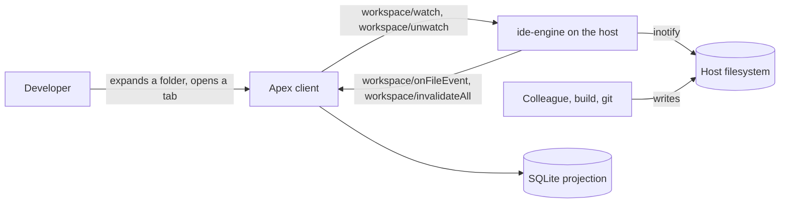
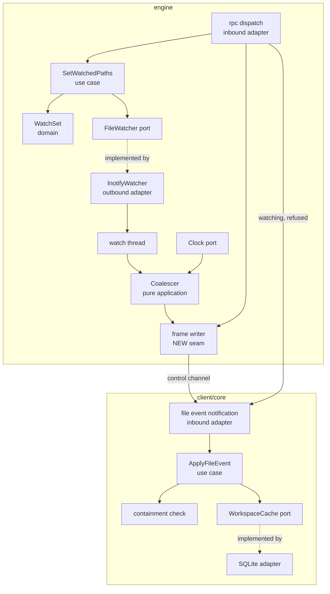
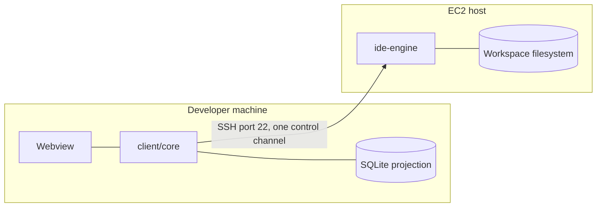

# Architecture: File Watch Sync

**Branch**: `feature/F004-file-watch-sync` | **Date**: 2026-09-24 | **Plan**: [plan.md](./plan.md)

**Input**: Implementation plan from `/specs/006-file-watch-sync/plan.md`

## Architectural Overview

F004 adds one observer and one correction path. On the host, a dedicated thread owns an
`inotify` descriptor and feeds a **pure coalescer** that decides what is worth telling the
client: repeated writes to one path become one event, and a flood becomes a single wholesale
invalidation. On the client, an inbound adapter turns each notification into use-case input,
and the use case corrects the SQLite projection F003 built rather than rebuilding it.

The one architectural idea to hold is that **nothing which decides anything touches the
filesystem**. The watcher port yields raw events and the clock port yields time; the coalescer
is a pure function of both. That is what makes "a thousand writes in one second" and "ten
thousand changes at once" unit tests rather than integration tests, and it is why `inotify`
appears in exactly one file.

The second idea is that watching is **client-driven**. The engine has no opinion about what
matters; it watches the set the client names and reconciles that set idempotently, which is
what makes reconnection a single call rather than a replayed history.

## System Context



The developer is not the only writer, which is the whole reason the feature exists: a
colleague's push, a build, or a branch switch changes the workspace with no client action to
hang an update on.

## Component Architecture



| Component | Responsibility | Entities owned |
|-----------|----------------|----------------|
| `SetWatchedPaths` (engine use case) | Reconcile the requested paths against the held set; resolve and contain each path; report refusals | `WatchSet` |
| `WatchSet` (engine domain) | The set of directories watched for one workspace, and its idempotency | `Watch` |
| `FileWatcher` (engine port) | The capability of observing directories and yielding raw events | `RawEvent` |
| `InotifyWatcher` (engine adapter) | The only code that names `inotify`; owns the descriptor and the thread | none |
| `Coalescer` (engine application, pure) | Collapse per path on the window, pair renames by cookie, convert a flood to one invalidation | `FileEvent` |
| `Clock` (engine port) | Time, so the coalescer never reads it directly | none |
| `ExclusionSet` (engine, on the registered workspace) | The one resolved ignore set, shared by construction with the future indexer | `ExclusionSet` |
| `ApplyFileEvent` (client use case) | Re-validate containment, then correct the projection | none |
| `WorkspaceCache` (client port) | Marking stale, marking unproven, renaming a subtree | `Staleness`, `UnprovenContent` |

## Deployment Topology



Unchanged from F003 in shape: one client process, one engine process, one multiplexed SSH
connection. F004 adds no runtime unit and no port. The watch thread lives inside the existing
engine process, which is why it may not assume an async runtime.

## Data Flow

```mermaid
sequenceDiagram
    participant D as Developer
    participant C as client/core
    participant E as engine rpc
    participant W as watch thread
    participant F as Host filesystem

    D->>C: expand folder src/
    C->>E: workspace/watch [src/, ancestors]
    E->>W: add watches
    W-->>E: watching=3, refused=[]
    E-->>C: {watching, refused}

    F->>W: raw events (many)
    Note over W: coalesce 100ms per path<br/>pair renames by cookie<br/>>=256 paths/1s -> wholesale
    W->>C: workspace/onFileEvent (one per path)
    C->>C: re-validate containment (Principle VI)
    C->>C: correct projection; mark unproven; never mark valid
```

The `Note` is the architecture. Everything expensive or surprising that the filesystem does is
absorbed before anything reaches the channel, because §4.6 makes this one pipe and one queue.

## Cross-Cutting Concerns

| Concern | Approach |
|---------|----------|
| Authentication / authorization | N/A — SSH access is the authorization (A-SEC), and F004 adds no new entry point beyond two methods on the existing authenticated session |
| Error handling | Watch refusals are data, not errors: `workspace/watch` returns `refused[]` so exhausted capacity degrades rather than failing (FR-005a). Protocol-level failures reuse §4.4 — `-32001` unregistered, `-32002` path refused, `-32009` root gone. A client that cannot watch is told, never left silent (FR-005) |
| Observability | The measurement obligations are the observability: watch count, coalescing ratio and reflection latency are printed by the A-NFR harness rather than asserted. Local logs only (A-OBS) |
| Configuration | None. The exclusion set is `.gitignore` plus the fixed built-in set, with no per-workspace user configuration in v1 (FR-009, A-IGNORE) |

## Architectural Decisions

| Decision | Recorded in |
|----------|-------------|
| Two new requests, list-shaped and idempotent, added to §4.8 | research.md, *Protocol additions* |
| Directories are watched, never files; ancestors and root included | research.md, *Watch scope: what is actually watched* |
| 100 ms trailing-edge coalescing per path | research.md, *The coalescing window* |
| 256 distinct paths within 1 second becomes one invalidation | research.md, *The bulk threshold* |
| Renames paired by inotify cookie inside the coalescing window | research.md, *Rename detection* |
| One event for a directory rename; the client rewrites descendants | research.md, *Directory rename with a subtree* |
| A dedicated OS thread, no async runtime added | research.md, *A watcher in a runtime-free engine* |
| The exclusion set is stored on the registered workspace | research.md, *Where the exclusion set lives* |
| Unproven is a flag beside validity, never a validity state | research.md, *Representing unproven content* |
| Local mode does not watch in this feature | research.md, *Local mode does not watch in this feature* |

## Phase 1 Reconciliation

This architecture was authored after `data-model.md` and `contracts/`, and checking it against
them found thirteen disagreements. Eleven changed an artifact; none was absorbed silently.

| Conflict with data-model.md or contracts/ | Action taken |
|-------------------------------------------|--------------|
| `workspace/onFileEvent` carries a singular `relativePath`, but research.md's bulk-threshold upper bound ("256 of them is about 64 KiB") is the arithmetic of one frame carrying a burst | §4.8 amended: the notification carries `events[]`. The batched shape is also better for FR-016 — one writer acquisition per flush rather than up to 256 interleaved with interactive traffic. research.md and A-COALESCE rewritten to say the bound depends on the array |
| §6.1 declares `watch(path) -> WatchHandle` and calls its signature normative; F003's stub is `watch(ws, path) -> ()`; this feature needs `watch(paths[]) -> WatchOutcome`. `WatchHandle` is defined nowhere in the codebase | §6.1 amended to the slice form with `unwatch` added and `WatchHandle` removed. Phase 0 had listed only §4.8 as the Principle II blocker; the same defect sat one section away, unlisted |
| §4.8 names the `event` parameter and never enumerates its values, so `renamed` — which FR-011 makes mandatory — is undiscoverable from the system specification | §4.8 amended to enumerate `created`, `modified`, `deleted`, `renamed`, and to state that only `renamed` sets `toPath` |
| A `created` event cannot produce a `files` row: `size_bytes`, `remote_modified_at` and `is_directory` are all `NOT NULL` and the event carries a path only. US1 acceptance 1 was unsatisfiable | §4.8 amended so `created` and `modified` carry `type`, `size`, `modified` — the same entry metadata `readDirectory` returns. Not a breach of FR-013, which forbids **content**; recorded in research.md with that reasoning |
| If the watched set held only directories, the engine could not tell a folder collapse from a tab close, so collapsing a folder would stop reporting a file still open inside it — FR-003c and FR-004 unsatisfiable, SC-009b failing | research.md's *Watch scope* rewritten: the client sends **what it cares about**, folder paths and file paths, and the engine derives the directories. A-WATCHSCOPE carries the reasoning |
| `files_fts_update` is `AFTER UPDATE ON files` with no `OF` clause, so marking the tree stale fires a delete-and-reinsert per row against FTS5 for terms that did not change — 2N writes for the feature's cheapest operation | §5.2 amended to `AFTER UPDATE OF relative_path, name`. Because V1 shipped, `data-model.md`'s V2 migration drops and recreates the trigger rather than defining it |
| `IN_Q_OVERFLOW` appears in no artifact, yet a kernel queue overflow drops events outright — the silence FR-005 and FR-025 forbid | Specified as `workspace/invalidateAll`, the answer §10.4 already gives the same problem. Absorbed into A-COALESCE rather than taking a fifth Appendix A identity |
| research.md said the watch thread writes "under the same mutex the responder uses". No such mutex exists: `rpc.rs` has `Action = Reply \| Nothing \| Restart`, `dispatch` returns frames and the loop writes them, because there has never been a second writer | research.md corrected. F004 introduces the writer seam, and `encode_notification` — currently hard-typed to `&RestartNotice` — is generalised. Both are now named tasks, and FR-016's measurement is a measurement of this seam |
| spec.md's Key Entities called a `Watch` "the engine's observation of one **workspace**", with a lifetime bounded by the workspace being open. FR-003a and FR-004 make it per-directory with a strictly shorter lifetime | spec.md corrected. The root is noted as the one watch whose lifetime really is the workspace's |
| The subtree rename needs two formulas, not one: descendants carry the old prefix in both `relative_path` and `parent_path`, but the renamed directory's own row does not, and one formula would set its parent to itself | Accepted as written in `data-model.md`; the `CASE` in the statement is load-bearing rather than cosmetic |
| `LIKE 'src/%'` will not use the index — SQLite's LIKE optimisation needs `case_sensitive_like` on with a BINARY column, and `apply_pragmas` sets only three pragmas | Accepted: an explicit range comparison rather than turning on a pragma that would change every `LIKE` in the codebase including `search_paths`. Correctness is identical; only the plan differs |
| The mock SSH daemon has no directive that emits a server-initiated frame, and `the_mock_implements_no_engine_method` fails the build if any §4.8 method name appears in that directory. F004 is the first feature with engine-originated traffic | research.md gains *Delivering a server-initiated frame in tests*: a directive emitting a **caller-supplied opaque frame**, so the method name lives in the test and the double stays a framing double |
| `-32003` is used for a missing path by every F003 method, but applying it to `watch` would fail the whole set-re-establishment call when one folder had been deleted — FR-025's failure by the route FR-026b exists to close | Accepted from `contracts/watch-methods.md`: a per-path `not_found` refusal. `-32002` remains whole-call, because §4.7 is normative for every method and degrading it would make the boundary check advisory |

The pattern worth naming: every one of these was found by writing the contracts and the data model
*against* the system specification rather than against the plan. Four of them — the singular
notification, the missing metadata, the directory-only watch set and the undefined `WatchHandle` —
would have compiled into a feature that failed an acceptance scenario, and three of those were
errors in Phase 0 rather than gaps in the catalogue.
