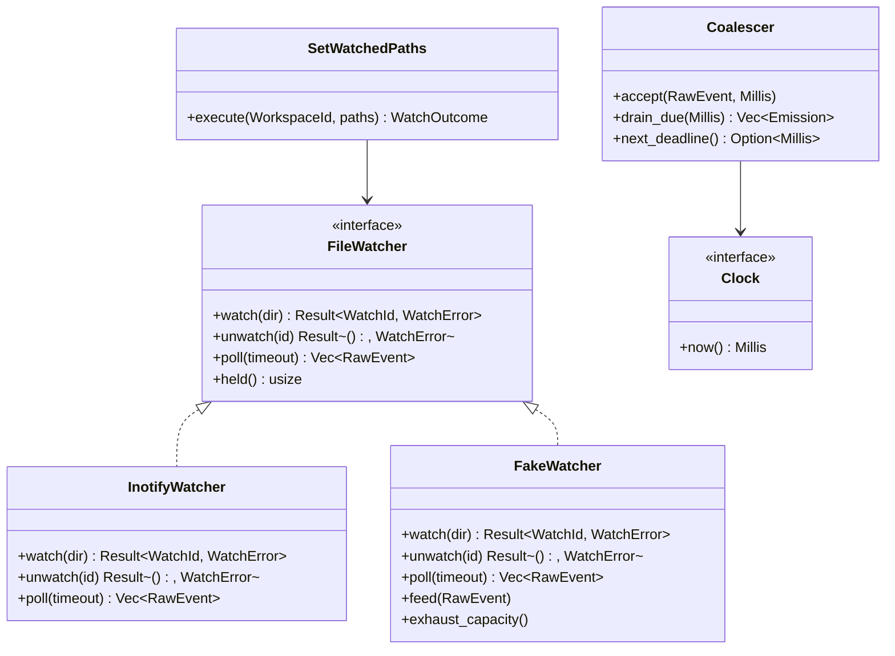
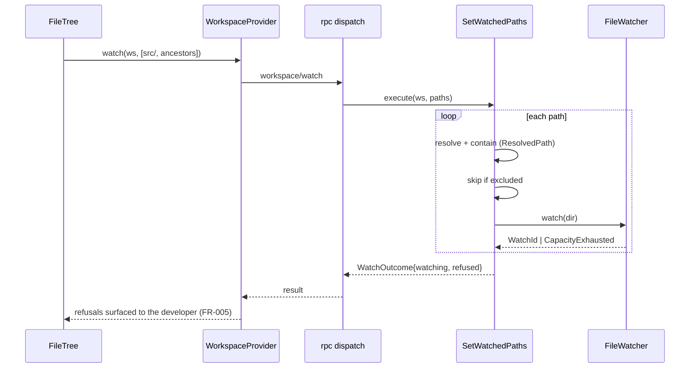
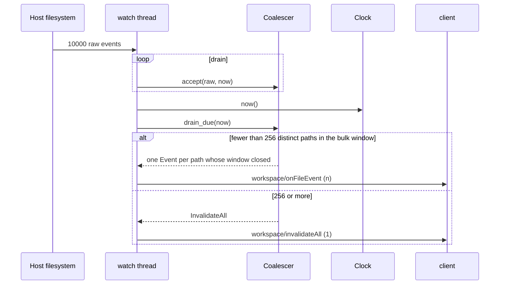
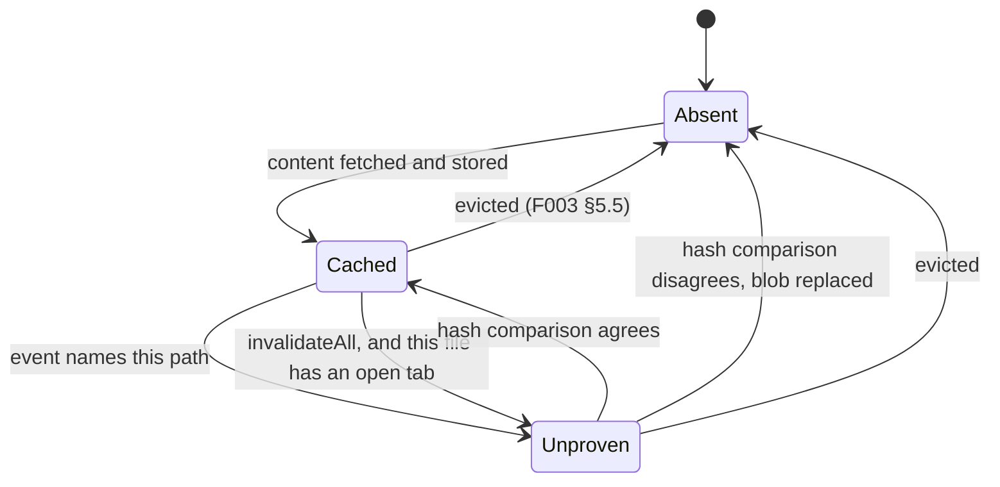
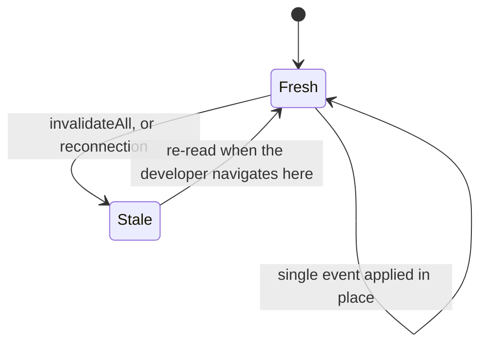

# Design: File Watch Sync

**Branch**: `feature/F004-file-watch-sync` | **Date**: 2026-09-24 | **Plan**: [plan.md](./plan.md)

**Input**: Implementation plan from `/specs/006-file-watch-sync/plan.md` and system shape from
`/specs/006-file-watch-sync/architecture.md`

Signatures only. Rust MSRV **1.75**; the engine is synchronous and adds no runtime, the client
keeps the `async_trait` shape F003 established for `WorkspaceProvider`.

## Module & File Layout

```text
protocol/src/
└── wire.rs                              # WatchParams, WatchResult, Refusal, FileEventParams

engine/src/
├── domain/
│   ├── path.rs                          # existing: ResolvedPath, unchanged
│   └── watch.rs                         # WatchId, Watch, WatchSet, RawEvent, FileEvent, EventKind
├── application/
│   ├── ports/
│   │   ├── file_watcher.rs              # FileWatcher, WatchError
│   │   └── clock.rs                     # Clock, Millis
│   ├── coalescer.rs                     # Coalescer, Emission — pure, no I/O, no threads
│   ├── exclusions.rs                    # ExclusionSet, resolved once at registration
│   └── use_cases/
│       └── watch.rs                     # SetWatchedPaths, ReleaseWatches, WatchOutcome
└── adapters/
    ├── inbound/rpc.rs                   # + workspace/watch, unwatch; encode_notification
    │                                    #   generalised off RestartNotice
    └── outbound/
        ├── frame_writer.rs              # NEW seam: sole owner of stdout, per frame
        ├── inotify_watcher.rs           # the ONLY file naming inotify
        └── watch_thread.rs              # owns the descriptor and the coalescer

client/core/src/
├── application/
│   ├── ports/
│   │   ├── workspace_provider.rs        # watch/unwatch replace the F004 Unsupported stub
│   │   └── workspace_cache.rs           # + mark_stale, mark_unproven, rename_subtree
│   └── use_cases/
│       └── apply_file_event.rs          # ApplyFileEvent — containment first, then projection
└── adapters/
    ├── inbound/file_event_notification.rs
    └── outbound/
        ├── sqlite/{schema.rs,migrate.rs}    # V2: files.stale, file_contents.unproven
        ├── remote_workspace.rs              # watch/unwatch over the transport
        └── local_workspace.rs               # returns Unsupported (A-WATCHLOCAL)
```

This matches plan.md's Structure Decision. The rule it encodes: `inotify_watcher.rs` is the only
file that may name `inotify`, and `coalescer.rs` may name neither a filesystem nor a thread.

## Class & Interface Model



| Type | Kind | Responsibility |
|------|------|----------------|
| `FileWatcher` | trait (port) | Observe directories; yield raw events; surface capacity exhaustion as a value |
| `InotifyWatcher` | struct (adapter) | The one implementation that touches the kernel |
| `FakeWatcher` | struct (test adapter) | Feed events and exhaust capacity on demand, with no filesystem |
| `Clock` | trait (port) | Monotonic milliseconds, so the coalescer never reads time itself |
| `Coalescer` | struct (pure) | Per-path collapsing, rename pairing, the bulk rule |
| `WatchSet` | struct (domain) | The watched directories for one workspace; idempotent insert and remove |
| `SetWatchedPaths` | struct (use case) | Resolve, contain, reconcile, report refusals |
| `ApplyFileEvent` | struct (use case, client) | Re-validate containment, then correct the projection |

## Interface Contracts

Full request and response shapes live in [contracts/](./contracts/). These are the in-process
signatures.

```text
rust — engine ports

trait FileWatcher {
    fn watch(&mut self, dir: &ResolvedPath) -> Result<WatchId, WatchError>
        precondition:  dir is contained in the workspace root and is a directory
        postcondition: events for dir's immediate children are yielded by poll
        raises:        WatchError::CapacityExhausted, NotADirectory, Gone

    fn unwatch(&mut self, id: WatchId) -> Result<(), WatchError>
        postcondition: no further events are yielded for that watch; unwatching twice is Ok

    fn poll(&mut self, timeout: Millis) -> Vec<RawEvent>
        postcondition: returns whatever arrived within timeout, possibly empty; never blocks
                       longer than timeout; yields RawKind::Overflow when the kernel dropped
                       events, rather than hiding the loss

    fn held(&self) -> usize
        postcondition: the number of host watch descriptors currently held
        note:          what SC-009/009a/009b assert against, so the count never has to be read
                       from /proc. NOT the size of the requested set — the two differ by
                       ancestors and the root
}

trait Clock {
    fn now(&self) -> Millis
        postcondition: monotonic non-decreasing
}
```

```text
rust — the coalescer, pure

fn accept(&mut self, raw: RawEvent, now: Millis)
    postcondition: raw is absorbed; no I/O occurs; no event is emitted here

fn drain_due(&mut self, now: Millis) -> Emission
    postcondition: Batch(events) holds at most one event per path whose window closed at or
                   before now, and the writer sends it as ONE frame; or InvalidateAll when
                   the bulk rule fired or the kernel queue overflowed, and then no per-path
                   event for the same window
    invariant:     for any path p and any interval of length T, the number of Events
                   emitted for p is at most T / window + 1   (FR-012, SC-007)

fn next_deadline(&self) -> Option<Millis>
    postcondition: the earliest time at which drain_due could emit; None when nothing pends
```

`next_deadline` is what lets the watch thread stay trivial: it polls for exactly as long as the
coalescer says nothing can be due, so timing lives in the pure component and the thread owns no
policy.

```text
rust — engine use case

fn execute(&mut self, ws: &WorkspaceId, paths: &[RelPath]) -> WatchOutcome
    precondition:  ws is registered
    postcondition: every contained, non-excluded path in paths is watched; the call is
                   idempotent; refusals are returned, never raised
    raises:        nothing — capacity exhaustion is data (FR-005a)
```

```text
rust — client, replacing the stub F003 left

async fn watch(&self, ws: &WorkspaceId, paths: &[RelPath]) -> ProviderResult<WatchOutcome>
async fn unwatch(&self, ws: &WorkspaceId, paths: &[RelPath]) -> ProviderResult<WatchOutcome>
```

`paths` carries **what the client cares about**, not what the engine will watch: folder paths for
expanded folders and **file** paths for open tabs. The engine derives the directories. This is the
correction Phase 1 forced — a directory-only set cannot distinguish a collapse from a tab close, so
collapsing a folder would stop reporting a file still open inside it (FR-003c, FR-004, SC-009b).

The existing stub is `watch(&self, _ws: &WorkspaceId, _path: &RelPath)` — one path. It becomes a
slice. §6.1 declared a third shape again — `watch(path) -> WatchHandle`, called normative, with
`WatchHandle` defined nowhere in the codebase. All three are now one: §6.1 was amended alongside
§4.8, and set semantics replace the handle because they are what make reconnection idempotent.

```text
rust — client cache port additions

fn mark_stale(&self, ws: &WorkspaceId, region: &RelPath) -> CacheResult<()>
fn mark_unproven(&self, ws: &WorkspaceId, path: &RelPath) -> CacheResult<()>
fn rename_subtree(&self, ws: &WorkspaceId, from: &RelPath, to: &RelPath) -> CacheResult<usize>
    precondition:  from and to are contained; from names a row that exists
    postcondition: the row at from and every row beneath from/ is rewritten, in ONE
                   transaction; returns the number of rows rewritten
    invariant:     a sibling whose path merely shares a prefix with from is untouched
```

That last invariant is the design's sharpest edge: `LIKE 'src%'` also matches `src-generated`.
The match is the exact row plus `LIKE 'src/%'`, and the returned count is what a test asserts
against so the boundary cannot silently loosen.

## Sequence Diagrams

Establishing a watch when a folder is expanded:



A burst arriving, and the bulk rule firing:



Applying an event that names a cached file:

```mermaid
sequenceDiagram
    participant N as notification adapter
    participant A as ApplyFileEvent
    participant Ca as WorkspaceCache

    N->>A: apply(ws, FileEvent)
    A->>A: contain(path) — independently of the engine (FR-014)
    alt path escapes the root
        A-->>N: refused, nothing written
    else contained
        A->>Ca: mark_unproven(path)
        Note over A,Ca: never marks valid; never fetches; never discards (FR-019, FR-020)
    end
```

## State Model

A cache entry, as events act on it:



`Unproven` is a flag, not a validity state — the hash still decides both exits (A-UNPROVEN).
While disconnected an `Unproven` entry remains servable, presented as possibly stale (FR-019b).

There are **two** ways in, and the second is easy to miss. A wholesale invalidation discards the
individual events (FR-015), so a branch switch that rewrote an open file would report nothing
about it while FR-023 admits no exception for how a change arrived. The client resolves it from
its own tab list rather than the engine exempting open tabs from the bulk rule (FR-023b,
research.md, *An open tab during a wholesale invalidation*). Marking a file with no open tab is
**not** one of the ways in: FR-024 and FR-018 both forbid it, and the tree going stale is what
covers those.

A tree region:



Nothing transitions out of `Stale` without the developer navigating, which is FR-017 and FR-026a:
re-query is lazy, and a burst of listings at the moment a link has just proved unreliable is the
worst time to issue one.

## Error Handling & Validation

| Condition | Behavior | Surfaced where |
|-----------|----------|----------------|
| Watched path escapes the workspace root | Refuse the path, keep the rest of the call | `refused[]`, and `-32002` only if every path is refused |
| Host watch capacity exhausted | Watch what fits, refuse the remainder; the workspace stays browsable | `refused[]` → the developer is told which freshness was lost (FR-005, FR-005a) |
| Watch requested on an excluded path | Silently not watched, reported as refused with an `excluded` reason | `refused[]` — silence here would look like a working watch (FR-008) |
| Workspace not registered | The call fails | `-32001`; the client re-registers, which is also the engine-restart path |
| Workspace root deleted while watched | Watching stops; the projection must stop presenting itself as live | `-32009`, distinct from `-32001` by design |
| Event arrives for a path outside the root | Client discards it and writes nothing | Client-side containment, independent of the engine (FR-014, Principle VI) |
| Event arrives for a path never fetched | Nothing to update; no fetch is triggered | No-op by design (FR-020) |
| Rename halves never pair within the window | Classified as a delete and a create | Correct, not degraded: a file moved out of the workspace is a deletion here |
| Subtree rename fails partway | Transaction rolls back; the projection stays consistent and stale rather than half-renamed | `CacheError`, and the region is marked stale |
| A wholesale invalidation arrives with files open | Mark those files' content unproven from the client's own tab list; discard no blob; fetch nothing | The tab, on next use — the hash settles it (FR-023b, SC-004a) |
| Kernel event queue overflows | Deliver `invalidateAll` | The route §10.4 already defines; the client's correct response is identical (A-COALESCE) |
| A watched folder was deleted while disconnected | Refuse that path with `not_found`; establish the rest | `refused[]`. `-32003` would fail the whole re-establishment call and leave everything unwatched — FR-025's failure by the route FR-026b exists to close |
| Local mode watch requested | `Unsupported` | FR-027's degradation path: browsing continues, the loss is stated (A-WATCHLOCAL) |

## Persistence Mapping

Field-level definitions live in [data-model.md](./data-model.md); this table says only who owns
what.

| Entity (see [data-model.md](./data-model.md)) | Owning type | Notes |
|-----------------------------------------------|-------------|-------|
| `Watch`, `WatchSet` | `WatchSet` in `engine/src/domain/watch.rs` | In memory; dies with the engine, like the workspace registry |
| `ExclusionSet` | the registered workspace in the engine | One per workspace, resolved at `workspace/register`; shared by construction with the future indexer (A-IGNORE) |
| `RawEvent` | `FileWatcher` port | Never persisted; consumed by the coalescer |
| `FileEvent` | `Coalescer` | Never persisted; serialised to the wire and discarded |
| `Staleness` | `files.stale` via the SQLite adapter | Schema V2 |
| `UnprovenContent` | `file_contents.unproven` via the SQLite adapter | Schema V2; beside `Validity`, never inside it |
| `OpenTab` | the webview's tab state | Not persisted by this feature; the client derives the watch set from it |
