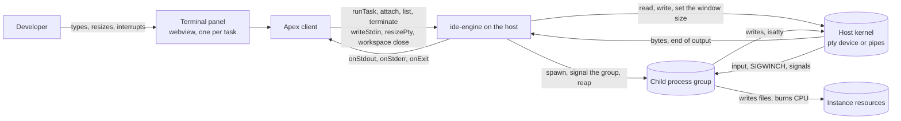
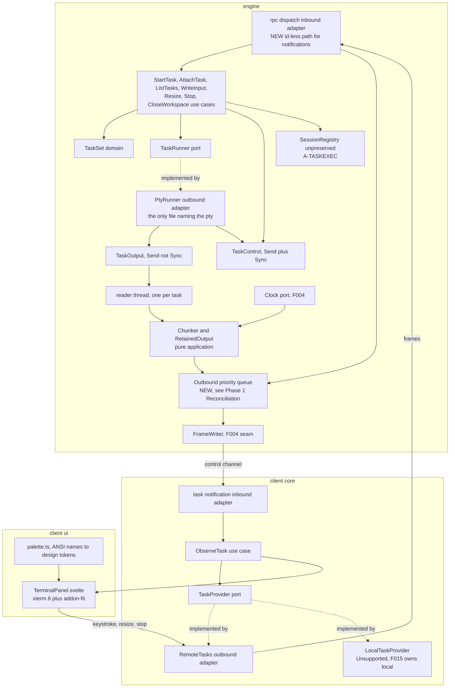
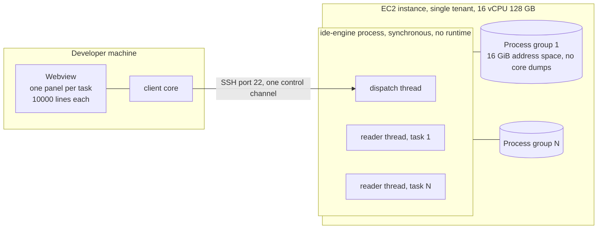
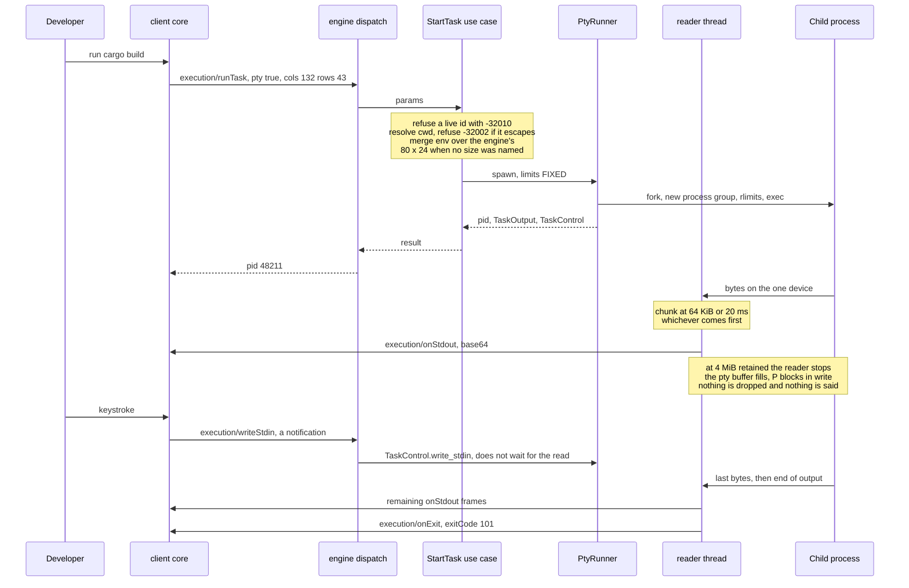

# Architecture: Execution Terminals

**Branch**: `feature/F010-execution-terminals` | **Date**: 2026-09-24 | **Plan**: [plan.md](./plan.md)

**Input**: Implementation plan from `/specs/007-execution-terminals/plan.md`

## Architectural Overview

F010 adds one producer and one controller, and keeps them apart. On the host a **reader thread per
task** owns that task's descriptor and feeds a **pure chunker** that decides what reaches the wire —
64 KiB of raw bytes or 20 ms, whichever comes first (plan.md, *Fixed Quantities*) — while the other
half of the same task, `TaskControl`, is `Send + Sync` behind an `Arc` and is held by the dispatch
thread, so a keystroke, a resize or a stop never waits behind a read that is blocked because the
process has nothing to say (runner-port.md, T12). The engine owns a task for the **task's** lifetime
rather than the connection's (A-TASKLIFE), which is what makes the retained-output buffer and the
reattachment path one mechanism instead of two.

The idea a reader most needs to hold is that **the thing which slows a runaway build is the absence
of a mechanism**. At 4 MiB retained the reader stops reading, the pseudo-terminal's kernel buffer
fills, and the process blocks in its next `write`, exactly as any program writing to a terminal
nobody reads (research.md, *Backpressure comes for free*; FR-013, SC-021). Nothing drops, nothing is
marked, nothing is announced — so there is no drop path to get wrong and no gap notification to
render.

The second idea is confinement. The pseudo-terminal is named in exactly one file,
`engine/src/adapters/outbound/pty_runner.rs`, guarded by `engine/tests/pty_confinement.rs`;
everything that decides anything — chunking, ordering, retention, whose identity is live, what an
attachment is still owed — is pure application code tested against an in-memory runner with no
process at all (Principle VIII, research.md, *Confining the mechanism*).

## System Context



**The child process is outside the boundary and outlives the frame that started it.** It is not a
component this feature owns; it is a third party the engine holds a handle to, running as the
developer's own user with no escalation (FR-005, A-SEC, A-EC2) on a single-tenant instance. Three
consequences shape everything below: it can be told it is attached to a terminal only by being given
one device (A-TASKSTREAM); it can be slowed only by not being read; and it survives the control
channel breaking (FR-031, SC-018), which is why the engine and not the connection is its owner.

The host kernel is the second external system, and it is the one that holds state this architecture
deliberately does not copy: the terminal's current size lives in the pty's `winsize` and nowhere
else (data-model.md, `Task`).

## Component Architecture



| Component | Responsibility | Entities owned |
|-----------|----------------|----------------|
| `rpc::dispatch` (engine inbound adapter) | Route the seven `execution/*` rows and `workspace/close`; **reach the method match for a frame with no `id`**, which it cannot do today | none |
| `StartTask` / `AttachTask` / `ListTasks` / `WriteInput` / `Resize` / `Stop` / `CloseWorkspace` (engine use cases) | Refuse a live identity (`-32010`), resolve and contain `cwd`, merge the environment, choose 80 x 24 when the client named no size, time the `SIGTERM`-to-`SIGKILL` escalation, release a delivered identity | `TaskSet` |
| `TaskSet` (engine domain) | The engine's live tasks, keyed engine-wide rather than per workspace; start, get, release, list, drain per workspace, drain all | `Task`, `TaskId` |
| `TaskRunner` (engine port) | Spawning a process as a **capability**, yielding a pid and the two halves of it | `ResourceLimits` |
| `PtyRunner` (engine outbound adapter) | The only code naming a pseudo-terminal; the pty pair or three pipes, the fork and exec, the process group, the limits between them, `waitpid` and its cached status | none |
| `TaskOutput` / `TaskControl` (port halves) | Reading, owned by one thread; writing, resizing, signalling the **group** and reaping, shared with dispatch | none |
| reader thread, one per task (`task_threads.rs`) | Block on one descriptor with the chunker's remaining time as its timeout; hand bytes up; stop reading at the bound | none |
| Chunker and retention (`application/output.rs`, pure) | The 64 KiB and 20 ms bounds, per-task ordering, the 4 MiB retention bound, the decision to stop reading, and what an attachment is still owed | `OutputChunk`, `RetainedOutput`, `ExitStatus` |
| `Clock` (engine port, F004's) | Time, so the time bound is driven by `advance` and never by the wall clock | none |
| Outbound priority queue (engine, **new**) | Two classes on the engine's outbound path, interactive ahead of task output, so §4.6 holds in the direction F010 floods | none |
| `FrameWriter` (engine, F004's) | One frame under the lock, then release | none |
| `SessionRegistry` (engine) | Carries F010's terminated task identities in `unpreserved` across a re-execution | none |
| `ObserveTask` (client use case) | Chunk to panel, exit to panel, and what a reconnection is told (FR-032) | none |
| `TaskProvider` (client port) | start, attach, list, write, resize, stop — one seam, two adapters | none |
| `RemoteTasks` / `LocalTaskProvider` (client adapters) | The methods over the transport; and `Unsupported` for every one of them in local mode | none |
| `TerminalPanel.svelte` + `palette.ts` (inbound adapters) | Render ANSI into a cell grid, 10 000 lines of scrollback, every colour a design-system token | none |

Three placements are worth naming because they look like adapter work and are not. **Backpressure is
not behind the port**: the port offers a read and the application declines to call it. **The
retention bound is not behind the port**: the port has no memory of what it already handed over.
**Path containment is not behind the port**: `SpawnRequest` carries a `&ResolvedPath`, whose only
public constructor is `resolve`, so the port cannot be given a working directory nobody checked
(§4.7, FR-003, Principle VI).

One placement is new to this architecture and is not in the Phase 1 artefacts. **`TaskControl`
handles are held outside the `TaskSet` map.** The port splits reading from control precisely so a
keystroke never waits behind a read (T12, T13) — but if the reader thread must take one map-wide
mutex to append each chunk to its task's `RetainedOutput`, and `writeStdin` must take the same mutex
to find that task's `TaskControl`, the split is undone by the container and a keystroke waits again.
A 50 MiB build takes that lock roughly 800 times and an idle shell every 20 ms. The architecture
therefore keeps per-task mutable state behind per-task locks and the control handles reachable
without the map lock; F004's `Mutex<HashMap<..>>` in `watchers.rs` is the precedent for the shape and
not for the granularity, because F004's watch thread never takes it.

## Deployment Topology



F004 added no runtime unit. **F010 adds one per task**, and it is the first runtime unit in this
system that is neither the client nor the engine: a process group on the instance, outside the
engine's process, bounded per process rather than per tree (A-TASKLIMIT). Its boundaries are
lifetimes rather than networks, and they are not the same as anything else's:

- It **survives** the control channel breaking (FR-031, A-TASKLIFE, SC-018), which is the whole
  point, and survives the client restarting (FR-031d, SC-023).
- It **does not survive** `workspace/close` (FR-024, SC-013), the engine exiting (FR-025), or an
  engine re-execution, which terminates it first and names it in `session/onRestart`'s `unpreserved`
  (A-TASKEXEC, §15.3).
- It **does survive an engine crash, unreachable** — still running, still in its own process group,
  reachable by pid and by nothing the protocol exposes. §15.2 states this rather than claiming
  recovery, and `execution/list` does not close it: enumeration reports what the engine holds, and
  after a crash the engine holds nothing.

There is no new network boundary, no new port, no new process on the developer's machine, and
nothing persisted anywhere: every entity in data-model.md is engine memory and dies with the engine
(plan.md, Storage). The client's SQLite projection stays at v2.

## Data Flow

Starting a task, streaming it, and slowing it (US1, US4; FR-007, FR-011, FR-012, FR-013, FR-022).



The `Note` on the reader thread is the architecture. Everything that decides what reaches the one
pipe happens before the pipe, because §4.6 makes it one queue and F010 is the largest producer it
will ever carry. The second `Note` is the whole of FR-013: the mechanism is that there is none.

Coming back to a task that kept running (US5; FR-031b, FR-032, SC-019, SC-020).

```mermaid
sequenceDiagram
    participant D as Developer
    participant C as client core
    participant E as engine dispatch
    participant S as TaskSet
    participant T as reader thread

    Note over C,E: the connection drops. The task is untouched:<br/>attached goes false and nothing else changes
    Note over T: the task keeps running and keeps retaining,<br/>under the same 4 MiB bound and the same slowing
    C->>E: auth/handshake, workspace/register, workspace/watch
    C->>E: execution/list, only if the identities were lost
    E-->>C: tasks[] with taskId, workspaceId, command, pty, pid, running
    C->>E: execution/attach per remembered taskId
    E->>S: look up by id; refuse -32001 if the workspace does not own it
    S-->>E: pid, running, retained byte count, exitCode or signal if it ended
    E-->>C: the response first
    T->>C: everything retained, in order, each chunk on its own stream's method
    T->>C: then anything produced since
    T->>C: then execution/onExit, if it ended while nobody was watching
    C->>E: execution/resizePty, the panel's dimensions, which attach never sets
    Note over C,D: the developer is told what survived and what was missed,<br/>from the response rather than from a panel that resumed
```

## Cross-Cutting Concerns

| Concern | Approach |
|---------|----------|
| Authentication / authorization | N/A — SSH access is the authorization (A-SEC), a task runs as the developer's own user with no escalation on a single-tenant instance (FR-005, A-EC2), and F010 adds no new entry point beyond seven methods on the existing authenticated session. What it does add is **containment**, not authorization: `cwd` is resolved and proven a descendant of the workspace root by the engine independently of the client, refused with `-32002` for the whole call (FR-003, §4.7, Principle VI), and a `TaskId` off the wire is a map key that never reaches a path, a command line or an `exec` |
| Error handling | Requests fail wholly and distinguishably: `-32010` a live identity, `-32011` a command that could not be started, `-32006` no live identity, `-32001` an unregistered or non-owning workspace, `-32002` an escaping `cwd`, `-32009` a vanished root. Every `SpawnFailure` becomes `-32011` with `data.reason` and **never** the environment (FR-005a, SC-025, T10). Notifications report nothing at all: `writeStdin` and `resizePty` to an unknown, exited or non-pty task are dropped silently, which is the only thing a notification can do and is stated so the silence is a known property. Backpressure is not an error and has no frame |
| Observability | `TaskId` is the correlation handle, because the one field that must never be logged is `env` — `Debug` elides it, A-OBS's crash reporter redacts, and `RLIMIT_CORE` = 0 leaves no dump to read it from (FR-005a, SC-025, invariant 22). The measurement obligations **are** the observability and are printed rather than asserted (A-NFR): interactive latency through a 50 MiB burst (SC-006), panel memory against the 10 000-line bound (SC-024), and the 2 s to a denied allocation at 16 GiB (SC-026). Local logs only |
| Configuration | None new, and deliberately none per task. Every quantity is a compile-time constant from plan.md's *Fixed Quantities* — `ResourceLimits::FIXED` is identical for every task and §4.8 offers no parameter that could vary it (FR-006b). The only value read from the environment is the developer's shell, `$SHELL` falling back to `/bin/sh` and not a login shell, and the engine's own environment, which a task inherits with the caller's `env` applied over it |

## Architectural Decisions

| Decision | Recorded in |
|----------|-------------|
| `execution/attach` is a separate call from `runTask`, never an idempotent start | research.md, *Attaching to a task that is already running* |
| `pty` chooses one of two exclusive output shapes; `pty: true` merges the streams | research.md, *What the `pty` parameter means, and what it costs* |
| `nix` in the engine, with the `term`, `process`, `resource` and `signal` features only | research.md, *The pseudo-terminal mechanism* |
| One reader thread per task, no async runtime added | research.md, *A thread per task* |
| Chunking on a size bound and a time bound, both pure and clock-driven | research.md, *Chunking, ordering, and what is pure* |
| At the retention bound the reader stops reading and nothing else is done | research.md, *Backpressure comes for free* |
| The client's local provider returns `Unsupported` for every task method | research.md, *Local mode is F015's* |
| The pseudo-terminal is named in one file, enforced by a confinement test | research.md, *Confining the mechanism* |
| A running task outlives the connection that started it | Appendix A, **A-TASKLIFE** |
| Tasks are bounded per process, not per tree, until a supervisor exists | Appendix A, **A-TASKLIMIT** |
| A terminal is one device, so separating the streams costs the terminal | Appendix A, **A-TASKSTREAM** |
| An engine re-execution terminates every task and names it in `unpreserved` | Appendix A, **A-TASKEXEC** |

## Phase 1 Reconciliation

This architecture was authored after `data-model.md` and `contracts/`, and checking it against them
found nine disagreements. Two would compile and fail an acceptance criterion; one is a mechanism
three documents assume exists and no code provides. None was absorbed silently.

| Conflict with data-model.md or contracts/ | Action taken |
|-------------------------------------------|--------------|
| **A signal is a name on the wire, and `data-model.md`'s wire types make it an integer.** §4.8 states it — "the signal's **name** ... not its number" — and both contracts type it `string, signal name`. `data-model.md`'s *The types* block declares `AttachResult::signal`, `TaskSummary::signal` and `ExitParams::signal` as `Option<i32>`, and leaves `TerminateParams { signal: ??? } // UNRESOLVED`, calling the encoding "the last undetermined field" | **Architecture follows §4.8 and the contracts: a name.** `data-model.md` is flagged for correction in four places; it is now describing a question the catalogue closed. An implementer following its wire block emits `{"signal": 15}` against every contract example's `{"signal":"SIGTERM"}` — it compiles, and every signal-death criterion fails |
| **`Exit::Signal(TaskSignal)` cannot carry the signal that actually killed a task.** `runner-port.md` closes `TaskSignal` at `Int`, `Term`, `Kill` and has `reap` report `Exit::Signal` for a signal death (T9). A task killed by `SIGSEGV`, `SIGPIPE` or the out-of-memory killer has no variant, and FR-020 requires "the signal that killed it" | **Architecture separates two vocabularies that the port conflated.** The **outbound** set is closed at three — what a client may ask `terminate` to send, which task-methods.md refuses otherwise with `-32602`. The **inbound** set is open: whatever the kernel delivered, named for the wire. `runner-port.md` is flagged; `data-model.md`'s `Signalled { signal: i32 }` holds the value but cannot produce the name, so both halves need the same edit |
| **The default terminal size is 80 x 24, and both contracts still say nobody chose one.** plan.md's *Fixed Quantities* fixes it and §4.8 states it. `runner-port.md`'s `Shape::Pty` doc comment instructs the use case to "pass zero" because "neither §4.8 nor plan.md's *Fixed Quantities* fixes a fallback"; `task-methods.md` keeps the 0 x 0 reading in four places — `runTask` guarantee 7's second paragraph, `resizePty` guarantee 4, the `runTask` worked example and the may/may-not-infer table — while one line of guarantee 7 and *What was open here* say 80 x 24 | **Architecture applies 80 x 24 in the use case**, so the port still invents nothing and the rule stays where FR-006b wants it. Both contracts flagged. The contradiction is internal to `task-methods.md`, which now states both outcomes for the same input, and 0 x 0 is the one value `resizePty` is specified to refuse |
| **The engine has no outbound priority queue, and `task-events.md` guarantee 10 asserts one.** §4.6 requires priority queueing and A-PRI implements it — in the **client**, in `client/core/src/adapters/outbound/openssh/sendq.rs`, two classes with the class as a parameter of the send call. The engine's only writer is `FrameWriter`, a `Mutex<Box<dyn Write + Send>>` that writes and flushes with the lock held and has no classes at all. plan.md's Structure Decision adds `task_threads.rs` writing **through** that writer and lists no change to it | **Architecture adds the two-class queue to the engine's outbound path**, mirroring A-PRI's client-side shape, and names it as a component. This is the mechanism FR-012 and SC-006 measure and it does not exist in the direction F010 floods: a mutex is FIFO by acquisition, a 50 MiB burst acquires it roughly 800 times, and a blocked `stdout` write holds it for the duration. The plan's Principle V row treats F004's seam as sufficient; it is necessary and not sufficient |
| **The reader thread and the dispatch thread contend on one map, undoing the port's split.** `runner-port.md` justifies `TaskOutput` being `Send` and not `Sync` and `TaskControl` being `Send + Sync` precisely so a keystroke never waits behind a read (T12) and a close reaches a blocked task immediately (T13). `data-model.md` then holds every `Task` — including its `RetainedOutput`, which the reader thread appends to per chunk — in one `BTreeMap` inside `TaskSet`, and neither document says where the lock is | **Architecture places the locks**: per-task state behind per-task locks, and `TaskControl` handles reachable without the map lock. Recorded rather than deferred, because a single map-wide mutex satisfies both documents as written and defeats T12 and T13 in the same line of code — and SC-006 would measure the result |
| **`data-model.md`'s *Quantities the plan fixes* table is two rows short of plan.md's.** It omits **Default terminal size** (80 x 24) and **File size** (not limited) | **plan.md is the source and the architecture takes it.** `data-model.md` flagged. The first omission is not incidental: it is why `data-model.md` can still say the window size lives only in the kernel with nothing choosing the absent case, which is the conflict above |
| **`execution/list` is unpaged and can exceed the frame cap; neither error table admits it.** §4.8 states the arithmetic and accepts it — "a large enough set would exceed §4.1's frame cap and answer `-32007` against the engine's own listing". `task-methods.md`'s `execution/list` errors are `-32001`, `-32601`, `-32602`; `data-model.md`'s error table does not carry it either | **Architecture records `execution/list` as the one engine-originated result whose size is unbounded by construction.** Both artefacts flagged to add `-32007`. Accepted rather than paged, on §4.8's grounds that the realistic count is tens — but a failure mode a client can meet is one its contract should name |
| **`attached: bool` against "each attachment".** `data-model.md` models one boolean, says multiplicity is undetermined, and calls the boolean "the honest minimum". `task-methods.md` guarantee 7 says "the engine tracks what an attachment has been sent", and `task-events.md` guarantees 8 and 14 are phrased per attachment | **Architecture states one attachment per task** and expresses "what has been sent" as the FIFO drain rather than as per-attachment bookkeeping, which is what the single `RetainedOutput` already implements. Under one viewer the two readings coincide; the contract's phrasing is recorded so it is not later read as a requirement for per-attachment state nothing builds |
| **Two questions `data-model.md` presents as open are closed upstream.** Its *Replay on reattachment* paragraph and its note under invariant 14 record §4.8 as disagreeing with SC-028; §4.8 now says each chunk is replayed "on the notification its own stream would have used when live". Its `AttachParams::workspace_id` paragraph declines to choose between three answers for a mismatch; §4.8 and `task-methods.md` both now refuse it with `-32001`. `task-methods.md`'s `attach` guarantee 3 still quotes the superseded §4.8 sentence | **No architectural change** — invariant 14 and `-32001` are what this architecture implements. Recorded as staleness rather than conflict, because a document that says a question is open invites somebody to answer it a second time and differently |

The pattern is the one F004 named, arriving from the other direction. Every conflict above was found
by checking the Phase 1 artefacts against the **amended** system specification and the **real code**,
rather than against each other. Four of them — the integer signal, the closed `TaskSignal`, the
0 x 0 terminal and the map-wide lock — would have compiled. The fifth, the missing priority queue,
would have compiled, passed every functional criterion, and failed only SC-006, which is the one
criterion the whole architecture exists to satisfy.
