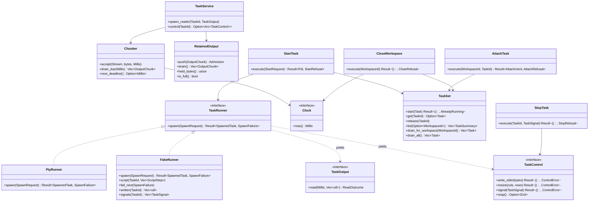
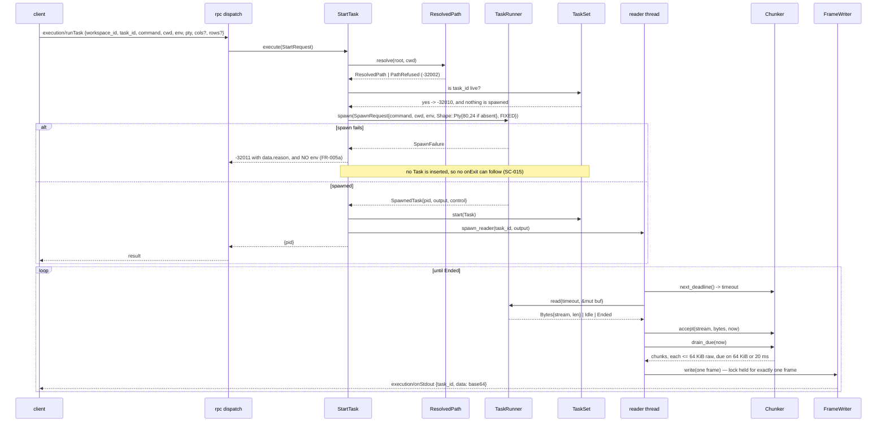
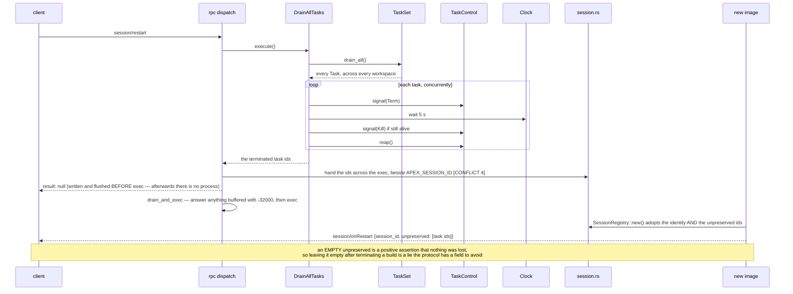
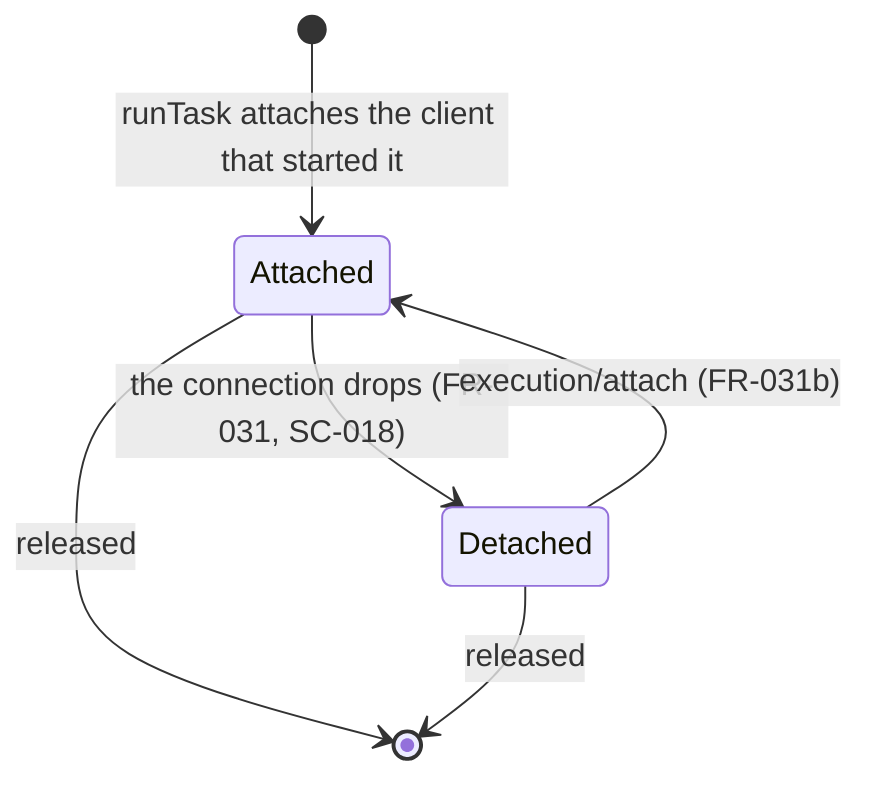

# Design: Execution Terminals

**Branch**: `feature/F010-execution-terminals` | **Date**: 2026-09-24 | **Plan**: [plan.md](./plan.md)

**Input**: Implementation plan from `/specs/007-execution-terminals/plan.md` and system shape from
`/specs/007-execution-terminals/architecture.md`

Signatures only. Rust MSRV **1.75** across `protocol`, `engine` and `client/core`; the engine stays
synchronous and adds no runtime, so **no `async fn` appears in engine code anywhere below**. The
webview is TypeScript 5.x with Svelte 5, and the terminal library is `@xterm/xterm` 6 with
`@xterm/addon-fit` (plan.md, Technical Context — the sole authority for the stack). Every quantity
is plan.md's *Fixed Quantities*; none is chosen here.

Entity fields and validation rules live in [data-model.md](./data-model.md) and are linked, never
restated. Request and response shapes live in [contracts/](./contracts/); the `TaskRunner`
signatures below are [contracts/runner-port.md](./contracts/runner-port.md)'s, matched rather than
redesigned.

Nine places where this design could not satisfy two documents at once are marked **[CONFLICT n]** and
collected at the end of *Error Handling & Validation*. Each states the reading taken and what is
owed to which document.

## Module & File Layout

```text
protocol/src/
└── wire.rs                              # + RunTaskParams/Result, AttachParams/Result,
                                         #   ListParams/Result, TaskSummary, WriteStdinParams,
                                         #   ResizePtyParams, TerminateParams, OutputParams,
                                         #   ExitParams, WorkspaceCloseParams, TaskId,
                                         #   SignalName, TerminateSignal
                                         # + codes::{TASK_NOT_FOUND, TASK_ALREADY_RUNNING,
                                         #   COMMAND_NOT_STARTED}

engine/src/
├── session.rs                           # + the unpreserved hand-off across exec (A-TASKEXEC)
├── domain/
│   ├── path.rs                          # existing: ResolvedPath, CanonicalRoot, unchanged
│   └── task.rs                          # NEW: TaskId, Task, TaskSet, TaskState, ExitStatus,
│                                        #   OutputChunk, OutputStream, RetainedOutput, Pid,
│                                        #   Shape, Stream, TaskSignal, EnvOverrides
├── application/
│   ├── ports/
│   │   ├── clock.rs                     # F004's, WIDENED here: Send + Sync, + sleep_until
│   │   ├── roots.rs                     # + deregister, which workspace/close needs [CONFLICT 6]
│   │   └── task_runner.rs               # NEW: TaskRunner, TaskOutput, TaskControl,
│   │                                    #   SpawnRequest, SpawnedTask, ReadOutcome, Exit,
│   │                                    #   SpawnFailure, ControlError, ResourceLimits
│   ├── output.rs                        # NEW: pure — Chunker, RetainedOutput bound, ordering.
│   │                                    #   Names no descriptor, no thread and no syscall
│   └── use_cases/
│       └── task.rs                      # NEW: StartTask, AttachTask, ListTasks, WriteInput,
│                                        #   ResizeTask, StopTask, CloseWorkspace, DrainAllTasks
└── adapters/
    ├── inbound/rpc.rs                   # + the id-less dispatch path (foundational), the seven
    │                                    #   execution/* arms and workspace/close
    └── outbound/
        ├── frame_writer.rs              # existing (F004): unchanged. F010 is its second
        │                                #   producer and its first real load
        ├── pty_runner.rs                # NEW: the ONLY file naming the pseudo-terminal
        └── task_threads.rs              # NEW: TaskService — one reader thread per task,
                                         #   writing through FrameWriter

engine/tests/
├── pty_confinement.rs                   # NEW: guards the rule, after inotify_confinement.rs
└── common/fake_runner.rs                # NEW: FakeRunner — beside the tests, never in src/

client/core/src/
├── application/
│   ├── ports/task_provider.rs           # NEW: start, attach, list, write, resize, stop, close
│   └── use_cases/observe_task.rs        # NEW: chunk -> panel, exit -> panel
└── adapters/
    ├── inbound/task_notification.rs     # NEW: notification -> use-case input
    └── outbound/
        ├── remote_tasks.rs              # NEW: the methods over the transport
        └── local_tasks.rs               # NEW: Unsupported for every method (F015 owns local)

client/ui/lib/
├── terminal/
│   ├── TerminalPanel.svelte             # NEW: one per task, themed from the prototype
│   ├── palette.ts                       # NEW: ANSI names -> design-system tokens
│   └── terminals.svelte.ts              # NEW: the panel set, keyed by task id (FR-026)
└── ds/layout-tokens.css                 # + --vk-term-* (generated; never hand-edited)

scripts/ds-sync.mjs                      # + the terminal surface: size, line height, padding,
                                         #   cursor, and the three semantic hues [CONFLICT 5]

tests/e2e/
└── terminal.spec.ts                     # NEW: run, type, resize, exit, reattach
```

This matches plan.md's Structure Decision with three additions plan.md's block omits and its prose
or the contracts require: `engine/tests/pty_confinement.rs` (plan.md's Structure Decision names it
in prose; research.md, *Confining the mechanism*), `client/core/.../local_tasks.rs`
(runner-port.md, *What is NOT behind this port* — `LocalTaskProvider` returns `Unsupported`, and
A-WATCHLOCAL's precedent is a file rather than a silence), and
`client/ui/lib/terminal/terminals.svelte.ts` (FR-026 gives each task its own panel and something
must hold the set; `workspace/tree.svelte.ts` is the existing precedent for a rune-backed store).
Note there is **no `src/` level under `client/ui`** — the webview is `client/ui/lib/<area>/`.

The rule this layout encodes, and the one Principle VIII makes non-negotiable: **the
pseudo-terminal is named in exactly one file, `engine/src/adapters/outbound/pty_runner.rs`.**
`output.rs` may name neither a descriptor nor a thread, `task.rs` neither a syscall nor a signal
number, and `task_threads.rs` may name a thread but not a terminal. `pty_confinement.rs` enforces
it the way `inotify_confinement.rs` does — by walking `engine/src` and failing on the forbidden
name anywhere but the permitted file, comments included (data-model.md, Invariant 25).

## Class & Interface Model



| Type | Kind | Responsibility |
|------|------|----------------|
| `TaskRunner` | trait (port) | Start a process as a capability; yield its two halves. Knows nothing of task identity |
| `PtyRunner` | struct (adapter) | The one implementation that names the pseudo-terminal, the process group and the limits |
| `FakeRunner` | struct (test adapter) | Scripted output, settable exits, provokable spawn failures, a recorded stdin buffer and signal log — with no process |
| `TaskOutput` | trait (port half) | The reading half. `Send`, deliberately not `Sync`: one thread owns one descriptor |
| `TaskControl` | trait (port half) | The controlling half. `Send + Sync` behind an `Arc`, so a keystroke never waits behind a read (T12, T13) |
| `Clock` | trait (port) | F004's, **widened** here to `Send + Sync` with `sleep_until` (CONFLICT 8). The chunker's time bound and the escalation thread both read it rather than the wall clock, and the chunker reads it on N reader threads while the stop path reads it on the dispatch thread, which is why `Sync` is required |
| `Chunker` | struct (pure) | The 64 KiB size bound, the 20 ms time bound, and order within one task |
| `RetainedOutput` | struct (pure) | The 4 MiB per-task bound, FIFO, and the ending awaiting delivery |
| `TaskSet` | struct (domain) | The engine's live tasks. Refuses a live id; releases a delivered one |
| `Task` | struct (domain) | One running command and everything needed to reach and end it. Hand-written `Debug` is not enough — see *Persistence Mapping* |
| `StartTask` | struct (use case) | Resolve, contain, refuse a live id, spawn, register, attach the starter |
| `AttachTask` | struct (use case) | Resolve the id, count what is owed, order the replay behind the response |
| `ListTasks` | struct (use case) | A pure read over `TaskSet`. Touches the port zero times |
| `WriteInput`, `ResizeTask` | struct (use case) | The two notification paths. Report nothing, by construction |
| `StopTask` | struct (use case) | Send the named signal to the group, then escalate on the `Clock` |
| `CloseWorkspace` | struct (use case) | Drain the workspace's tasks, stop each, release its watches, deregister |
| `DrainAllTasks` | struct (use case) | Engine exit and re-execution. Produces the `unpreserved` list (A-TASKEXEC) |
| `TaskService` | struct (adapter) | Owns the reader threads and the `Arc<dyn TaskControl>` map. The only thing that joins them |
| `TaskProvider` | trait (client port) | What the client reaches tasks through; `RemoteTasks` and `LocalTasks` implement it |
| `ObserveTask` | struct (client use case) | Chunk to panel, exit to panel, replay boundary counted from `retained` |

## Interface Contracts

Request and response shapes are [contracts/task-methods.md](./contracts/task-methods.md) and
[contracts/task-events.md](./contracts/task-events.md); the port is
[contracts/runner-port.md](./contracts/runner-port.md). These are the in-process signatures.

```text
rust — engine outbound port (runner-port.md, matched verbatim)

trait TaskRunner: Send + Sync {
    fn spawn(&self, request: &SpawnRequest<'_>) -> Result<SpawnedTask, SpawnFailure>
        precondition:  request.cwd is a ResolvedPath, so containment was proven by construction
                       and cannot be skipped at this boundary (T1, §4.7, FR-003)
        postcondition: either a running process in its own process group under
                       ResourceLimits::FIXED, or a SpawnFailure. No third outcome (T2, SC-015)
        raises:        nothing; failure is a value
}

trait TaskOutput: Send {                       // NOT Sync — one thread, one descriptor
    fn read(&mut self, timeout: Millis, out: &mut Vec<u8>) -> ReadOutcome
        postcondition: never blocks longer than timeout (T6); Ended only after every byte the
                       process wrote has been returned (T4, FR-022); bytes are unmodified (T5)
}

trait TaskControl: Send + Sync {                // Arc-shared with the dispatch thread
    fn write_stdin(&self, data: &[u8]) -> Result<(), ControlError>
        postcondition: every byte handed to the kernel, unmodified, in call order (FR-014, SC-007)
    fn resize(&self, cols: u16, rows: u16) -> Result<(), ControlError>
        postcondition: the process observes the new size; Ok and no effect for Shape::Pipes
    fn signal(&self, signal: TaskSignal) -> Result<(), ControlError>
        postcondition: delivered to the process GROUP, not the pid (T8, FR-018; SC-012 counts the direct children, SC-027 arbitrary depth);
                       takes effect while this task's reader is blocked in read (T13)
    fn reap(&self) -> Option<Exit>
        postcondition: non-blocking; idempotent — the status is cached, so every caller after
                       the first still sees Some (T9)
}
```

`SpawnRequest<'a>`, `SpawnedTask`, `ReadOutcome`, `Exit`, `Shape`, `Stream`, `TaskSignal`,
`SpawnFailure`, `ControlError` and `ResourceLimits` are declared in runner-port.md and are not
restated. Two notes bind them to this design: `Shape::Pty { cols, rows }` receives **80 × 24** when
the client omits them, not zero (**[CONFLICT 1]**), and `ResourceLimits::FIXED` is 16 GiB of
address space soft *and* hard with `core_bytes` at 0 — a constant of the build, not a per-task
judgement (FR-006b).

```text
rust — the pure core, engine/src/application/output.rs

fn Chunker::accept(&mut self, stream: Stream, bytes: &[u8], now: Millis)
    postcondition: absorbed; nothing is emitted here, so what is sent is a function of elapsed
                   time and volume rather than of arrival — the shape coalescer.rs established

fn Chunker::drain_due(&mut self, now: Millis) -> Vec<OutputChunk>
    postcondition: every chunk is at most 64 KiB of RAW bytes, and a chunk is due when it
                   reaches that bound or 20 ms have passed with bytes waiting (FR-011, SC-005,
                   SC-001; plan.md Fixed Quantities)
    invariant:     for one task, output order is the order accepted, across chunk boundaries and
                   across streams (FR-010, SC-004)
    invariant:     a chunk carries exactly one Stream; a Pty task yields only Stdout (T3, SC-028)

fn Chunker::next_deadline(&self) -> Option<Millis>
    postcondition: the earliest time drain_due could emit, or None. This is the timeout the
                   reader thread passes to TaskOutput::read, so the thread owns no policy

fn RetainedOutput::push(&mut self, chunk: OutputChunk) -> Admission
    postcondition: Accepted while held bytes are under 4 MiB; AtBound once they reach it, at
                   which point the caller stops reading and NOTHING is dropped (FR-013, FR-013a,
                   SC-021). Identical whether a client is attached (FR-031a)

fn RetainedOutput::drain(&mut self) -> Vec<OutputChunk>
    postcondition: FIFO, and empties. Each chunk keeps its own Stream, so a replay uses the
                   notification that chunk would have used live (data-model.md Invariant 14)

fn RetainedOutput::set_ending(&mut self, exit: ExitStatus)
    postcondition: set once; delivered only after drain has emptied (FR-022, SC-011)
```

`Chunker` and `RetainedOutput` name no descriptor, no thread and no syscall. That is what makes
FR-010, FR-011, FR-013 and SC-005 unit tests against `FakeRunner` and `FakeClock` rather than
integration tests with a build in them (runner-port.md, *The dividing line*).

```text
rust — engine domain, engine/src/domain/task.rs

fn TaskSet::start(&mut self, task: Task) -> Result<(), AlreadyRunning>
    precondition:  the runner has already spawned; no Task exists for a failed spawn (SC-015)
    postcondition: refuses a key already present, and starts no second process (FR-031c, SC-022)
    note:          deliberately NOT idempotent, where WatchSet::acquire is. A second acquire is
                   a client reconciling; a second start would fork a second process

fn TaskSet::list(&self, ws: Option<&WorkspaceId>) -> Vec<TaskSummary>
    postcondition: &self — a listing cannot mutate. Ordered by TaskId for determinism only
                   (task-methods.md, list guarantee 9)

fn TaskSet::drain_for_workspace(&mut self, ws: &WorkspaceId) -> Vec<Task>
fn TaskSet::drain_all(&mut self) -> Vec<Task>
    postcondition: removes and returns; draining twice yields nothing the second time
```

```text
rust — engine use cases, engine/src/application/use_cases/task.rs

fn StartTask::execute(&self, req: &StartRequest<'_>) -> Result<Pid, StartRefusal>
    precondition:  workspace registered; cwd resolved through ResolvedPath::resolve
    postcondition: on success the identity is live, a reader thread owns the output half, and
                   the starting connection is attached (task-events.md guarantee 14)
    raises:        StartRefusal::{NotRegistered, RootGone, PathRefused, NotFound, AlreadyRunning,
                   CouldNotStart(SpawnFailure)} — mapped to codes in Error Handling below

fn AttachTask::execute(&self, ws: &WorkspaceId, id: &TaskId) -> Result<Attachment, AttachRefusal>
    postcondition: Attachment carries {pid, running, retained, ending}; retained is the BYTE
                   COUNT measured at the moment the drain begins, never a high-water mark
    postcondition: the response is written before the first replayed chunk, and the replay
                   precedes anything produced since (FR-031b, SC-019)
    postcondition: no side effect on the process — it does not resize, write or signal
    raises:        AttachRefusal::{NotRegistered, NotThisWorkspace, NoSuchTask} — no RootGone:
                   attaching resolves no root, so a deleted workspace root must not stop a
                   developer watching a task that is still running (task-methods.md, FR-031b)

fn ListTasks::execute(&self, ws: Option<&WorkspaceId>) -> Result<Vec<TaskSummary>, ListRefusal>
    postcondition: a pure read; touches TaskRunner zero times (runner-port.md)

fn WriteInput::execute(&self, id: &TaskId, data: &[u8])
fn ResizeTask::execute(&self, id: &TaskId, cols: u16, rows: u16)
    postcondition: both return nothing. A notification has no response, so an unknown id, an
                   exited task and a success are indistinguishable to the caller (§4.2)
    postcondition: ResizeTask is a no-op for a Shape::Pipes task, and for cols or rows of zero

fn StopTask::execute(&self, id: &TaskId, signal: TaskSignal) -> Result<(), StopRefusal>
    postcondition: sends exactly the named signal FIRST, to the group (FR-017)
    postcondition: Term schedules Kill 5 s later on the Clock; Int does not escalate; Kill has
                   nothing to escalate to (plan.md Fixed Quantities)
    postcondition: succeeds for a task that has already exited (FR-019); the identity is NOT
                   released by this call — release follows delivery of the exit (FR-023)
    raises:        StopRefusal::NoSuchTask only

fn CloseWorkspace::execute(&self, ws: &WorkspaceId) -> Result<(), CloseRefusal>
    postcondition: every task of ws is signalled Term then Kill after 5 s, the escalations run
                   concurrently so the bound is 5 s for the workspace rather than per task, and
                   the response is written after the last of them has ended (close guarantee 3)
    postcondition: the workspace's watches are released and the workspace is deregistered
    raises:        CloseRefusal::NotRegistered — including a second close (close guarantee 8)

fn DrainAllTasks::execute(&self) -> Vec<TaskId>
    postcondition: the same Term-then-Kill escalation, and the returned ids are the input to
                   session/onRestart's unpreserved list (A-TASKEXEC, FR-025) [CONFLICT 4]
```

```text
rust — engine inbound, engine/src/adapters/inbound/rpc.rs

fn dispatch(.., tasks: Option<&TaskService>, codec, body) -> Action
    precondition:  none; body is untrusted
    postcondition: a frame with NO id is routed to the notification arm and acted on, rather
                   than returning Action::Nothing before the method match
    postcondition: a frame with a non-string id is answered, not dropped

fn dispatch_notification(tasks: Option<&TaskService>, method: &str, params: &Value)
    postcondition: returns nothing, ever. execution/writeStdin and execution/resizePty are the
                   catalogue's first client-to-engine notifications; an unknown method here is
                   dropped in silence, because §4.2 leaves nothing else to do
```

**The id-less path is foundational, not story work.** `dispatch` today reads `id` with
`.and_then(|i| i.as_str())` and returns `Action::Nothing` **before** the method match, so no
notification the client sends can be received at all — plan.md records this under *Constraints*.
No task that sends a keystroke can pass until this lands, which makes it the first thing tasks.md
orders. The same line drops a **numeric** id, legal under JSON-RPC 2.0, as though it were a
notification; plan.md notes it and declines to fix it because no client sends one, and this design
follows that. The fix is nonetheless a widening rather than a rewrite: read `id` as `Value`, treat
`None` as a notification and anything else as a request, and the numeric case stops being
misrouted as a side effect.

Adding `tasks` takes `dispatch` to seven parameters, following F004's `watchers: Option<&_>`
precedent exactly. That is one more than is comfortable and the pattern does not extend again: the
next feature that needs a collaborator should introduce a `DispatchContext` rather than an eighth
argument. Recorded here so the choice is visible; changing it now would be F010 refactoring F002's
seam for a reason F010 does not have.

```text
rust — protocol/src/wire.rs, only what data-model.md left unresolved or stated differently

/// The name of a signal, as the wire carries it. Reporting only: a process may be killed by
/// any signal the host defines, including ones this feature never sends (SIGSEGV, SIGHUP, and
/// SIGKILL from the out-of-memory killer). [CONFLICT 3]
pub struct SignalName(pub String);

/// What execution/terminate accepts: a closed vocabulary of three (§4.8, FR-017).
/// Per-variant renames rather than rename_all, because "UPPERCASE" on Int yields "INT".
#[derive(Debug, Clone, Copy, PartialEq, Eq, Serialize, Deserialize)]
pub enum TerminateSignal {
    #[serde(rename = "SIGINT")]  Int,
    #[serde(rename = "SIGTERM")] Term,
    #[serde(rename = "SIGKILL")] Kill,
}

pub struct TerminateParams { pub task_id: TaskId, pub signal: TerminateSignal }

// signal is a NAME on every payload that reports one — onExit, attach, list — not an integer.
// data-model.md's Option<i32> predates §4.8 fixing the encoding. [CONFLICT 2]
pub struct ExitParams  { task_id, exit_code: Option<i32>, signal: Option<SignalName> }
pub struct AttachResult{ pid, running, retained: u64, exit_code: Option<i32>,
                         signal: Option<SignalName> }
pub struct TaskSummary { task_id, workspace_id, command, pty, pid, running,
                         exit_code: Option<i32>, signal: Option<SignalName> }

pub mod codes {
    pub const TASK_NOT_FOUND: i32       = -32006;
    pub const TASK_ALREADY_RUNNING: i32 = -32010;
    pub const COMMAND_NOT_STARTED: i32  = -32011;
}
```

Every other wire type is data-model.md's, unchanged. Three conventions are `wire.rs`'s own and are
followed rather than re-argued: fields are **snake_case with no `rename_all` on any params or
result struct** (`taskId` is `task_id`, `exitCode` is `exit_code`); `#[serde(rename = "type")]`
exists only where a Rust keyword collides, which nothing in F010 does; and **nobody writes the
integer inline** — a literal `-32010` in a match arm is a fact stated twice, so the three constants
above are the only place the numbers appear. `Option` fields that must be **absent** rather than
null carry `#[serde(skip_serializing_if = "Option::is_none")]`, which is what makes §4.8's "exactly
one of the two, never both and never neither" expressible at all.

```text
typescript — client/ui/lib/terminal

interface TerminalPanelProps { taskId: string; pty: boolean; title: string }
function createPanel(el: HTMLElement, opts: PanelOptions): Panel
function ansiTheme(root: HTMLElement): ITheme          // resolved tokens, never var(--…)
function applyChunk(panel: Panel, data: Uint8Array): void
function reportExit(panel: Panel, ending: Ending): void
```

```text
rust — client/core outbound port, client/core/src/application/ports/task_provider.rs

#[async_trait] trait TaskProvider {
    async fn start(&self, req: &StartTaskRequest) -> ProviderResult<Pid>
    async fn attach(&self, ws: &WorkspaceId, id: &TaskId) -> ProviderResult<Attachment>
    async fn list(&self, ws: Option<&WorkspaceId>) -> ProviderResult<Vec<TaskSummary>>
    async fn write_stdin(&self, id: &TaskId, data: &[u8]) -> ProviderResult<()>
    async fn resize(&self, id: &TaskId, cols: u16, rows: u16) -> ProviderResult<()>
    async fn terminate(&self, id: &TaskId, signal: TerminateSignal) -> ProviderResult<()>
    async fn close_workspace(&self, ws: &WorkspaceId) -> ProviderResult<()>
}
```

`#[async_trait]` on the **client** side and nothing async on the engine side is not an
inconsistency: it is `WorkspaceProvider`'s existing shape, chosen because the concrete provider is
selected at runtime and the trait must be `dyn`-compatible. `LocalTasks` returns
`Unsupported(Owner::F015LocalMode)` for all seven, which is a specified degradation rather than a
gap (research.md, *Local mode is F015's*; §13.2 as amended).

### The webview, and which way the theming runs

§8.3 names the library; Principle I names the appearance; **the library is themed to the prototype,
never the reverse**, and `@xterm/xterm`'s default palette is a violation like any other raw value.
Four consequences shape `TerminalPanel.svelte` and `palette.ts`:

1. **The prototype specifies a third font size.** Its terminal dock is JetBrains Mono at
   **12.5px**, line-height **1.6**, padding **2px 12px 12px** — and 12.5px is neither `--vk-fs`
   nor `--vk-code`, both of which are 13.5px. A component that wrote `font-size: 12.5px` would be
   the application asserting a value the prototype owns, which is the exact failure `ds-sync.mjs`
   exists to prevent. So `ds-sync.mjs` gains a terminal surface, anchored structurally on the
   `isTerminal` branch the way every other surface is anchored, emitting `--vk-term-fs`,
   `--vk-term-line-height`, `--vk-term-pad`, `--vk-term-cursor-w`, `--vk-term-cursor-h` and
   `--vk-term-cursor-blink`. Anchoring on structure means a prototype change breaks one anchor
   loudly rather than silently matching an element that shares a number.

   **The three semantic hues need a second anchor, not this one.** Those dimensions genuinely do
   live on the `isTerminal` branch. The hues do not: the prototype declares them once, as
   module-level constants — `const ERR='#d4736a', WARN='#c9a96a', OK='#7fa98f'` — and spends them
   across the diff gutter, the squiggle, the minimap and the VCS counts as well as the terminal
   transcript (`#7fa98f` appears sixteen times, the other two five each). Extracting them from the
   terminal branch would anchor a system-wide value to one of its consumers, so that moving the
   terminal would silently take the diff gutter's green with it. They are extracted from the
   constant declaration, as their own anchor, and the two extractions are separate tasks for that
   reason.
2. **`ITheme` cannot take a `var()`.** xterm resolves colours to a canvas, not to CSS, so
   `palette.ts` reads the tokens off the mounted element with `getComputedStyle` and hands xterm
   resolved strings — and re-reads them when the theme changes, because a cached palette is a panel
   that stops matching the rest of the window. The mapping from ANSI name to token lives in
   `palette.ts` and nowhere else, which is what makes SC-016 checkable by reading one file.
3. **The extracted cursor is the panel's, not xterm's.** The prototype's 7 × 15px block on
   `vkpulse 1.1s steps(1,end) infinite` sits in a 20px line box (12.5 × 1.6), so it is not a cell.
   xterm derives its own cursor from cell metrics and cannot be given a size. The tokens therefore
   govern the panel's **idle prompt** — the accent-coloured `shellPrompt` row the dock shows before
   a task is attached — and xterm is configured `cursorStyle: 'block'`, `cursorBlink: true`, which
   is the same appearance arrived at by the mechanism that owns it.
4. **Scrollback is 10 000 lines per terminal** (plan.md, FR-029a), overriding the library's default
   of 1 000, which is too few to scroll back through a compile — the thing a developer most often
   wants to re-read. At roughly 200 bytes a line that is about 2 MB per terminal, which is what
   SC-024 measures and prints.

`@xterm/addon-fit` computes cols and rows from the element; the panel sends `execution/resizePty`
on every fit, and again after a successful `attach`, because attaching deliberately has no side
effect on the process and a client that forgets leaves the process laying out to the old width
(attach guarantee 9). The dock title switches on mode — `Terminal — build-01.euw1` against
`Terminal — local` — which is the prototype's own behaviour and therefore binding.
`TerminalPanel.svelte` buffers across frames: a chunk boundary may fall mid-character or
mid-escape-sequence and means nothing.

## Sequence Diagrams

Starting a task, and its first output (US1, FR-001, FR-007, SC-001):



A keystroke reaching the process while a build floods the channel (US2, US4, FR-012, FR-014,
SC-006, SC-007):

```mermaid
sequenceDiagram
    participant C as client
    participant D as dispatch thread
    participant Ctl as Arc~TaskControl~
    participant Th as reader thread
    participant W as FrameWriter
    participant Pr as the process

    Note over Th,W: the build is emitting megabytes; Th is inside read, or holding W for one frame
    C->>D: execution/writeStdin {task_id, data} — NO id
    D->>D: id absent -> the notification arm (the path dispatch lacks today)
    D->>Ctl: write_stdin(decoded bytes)
    Note over Ctl,Th: TaskControl is Send + Sync behind an Arc; TaskOutput is owned by Th.<br/>The write never waits for the read to return (T12, T13)
    Ctl->>Pr: bytes, unmodified and in frame order
    par output continues
        Th->>W: write(frame n)
        W-->>C: execution/onStdout
    end
    Note over W: §4.6 is one pipe and one queue. FR-012 is a claim about how long<br/>this lock is held, not about how fast the reader is — SC-006 measures it and prints it
```

Reattaching after a disconnection, with replay before live output (US5, FR-031b, SC-019, SC-020):

```mermaid
sequenceDiagram
    participant C as client
    participant R as rpc dispatch
    participant A as AttachTask
    participant S as TaskSet
    participant Ret as RetainedOutput
    participant Th as reader thread
    participant W as FrameWriter

    Note over S,Th: the connection dropped; attached went false and NOTHING else changed (SC-018)
    C->>R: execution/attach {workspace_id, task_id}
    R->>A: execute(ws, id)
    A->>S: get(id)
    alt absent
        S-->>A: none -> -32006
    else present, owned by another workspace
        S-->>A: mismatch -> -32001, refused rather than serviced (§4.8, Principle VI)
    else present
        A->>Ret: held_bytes()
        Ret-->>A: retained (counted at the drain, not a high-water mark)
        A-->>C: {pid, running, retained, exit_code? | signal?}
        A->>Ret: drain()
        loop each retained chunk, in order
            A->>W: onStdout or onStderr — the method matching THAT chunk's own stream
            W-->>C: replayed frame (indistinguishable from live, deliberately)
        end
        Note over Th,W: the reader resumes BEHIND the drain, never beside it
        Th->>W: live frames
        opt the task had already ended
            A->>W: execution/onExit {exit_code? | signal?}
            A->>S: release(id) — the identity is now free (FR-023)
        end
    end
```

Stopping a task, with escalation (US2 scenario 5, FR-017, FR-018, FR-019, SC-012, SC-027):

```mermaid
sequenceDiagram
    participant C as client
    participant U as StopTask
    participant S as TaskSet
    participant Ctl as TaskControl
    participant K as Clock
    participant G as the process group
    participant W as FrameWriter

    C->>U: execution/terminate {task_id, signal: "SIGTERM"}
    U->>S: get(id)
    alt no live identity
        S-->>U: none -> -32006
    else present (running OR already exited)
        U->>Ctl: signal(Term)
        Ctl->>G: to the GROUP, so compilers go with the build
        U-->>C: result: null
        Note over U,C: the result says the signal was delivered, never that the process died
        U->>K: now() + 5 s
        alt the group ends first
            G-->>Ctl: reaped
        else still alive at 5 s
            U->>Ctl: signal(Kill)
            Ctl->>G: SIGKILL
        end
        Ctl->>U: reap() -> Exit (idempotent; a second caller still sees Some)
        U->>W: last output first, then execution/onExit {signal: "SIGTERM"}
        U->>S: release(id), once that exit has been delivered (FR-023)
    end
    Note over U: SIGINT does not escalate; SIGKILL has nothing to escalate to.<br/>A second terminate after the exit SUCCEEDS (FR-019)
```

An engine re-execution terminating every task (A-TASKEXEC, FR-025, §15.3):



## State Model

One task, on the axis the process owns:

```mermaid
stateDiagram-v2
    [*] --> Starting: execution/runTask
    Starting --> [*]: spawn failed — the REQUEST fails with -32011,<br/>no Task exists, zero onExit (FR-004, SC-015)
    Starting --> Running: spawned; pid and pgid known
    Running --> Running: writeStdin, resizePty
    Running --> Exited: the process exited
    Running --> Signalled: killed, terminated, closed, or a re-execution
    Exited --> Released: ending reported AND retained output delivered
    Signalled --> Released: as above (FR-022, FR-023)
    Released --> [*]: the id is free to reuse
```



`Released` is reached by every path except two, and the exception is worth stating because it is
where the requirement stops applying: an engine **exit** and an engine **re-execution** end the
task with the same escalation but leave no engine to deliver anything, so the whole set goes with
the process. For a re-execution what the client learns instead is `unpreserved`; for an exit it
learns from the connection closing; for a **crash** it learns nothing, and §15.2 now says so rather
than claiming a recovery the mechanism does not have.

The attachment axis, which crosses every state above and is independent of it — that independence
**is** A-TASKLIFE expressed as a shape:



The one combination that cannot exist is `Starting` and `Detached`: a task is created by a request,
so a client is present at its birth by construction. Whether **two** clients may attach at once is
undetermined and spec.md says so; `Task::attached` is a boolean because that is the honest minimum,
and a count is what the answer "many" would need.

The reader thread's flow control, which has no wire representation at all:

```mermaid
stateDiagram-v2
    [*] --> Reading
    Reading --> Reading: Bytes -> Chunker -> RetainedOutput::push = Accepted
    Reading --> Held: push = AtBound (4 MiB held for this task)
    Held --> Reading: the attachment drained; bytes were taken
    Reading --> Ending: ReadOutcome::Ended
    Ending --> [*]: reap, deliver the last chunks, then onExit
```

`Held` is the whole of backpressure: the thread stops calling `read`, the pseudo-terminal's kernel
buffer fills, and the process's next `write` blocks, exactly as it does against any terminal nobody
is reading. Nothing is dropped, nothing is marked and nothing is announced — there is no
notification for it and none for the process either. Two consequences a client must hold: a gap in
time is **not** a gap in output, and the bound behaves identically while detached, because a
process must not discover it is unobserved by being treated differently (FR-013, FR-031a, SC-021).

## Error Handling & Validation

| Condition | Behavior | Surfaced where |
|-----------|----------|----------------|
| `workspaceId` unknown or unregistered on `runTask`, `attach`, `list`, `workspace/close` | The whole call fails; nothing starts, nothing attaches | `-32001` (`WORKSPACE_NOT_REGISTERED`); the client registers and retries |
| `attach` with a `taskId` live under a **different** workspace | Refused, not serviced — a client whose state has diverged is told (§4.8, Principle VI) | `-32001`, deliberately not `-32006` |
| Workspace registered, root deleted, on `runTask` | The call fails | `-32009` (`WORKSPACE_GONE`). **Never** returned by `list` or `workspace/close` — refusing to enumerate or stop the tasks of a deleted directory strands exactly what FR-025 forbids |
| `cwd` escapes the workspace root, lexically or after a symlink | The whole call fails; no pid allocated, no identity live | `-32002` (`PATH_REFUSED`), identical whether or not the target exists (§4.7, FR-003) |
| `cwd` inside the root and absent, or not a directory | The call fails | `-32003` (`NOT_FOUND`) |
| `taskId` already live on `runTask` | Refused; **no second process** (FR-031c, SC-022) | `-32010` (`TASK_ALREADY_RUNNING`). §4.4's stated client response is to **attach**, not to retry |
| The command cannot be started — not found, not executable, `cwd` unusable, no device, limit refused | The request fails; no `Task`, and zero `onExit` frames (FR-004, SC-015) | `-32011` (`COMMAND_NOT_STARTED`), with `data.reason` from the `SpawnFailure` variant and **no environment** (FR-005a, SC-025, T10) |
| `attach` or `terminate` against an id the engine does not hold | The call fails | `-32006` (`TASK_NOT_FOUND`) — "never started" and "released after delivery" are one condition, because after release the engine keeps no history that could tell them apart |
| `terminate` against a task that has already **exited** | **Succeeds** (FR-019). The caller asked for it not to be running and it is not | `result: null`, indistinguishable from signalling a live task — deliberately, since nothing would be done differently |
| `workspace/close` on a workspace already closed | The call fails; a workspace never closes itself, so a second close is a client bug worth reporting | `-32001` (close guarantee 8) — and this is *not* FR-019 generalising, because the races differ |
| `writeStdin` or `resizePty` with an unknown `taskId`, an exited task, or a full buffer | Dropped in silence. A notification has no response and nothing to carry one (§4.2) | Nowhere. The client's recovery is `attach`, which is a request and does answer |
| `resizePty` against a `pty: false` task, or with `cols`/`rows` of zero | Silently ignored — no terminal to resize, and zero is the value some programmes read as "no terminal" | Nowhere (§4.8; `resizePty` guarantee 3) |
| `terminate` with a `signal` outside `SIGINT`/`SIGTERM`/`SIGKILL` | Refused before anything reaches a syscall | `-32602` — `ResolvedPath`'s reasoning applied to a second kind of untrusted input |
| `command` absent, not an array or empty; `env` not an object of strings; `pty` not a boolean; `cols`/`rows` present and not positive | The call fails | `-32602` (`INVALID_PARAMS`) |
| The engine predates `execution/attach`, `execution/list` or `workspace/close` | Answered by name | `-32601`; the client redeploys (§3.8, A-BOOT). Adding a method does **not** increment `protocolVersion`, so `auth/handshake`'s `capabilities` is what a client tests |
| A task outruns the link, attached or detached | The reader stops at 4 MiB; the process blocks in `write`. Zero bytes dropped, zero truncated | Nowhere — there is no drop marker because there is nothing to mark (FR-013, SC-021) |
| One process reaches its 16 GiB ceiling | The **allocation is denied**; whether the process then exits is its own behaviour. The engine survives | `onExit` if the process dies of it, as an ordinary ending (SC-026) |
| A process **tree** collectively exhausts the instance | Not caught. Recorded and accepted (A-TASKLIMIT), owed to §7.3's shared supervisor | Nowhere. Every process stayed under its own ceiling |
| `execution/list` grows past §4.1's 1 MiB frame cap | The engine's own listing is refused | `-32007`. §4.8 accepts this: the method is unpaged, the realistic count is tens, and the arithmetic does not care |
| An `onExit` frame carrying **both** `exitCode` and `signal`, or **neither** | A protocol violation the client surfaces rather than guessing. There is no ending that is neither | The panel, as an error — never as `Exited{0}` (FR-021, SC-010) |
| The engine crashes with tasks running | The processes keep running, in their own groups, reachable by pid and by nothing the protocol exposes | The client's resumption is refused, which is how it learns not to trust the identities it holds (§15.2). `execution/list` does **not** close this: it enumerates what the engine holds, and after a crash it holds nothing |
| Local mode task requested | `Unsupported(F015 local-mode)` | Specified degradation, not a gap (research.md; §13.2) |

**A task's environment is the one value with a handling rule attached to it**, and a
`#[derive(Debug)]` plus one `tracing` call carrying `?task` defeats it. `Task::env` is therefore an
`EnvOverrides` newtype **whose own `Debug` elides its contents**, rather than a hand-written `Debug`
on `Task`: the wrapper cannot be defeated by someone adding a field or logging a sub-struct, and a
hand-written `Debug` can. data-model.md recommends this shape and leaves the choice to design; this
is the choice. `SpawnFailure` has no field the environment could occupy, `RLIMIT_CORE` is 0 so no
dump exists to read it from, and SC-025 asserts zero occurrences including on the failed-spawn path
where a diagnostic would most naturally quote the whole request.

### Where this design cannot satisfy two documents at once

**[CONFLICT 1] — the default terminal size. RESOLVED: runner-port.md now states 80 x 24, applied in the use case, and that 0 x 0 is what the port must never be passed.** As raised: runner-port.md's `Shape::Pty` doc comment said
"neither §4.8 nor plan.md's *Fixed Quantities* fixes a fallback, so the use case passes zero and
the terminal is created 0×0". Both now do: §4.8 states "Omitted, they default to **80 by 24**",
plan.md's *Fixed Quantities* carries the row, and task-methods.md guarantee 7 closes it in *What
was open here, and is not any more*. **This design passes 80 × 24**, because plan.md is the sole
authority for quantities. runner-port.md's comment is stale and owes an edit; its cross-reference
to "*What remains open*, item 1" names a section task-methods.md has since renamed.

**[CONFLICT 2] — `signal` on the wire. RESOLVED: data-model.md now carries `SignalName` on all three payloads and `TerminateSignal` on `TerminateParams`.** As raised: data-model.md typed `signal` as `Option<i32>` on
`ExitParams`, `AttachResult` and `TaskSummary`, and leaves `TerminateParams::signal` as `???`.
§4.8, both contracts and every worked example carry the signal's **name** — `"SIGTERM"`, not `15` —
because numbers differ between platforms and the client is not always on the engine's. **This
design carries names.** data-model.md's wire block predates §4.8 fixing the encoding and owes the
edit.

**[CONFLICT 3] — a closed signal enum cannot report an open world. RESOLVED: runner-port.md now declares `Exit { Code(i32), Signal(i32) }`, with `TaskSignal` closing the sending vocabulary only.** As raised: runner-port.md's
`Exit::Signal(TaskSignal)` draws from three variants, correctly, because three is the vocabulary
this feature **sends**. A process may be **killed** by any signal the host defines: `SIGSEGV` from
a compiler bug, `SIGKILL` from the out-of-memory killer, `SIGHUP`, `SIGPIPE`. FR-021 and SC-010
require a signal death to be distinguishable "in 100% of exercised cases", and a segfaulting build
is an ordinary case, not an exotic one. The two documents disagree: data-model.md's domain
`ExitStatus::Signalled { signal: i32 }` can hold it and the port's `Exit` cannot. **This design
states the port verbatim, as instructed, and records that it is the document that must change**:
the minimal edit is `Exit::Signal(i32)` with the adapter naming it for the wire, keeping
`TaskSignal` closed for `TaskControl::signal`, which is the only place a caller *chooses* one. The
send-side vocabulary and the report-side vocabulary are different sets and the design should not
pretend otherwise.

**[CONFLICT 4] — `unpreserved` has no way across the `exec`.** A-TASKEXEC says the drained task
ids are `session/onRestart`'s `unpreserved` list. But `session/onRestart` is emitted by the **new**
image (`engine/src/main.rs`, from `registry.restart_notice()`), and `SessionRegistry::new()` sets
`unpreserved: Vec::new()` in the restarted branch under the comment "F007 and F010 will have
something to report here". The ids are built in the old image, and `APEX_SESSION_ID` is the only
thing that crosses. **This design extends the same hand-off** — a second environment variable
carrying the ids, adopted in the same branch that adopts the identity — because the notification's
contract is that it follows the restart, and moving it before the `exec` would make an empty
`unpreserved` indistinguishable from a notice that never arrived. The environment block is bounded
by `ARG_MAX` and a developer's task count is tens, so the bound is not reached by working. This is
work F010 owes `session.rs`; A-TASKEXEC does not supply it.

**[CONFLICT 8] — the five-second escalation has no execution vehicle, and the clock cannot be
shared.** Three artefacts describe `SIGTERM`, a wait, then `SIGKILL`, and nothing names the thread
or timer that waits. `Clock` is `fn now(&self) -> Millis` and nothing else: there is no sleep, no
deadline, no scheduler, and plan.md forbids an async runtime. "A `Clock` wait between them" is not
expressible against that port. Worse, the only reading consistent with a single synchronous
dispatch thread is that the thread blocks for up to five seconds per stop and per close — so a
keystroke bound for an unrelated task would queue behind a `workspace/close`, which is FR-012,
§1.4 and Principle V failing through the mechanism meant to satisfy FR-018.

Compounding it, `Clock` is `Send` and **not `Sync`**, and `FakeClock` is `Cell`-backed and so
actively `!Sync`. The chunker reads the clock on N reader threads while the stop and close paths
read it on the dispatch thread; one instance cannot be shared across them, and giving each thread
its own defeats every test that advances one clock and asserts about work on another.

**Resolution.** The port gains one method and one bound:

```rust
pub trait Clock: Send + Sync {
    fn now(&self) -> Millis;
    /// Block until `deadline` has passed, or until the clock is advanced past it.
    fn sleep_until(&self, deadline: Millis);
}
```

A single **escalation thread** owns a deadline set — one thread for the engine, not one per stop —
and `sleep_until` is what it waits on. `TaskService` records a deadline when it sends `SIGTERM`,
the thread wakes, and any task still alive at its deadline is sent `SIGKILL` to its process group.
The dispatch thread writes the `terminate` response immediately and never waits, which is what
keeps FR-012 true while FR-017 is satisfied.

`FakeClock` moves from `Cell<Millis>` to a `Mutex<Millis>` with a `Condvar`: `advance` sets the
value and notifies, `sleep_until` waits until `now >= deadline`. That makes the escalation
deterministic — a test advances to 4 999 ms and asserts no `SIGKILL`, advances to 5 000 and
asserts exactly one — with no sleeping and no flake, which is the reason F004 chose a settable
counter over an `Instant` in the first place.

This is a change to an F004 port, so it is **foundational work**, and both this document and
`runner-port.md` previously asserted the port was reused unchanged. It is not.

**Who owns the wait, precisely.** The five-second *policy* stays in the use case, which is what
keeps Principle VIII's dividing line honest: `StopTask` sends `SIGTERM` and **registers a
deadline**, and it does not sleep. The escalation thread owns only the waiting and the second
signal. So a use-case test asserts that a deadline was registered at `now + 5 s`, and a thread
test asserts that a task alive at its deadline is signalled — neither needs the other, and neither
needs a real clock. Any task that still describes the escalation as "two `signal` calls with a
`Clock` wait between them" inside the use case describes the shape this resolution replaced.

**What the thread blocks on when it has nothing to wait for.** `sleep_until` cannot express "block
until a deadline is registered", and an empty set has no deadline. The thread therefore waits on
the deadline set's own condvar, which `TaskService` notifies on registration, and uses
`sleep_until` only once it holds a deadline. Without this the very first stop of a run parks
behind a thread that was never woken. Because every deadline is `now + 5 s`, a later registration
is never earlier than the one being waited on, so only the empty-set and idle cases need the
notification.

**The boundary is `>=`.** A task still alive when `now >= deadline` is signalled. At exactly
5 000 ms the kill has happened, not is about to.

**The production clock does not exist yet, and the widened trait will not compile without it.**
The engine's only `impl Clock` is a private `struct SystemClock` inside
`adapters/outbound/inotify_watcher.rs`, handed out by `factory()` paired with a watcher. It moves
to `adapters/outbound/system_clock.rs` as a public type implementing `sleep_until`, shared as
`Arc<dyn Clock>` rather than `Box`, and is wired to the chunker, `TaskService` and the escalation
thread at composition. Moving it also takes a type that has nothing to do with inotify out of the
file `inotify_confinement.rs` guards.

**[CONFLICT 9] — the send queue would have removed the backpressure it sits in front of.**
CONFLICT 8's sibling, and the more dangerous of the two. §4.6 needs an engine-side priority queue,
and `client/core`'s `sendq.rs` — the model architecture.md points at — is two **unbounded**
`VecDeque`s with a non-blocking `push`. Today a reader thread blocks inside `FrameWriter::write`
when the client is not draining, the pseudo-terminal's buffer fills behind it, and the process
blocks in `write`. That chain is FR-013's entire mechanism, and research.md describes it as
backpressure working "by the absence of a mechanism".

Interposing an unbounded queue breaks every link. `push` returns at once, so the reader never
blocks; the pty never fills, so the process never slows; `RetainedOutput` drains to zero on every
write, so `Admission` is never `AtBound`; and a 50 MiB build accumulates in engine memory while
FR-013a's chosen bound is satisfied on paper. SC-021 measures bytes held at the retention point
and would read zero, and the mutation written for it mutates the reader, so neither can see it.

**Resolution.** A chunk is **held** from the moment the reader produces it until `FrameWriter` has
written it, and the two stages are one budget: `held = retained + queued`. The reader stops
reading when `held` reaches plan.md's 4 MiB, not when the retention buffer alone does. The
Background class is bounded by that budget and `push` blocks the calling reader thread once it is
reached — which is the same blocking that `FrameWriter::write` used to provide, moved one step
earlier and now deliberate. The Interactive class is **never** bounded and never blocks: it is
small, it is the traffic the queue exists to protect, and a blocked keystroke is the failure the
whole arrangement is built to avoid.

**[CONFLICT 7] — the signal number to name mapping had nowhere to live.** (Filed here rather than after 6 because it is a consequence of CONFLICT 3 above, and splitting them would separate a cause from its effect.) `Exit::Signal(i32)`
carries whatever the kernel delivered and the wire carries a name, so something must hold the
table. It cannot be `task.rs`, which may name neither a syscall nor a signal number, and it must
not be `pty_runner.rs`, which would put a protocol spelling inside the pty adapter. It belongs in
`protocol`, beside the wire types that consume it: a signal's name is the wire's vocabulary, the
same way an error code is, and `protocol` is the crate both sides already share for exactly that.
The engine adapter converts at the point it builds the notification, and the mapping is total over
the host's signals rather than a lookup in the three `terminate` accepts — an unrecognised number
formats as its own decimal rather than being dropped, because a signal nobody anticipated is still
how the task died.

**[CONFLICT 5] — the design system has no ANSI palette.** FR-030 requires the panel's colours,
"including the colours ANSI names", to come from the design system; SC-016 requires zero raw
values. The signed-off system defines `--color-bg`, `--color-surface`, `--color-text`,
`--color-divider`, `--color-section*`, a nine-step `--color-neutral-*` ramp and two accents. It
defines **no red, green, yellow, blue, magenta or cyan**. The prototype supplies three semantic
hues and supplies them as **raw hex in its own markup** — `#7fa98f` success, `#d4736a` error,
`#c9a96a` warning. Two halves, one closed and one open:

- The closed half: those three are the prototype's values, so `ds-sync.mjs` extracts them as
  `--vk-term-ansi-green`, `--vk-term-ansi-red` and `--vk-term-ansi-yellow` on the same grounds it
  extracts every layout dimension — hand-typing them into `palette.ts` would make the application
  the source of truth for a value the prototype owns, and would be a raw hex `lint:ds` rejects.
  They land in `client/ui/lib/ds/layout-tokens.css`, which `lint:ds` skips precisely because a
  generated token file necessarily holds the literals the lint forbids everywhere else.
- The open half: **blue, magenta, cyan, the eight bright variants and the two black/white slots
  have no source at all** — not in the design system, not in the prototype. Black and white map to
  `--color-bg` and `--color-text`, and the brights to the neutral ramp, defensibly. The three
  remaining hues cannot be derived from one accent ramp without inventing them, which is the raw
  value SC-016 forbids. **This design does not invent them.**

**Resolved, after this document raised it: A-TERMPALETTE.** The specification decision was taken
rather than left open. The three hues the prototype states are extracted as tokens, exactly as the
closed half above describes. The remaining slots come from the terminal library's own palette, as
a named and recorded exception, and a full sixteen-colour ramp is logged as owed to the design
system rather than owed by this feature. SC-016 was narrowed to match: it now measures that the
three defined hues resolve to tokens, and records the library's palette as the accepted source for
the rest. Nothing here blocks a task; extending the prototype remains the better long-term answer
and is a design act, not this feature's.

**[CONFLICT 6] — `workspace/close` needs a port method that does not exist.** close guarantee 7
says the call deregisters the workspace, and `WorkspaceRoots` (`engine/src/application/ports/roots.rs`)
offers only `register` and `resolve`. **This design adds `fn deregister(&self, id: &str) ->
Result<(), RootError>`**, returning `NotRegistered` for an id that is not there — which is exactly
what makes a second close `-32001` rather than a silent success. It is a one-method widening of an
F003 port, named here so tasks.md orders it before the `workspace/close` arm rather than
discovering it during implementation.

## Persistence Mapping

Field-level definitions live in [data-model.md](./data-model.md); this table says only who owns
what. **Nothing here is persisted.** There is no new SQLite table, column, index or migration:
F004 took the client projection from v1 to v2 and F010 leaves it at v2, because nothing in this
feature outlives the engine process.

| Entity (see [data-model.md](./data-model.md)) | Owning type | Notes |
|-----------------------------------------------|-------------|-------|
| `TaskId` | `TaskSet`'s key, in `engine/src/domain/task.rs` | Client-minted, engine-unique, opaque. A map key and nothing else — it never reaches a path, a command line or an `exec` |
| `Task` | `TaskSet`, one entry per live identity | In engine memory, beside `WorkspaceRoots` and F004's `WatchSet`; dies with the process. Its `env` is an `EnvOverrides` newtype whose `Debug` elides itself (FR-005a, SC-025) |
| `TaskSet` | the composition root, one per engine | **Not one per workspace**, and never given a reference to the transport — Invariant 12 would otherwise pass for the wrong reason |
| `OutputChunk` | `Chunker` in `engine/src/application/output.rs` | Never persisted, never a file. Produced by the chunker, held by `RetainedOutput`, serialised to the wire and discarded |
| `ExitStatus` | `RetainedOutput::ending`, then the wire | Constructed once when the process is reaped; outlives the process so a task that ended unobserved can still say how (FR-031b, SC-020) |
| `RetainedOutput` | its `Task` | Bounded memory, **not a file** (plan.md, Storage). One structure whether attached or detached, with no branch on `attached` (FR-031a) |
| `ResourceLimits` | `ResourceLimits::FIXED`, a constant of the engine build | Not per-task state. A value the port is handed and tests can shrink to provoke `LimitRefused`; nothing in `runTask`'s parameters varies it |
| Wire types (`RunTaskParams` … `WorkspaceCloseParams`) | `protocol/src/wire.rs` | Shared so a field name that differs between the two ends fails at compile time rather than at the far end, where the evidence is worst |
| `TaskControl` handles | `TaskService` in `task_threads.rs` | `Arc<dyn TaskControl>` per live task, dropped on release. The only thing holding a descriptor outside the reader thread |
| Panel scrollback | the webview's `terminals.svelte.ts` | 10 000 lines per terminal, webview memory, goes when the panel goes. Not persisted by this feature |
| Task identities across a **client** restart | A-STATE's JSON file (F000 `app-shell`) | **Added by A-STATE2** — A-STATE's own payload is window geometry, region layout, open document references and focus; A-STATE2 supersedes it and carries the task identities FR-031d needs. A-STATE is not edited (Principle III). A client that has lost them entirely recovers through `execution/list` (SC-023) |
| Task identities across an **engine** restart | nothing | They do not survive (A-TASKEXEC). A re-execution terminates them and names them in `unpreserved`; a crash leaves the processes running and unreachable, which §15.2 states rather than recovers |
