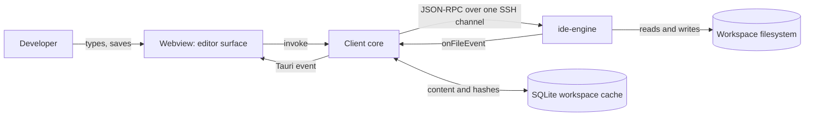
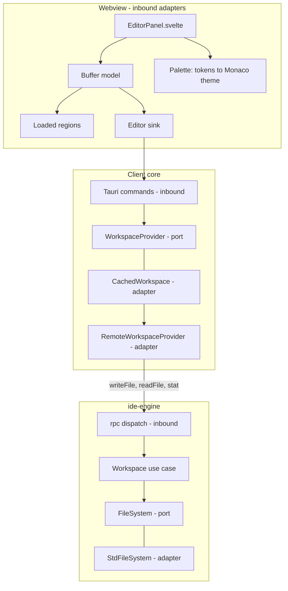
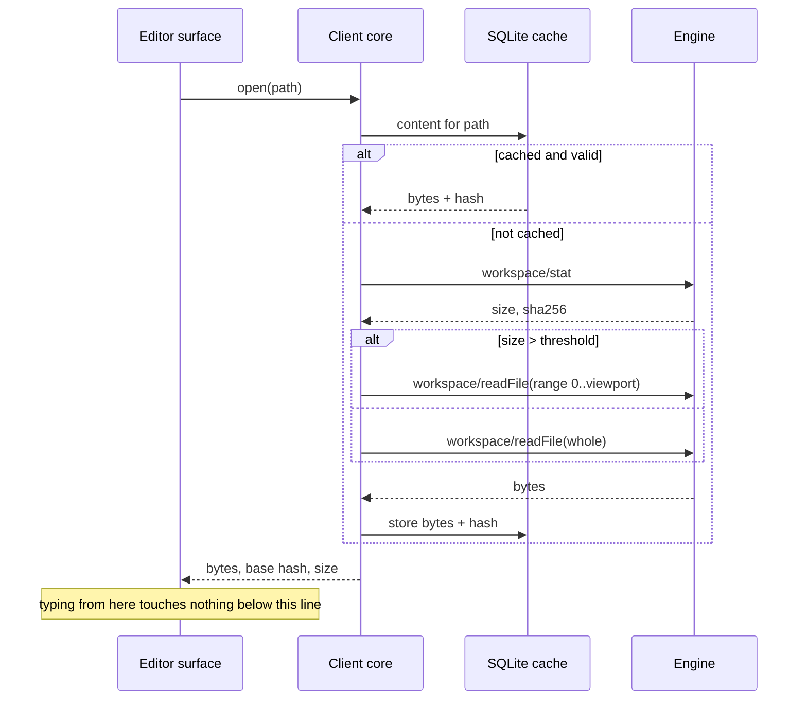
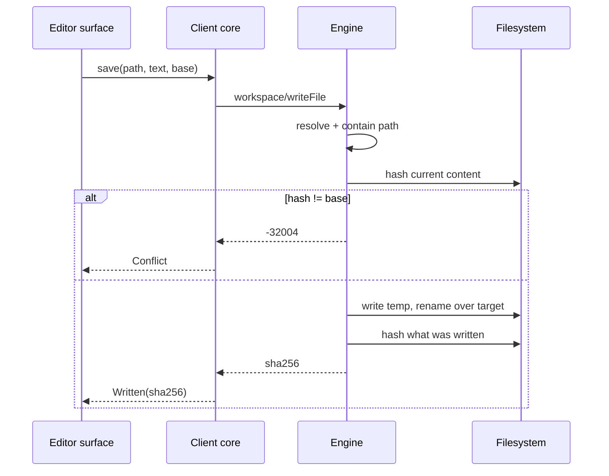

# Architecture: Editor Integration

**Branch**: `feature/F006-editor-integration` | **Date**: 2026-09-26 | **Plan**: [plan.md](./plan.md)

**Input**: Implementation plan from `/specs/008-editor-integration/plan.md`

---

## Architectural Overview

Four moving parts, and only one of them is new ground. In the webview, an editor surface owns a
Monaco instance and the buffers behind the open tabs; it renders every keystroke itself and asks
the core for nothing while typing. In the client core, the existing `WorkspaceProvider` port
gains the `write_file` it has always declared, and two inbound Tauri commands connect the surface
to it. In the engine, `workspace/writeFile` becomes a real dispatch arm over a use case that
compares a hash before it writes anything. Around all of it, the file-event route F010 built
carries the host's changes back, and the editor asks whether each one actually means anything.

The shape is deliberately the terminal's, one surface over: a third-party view over a byte
stream, a model that outlives the component, a palette built from design tokens, and a thin seam
to the core. That is not a coincidence to note but a precedent to follow — it is the only place
in this codebase where those four have been got right together.

---

## System Context



Nothing here is a new boundary. The editor is inside a boundary that already exists, and the one
new capability — writing — crosses the boundary that already carries reading.

---

## Component Architecture



**The buffer model outlives the component.** `EditorPanel` is unmounted whenever its tab is not
the focused one, and a model held in component state would lose the buffer, its base hash and
its dirty flag on every tab switch. This is the same defect the terminal had when `detach()`
disposed its instance, found late because nothing could hide and show a panel until the dock had
tabs. Here it is designed out from the start.

**The palette is a translation, not a theme.** Monaco takes a theme object of colour strings;
the design system supplies CSS custom properties. One module reads the tokens off the mounted
element and builds the object, which is the only place any editor colour is decided.

---

## Deployment Topology

N/A — this feature adds no process, no service and no deployment unit. It extends two binaries
that already ship together: the desktop client and `ide-engine`. The engine's new method travels
with the engine binary, which A-BOOT already deploys and version-negotiates.

---

## Data Flow

**Opening a file**



**Saving**



**A change arriving from the host**

```mermaid
sequenceDiagram
  participant Eng as Engine
  participant Core as Client core
  participant UI as Editor surface
  Eng->>Core: workspace/onFileEvent(path)
  Core->>UI: notify
  UI->>Core: current hash for path
  Core->>Eng: workspace/stat
  Eng-->>Core: sha256
  Core-->>UI: sha256
  alt sha256 == buffer base
    Note over UI: our own write, or a change back to the same bytes. Nothing to say.
  else buffer clean
    Note over UI: refresh
  else buffer dirty
    Note over UI: tell the developer; do not replace
  end
```

---

## Cross-Cutting Concerns

| Concern | How this feature handles it |
|---|---|
| **Security** | The write path is the first that can destroy a file. Containment is enforced engine-side by the same `resolve_request` the read methods use, so symlink escape is resolved before comparison. Content is bounded before work begins. Principle VI, and research.md's first entry. |
| **Error handling** | `WriteOutcome` has four variants and they are never collapsed: written, conflict, refused, unreachable. FR-012 requires a developer to distinguish a colleague's edit from a dropped link, because the next action differs completely. |
| **Performance** | The keystroke path contains no IPC at all, which is the point of the whole architecture (§1.5 rule 1). SC-001 measures it as a request count. Ranged reads keep a large file off the control pipe (§4.6). |
| **Observability** | Writes and conflicts are logged at the engine with the path and the two hashes. A conflict that cannot be explained afterwards is a support call with nothing to look at. |
| **Accessibility** | Monaco carries its own; this feature adds a conflict notice and an autosave control, both of which follow the rail's precedent — a non-colour channel and keyboard reachability. |
| **Configuration** | One preference, autosave, in the session store. No settings surface exists; see research.md's last entry. |
| **Internationalisation** | N/A — no new user-facing strings beyond the conflict notice and the autosave label, and the application has no localisation layer yet. |
| **Rate limiting** | N/A — the engine serves one client over one connection. Autosave's debounce bounds write frequency for its own reasons, not as a limit. |

---

## Architectural Decisions

Each is recorded in [research.md](./research.md); the rationale and rejected alternatives live
there and are not repeated.

- *Writing is the first method that can destroy something* — containment reuse, rename-over-write, size bound.
- *Telling our own write apart from someone else's* — hash comparison on a file event.
- *The editor's palette is five colours and a deferral* — extracted tokens, deferred theme.
- *Where the base hash lives, and what "valid" means* — the buffer owns the base.
- *Ranges, and what a partially loaded buffer is allowed to do* — partial buffers are read-only.
- *Why Monaco's own workers are off* — no local answers about a remote workspace.
- *Saving is explicit, with autosave available and off* — from the clarification session.

Two will be promoted to Appendix A of the system specification before implementation, because
they close alternatives that bind features beyond this one: the editor palette (which the design
system will eventually absorb) and the write-echo rule (which every future writer of a watched
file inherits).

---

## Phase 1 Reconciliation

Checked against [data-model.md](./data-model.md) and [contracts/write-file.md](./contracts/write-file.md),
both written before this document.

**One conflict found, and the architecture changed rather than the contract.**

The data model gives `Buffer` a derived `editable` flag that is false while regions are missing,
and the contract says a write carries the whole file. An earlier sketch of this architecture had
the editor surface fetch any missing ranges at save time so the write could proceed. That would
make a save take unbounded time at the moment the developer least expects it, and it contradicts
the data model's rule rather than implementing it. The flow above has no such step: a partial
buffer never reaches a save, because it never accepts an edit.

Everything else agrees. The four `WriteOutcome` variants map one-to-one onto the contract's
error table plus its success. `LoadedRegions` is consumed only by the opening flow. The
`AutosavePreference` touches no component in this diagram except the surface that sets it and
the store that holds it.
