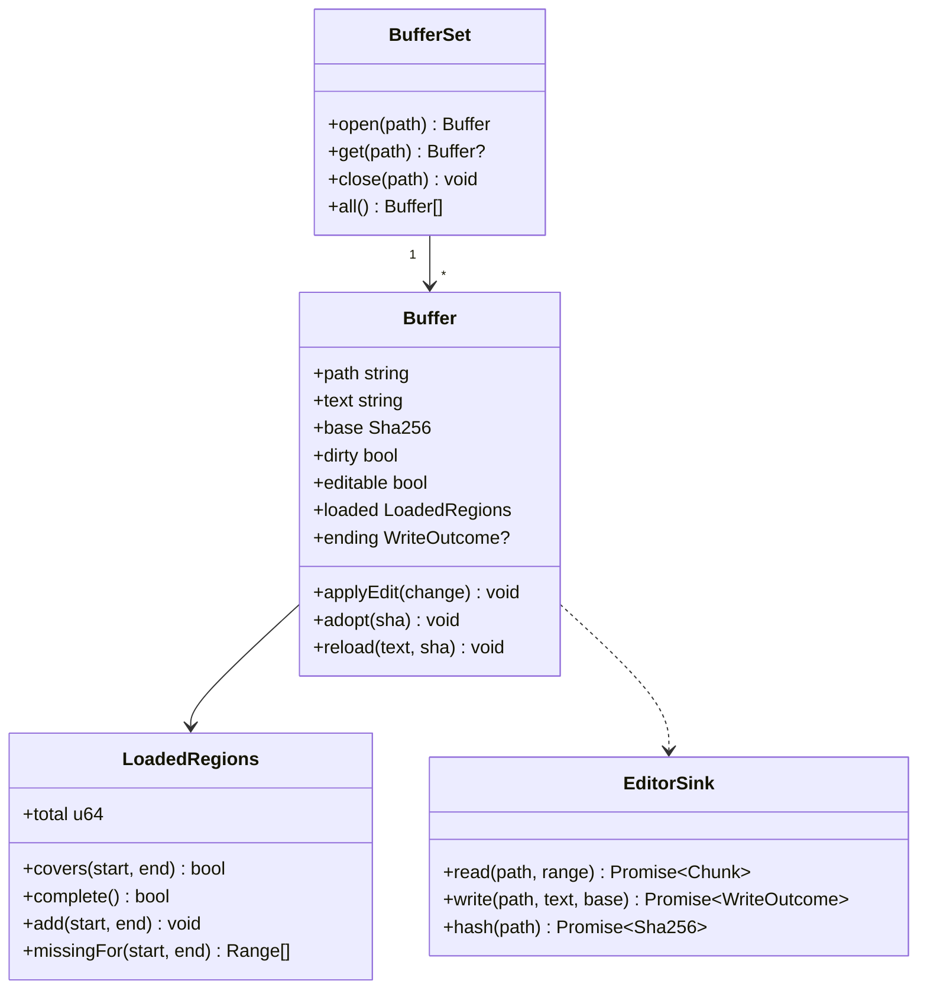
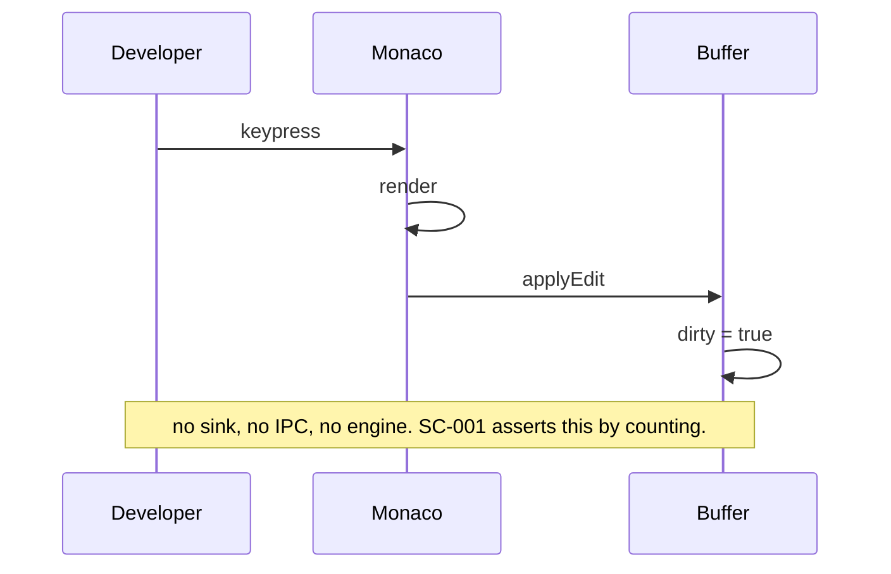

# Design: Editor Integration

**Branch**: `feature/F006-editor-integration` | **Date**: 2026-09-26 | **Plan**: [plan.md](./plan.md)

**Input**: Implementation plan from `/specs/008-editor-integration/plan.md`

Language and versions come from plan.md's *Technical Context*, which remains the only source of
truth for the stack. Signatures only below — no bodies.

---

## Module & File Layout

```
engine/src/
  application/ports/file_system.rs          write_atomic + hash_file added to the port
  application/use_cases/workspace.rs        write_file: the compare-then-write rule
  adapters/outbound/std_fs.rs               temp-file-and-rename, mode preserved
  adapters/inbound/rpc.rs                   workspace/writeFile dispatch arm

protocol/src/wire.rs                        WriteFileParams, WriteFileResult
protocol/src/lib.rs                         codes::WRITE_CONFLICT = -32004

client/core/src/
  adapters/outbound/remote_workspace.rs     write_file implemented, refusal removed
  adapters/inbound/tauri_commands.rs        file_write, file_read, file_read_range
  application/use_cases/edit_file.rs        base-hash rules, outcome mapping
  domain/session.rs                         autosave preference; schema version raised

client/ui/lib/editor/
  EditorPanel.svelte                        inbound adapter; mounts Monaco
  buffers.svelte.ts                         Buffer, BufferSet — outlives the component
  ranges.ts                                 LoadedRegions arithmetic — pure
  palette.ts                                design tokens -> Monaco theme
  ending.ts                                 WriteOutcome -> what the developer is told
  sink.ts                                   the seam to the core

scripts/ds-sync.mjs                         editor surface: five code colours

protocol/tests/write_wire.rs                params and result round-trip, snake_case on the wire
engine/tests/write_file.rs                  the write path against a real filesystem
client/core/tests/write_file.rs             provider outcome mapping against a scripted transport
client/core/tests/editor_first_paint.rs     SC-005's printed p99

tests/unit/                                 editor-ranges, editor-palette, editor-buffers,
                                            editor-ending
tests/e2e/                                  editor-local-echo, editor-open, editor-save,
                                            editor-echo, editor-large-file, editor-session,
                                            editor-a11y
```

The webview directory mirrors `terminal/` deliberately: same split between a component, a model
that outlives it, a pure geometry module, a palette and a sink. A reader who has understood one
has understood the other.

---

## Class & Interface Model



`BufferSet` is a module-level singleton in the webview, for the reason the architecture gives:
the component is unmounted on every tab switch and a model in component state would lose the
buffer with it.

---

## Interface Contracts

**Engine — the port gains two capabilities**

```rust
pub trait FileSystem: Send + Sync {
    // ... existing: canonicalize, read_dir, metadata, read_range

    /// Write `bytes` so that a failure leaves the previous content intact.
    fn write_atomic(&self, path: &Path, bytes: &[u8]) -> io::Result<()>;

    /// The hash of what is on disk now.
    fn hash_file(&self, path: &Path) -> io::Result<Sha256>;
}
```

**Engine — the use case**

```rust
pub fn write_file(
    roots: &dyn WorkspaceRoots,
    fs: &dyn FileSystem,
    params: &WriteFileParams,
) -> Result<WriteFileResult, WriteRefusal>;

pub enum WriteRefusal {
    Request(RequestRefusal),   // path or workspace, reusing what reads already return
    Conflict,                  // -32004
    TooLarge { limit: usize },
    Io(String),
}
```

**Client core — the port's refusal is replaced**

```rust
async fn write_file(
    &self,
    ws: &WorkspaceId,
    path: &RelPath,
    content: &[u8],
    base: &Sha256,
) -> ProviderResult<Sha256>;
```

**Client core — inbound**

```rust
#[tauri::command]
pub async fn file_write(path: String, content: String, base: String, ...)
    -> Result<WriteOutcomeDto, ShellError>;

#[tauri::command]
pub async fn file_read_range(path: String, offset: u64, len: u64, ...)
    -> Result<ChunkDto, ShellError>;
```

**Webview — the sink**

```ts
export interface EditorSink {
  read(path: string, range: ByteRange | null): Promise<Chunk>;
  write(path: string, text: string, base: string): Promise<WriteOutcome>;
  hash(path: string): Promise<string>;
}
```

**Webview — pure modules**

```ts
export function describeOutcome(o: WriteOutcome): OutcomeLabel;
export function monacoTheme(el: HTMLElement): IStandaloneThemeData;
export function missingFor(r: LoadedRegions, start: number, end: number): ByteRange[];
```

---

## Sequence Diagrams

**Typing — the path that must contain nothing**



**Saving, and being refused**

```mermaid
sequenceDiagram
  participant Buffer
  participant Sink
  participant Core
  participant Engine
  Buffer->>Sink: write(path, text, base)
  Sink->>Core: invoke file_write
  Core->>Engine: workspace/writeFile
  Engine-->>Core: -32004
  Core-->>Sink: Conflict
  Sink-->>Buffer: ending = Conflict
  Note over Buffer: dirty stays true; text untouched; one way out offered
```

**Discarding after a conflict**

```mermaid
sequenceDiagram
  participant Dev as Developer
  participant Buffer
  participant Sink
  Dev->>Buffer: discard and reload
  Buffer->>Sink: read(path, null)
  Sink-->>Buffer: bytes + sha
  Buffer->>Buffer: reload(text, sha); dirty = false
```

---

## State Model

The buffer's states and transitions are in [data-model.md](./data-model.md) and are not repeated
here. Two properties that belong to the design rather than the model:

- `dirty` is set by `applyEdit` and cleared only by `adopt` (a successful write) or `reload` (an
  explicit discard). No other path clears it — in particular, a file event never does, which is
  what stops a colleague's change silently dropping unsaved work.
- `editable` is derived from `loaded.complete()`, not stored. A stored flag is a second thing to
  keep in step with the ranges it describes.

---

## Error Handling & Validation

| What goes wrong | What happens | Where it is seen |
|---|---|---|
| Base hash differs | Engine replies `-32004` without opening the file | A conflict notice with one action: discard and reload |
| Path escapes the root | Engine replies `-32003` | A refusal naming the path |
| Content above the bound | Engine refuses before writing | A refusal naming the limit |
| Write fails part-way | Rename never happens; previous content intact | A refusal; the buffer stays dirty |
| Connection drops mid-save | No outcome arrives | `Unreachable`; explicitly not a conflict |
| File deleted while open | Canonicalisation fails on save; a file event reports it sooner | Told; the buffer is kept |
| Content is not UTF-8 | The editor declines to open it | A message naming F017 |
| File above the text maximum | The editor declines to open it | A message naming the limit |
| A range returns short | `total` is re-read; the regions record what arrived | Nothing, unless it repeats |

**Validation happens at both ends and neither trusts the other.** The webview checks what it can
so the developer gets an immediate answer; the engine checks everything again because the
webview is not a trusted caller (Principle VI). The engine's checks are the ones that matter and
the ones the integration tests exercise.

---

## Persistence Mapping

| Entity | Owned by | Where it lives |
|---|---|---|
| `Buffer`, `LoadedRegions` | `BufferSet` in the webview | Memory only. Nothing about an editing session survives a restart — that is F012's. |
| `AutosavePreference` | `PersistSession` | The JSON session store A-STATE defines; schema version raised with `serde(default)`, the migration A-STATE2 established. |
| File content and its hash | `WorkspaceCache` | The SQLite projection F003 owns. This feature reads it and, after a successful write, updates it so a reopen does not show stale content (FR-010). |

Fields and validation rules are in [data-model.md](./data-model.md) and are deliberately not
copied here; two statements of one rule drift.
