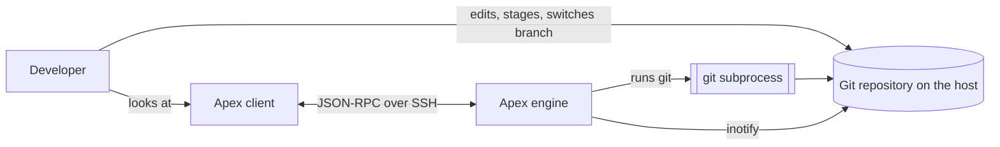
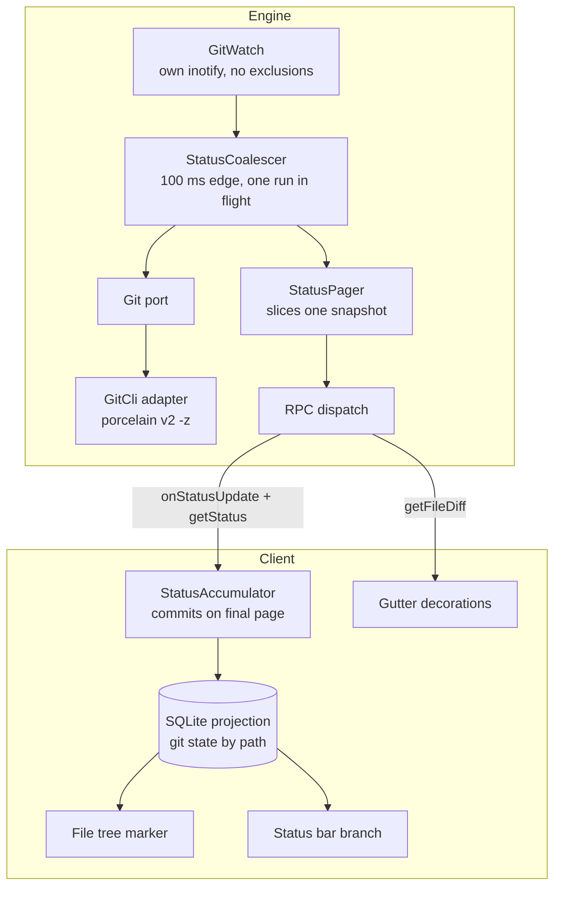
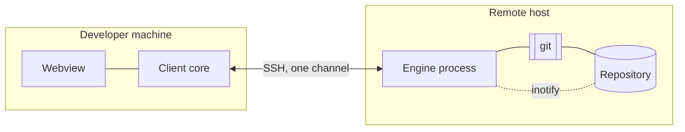
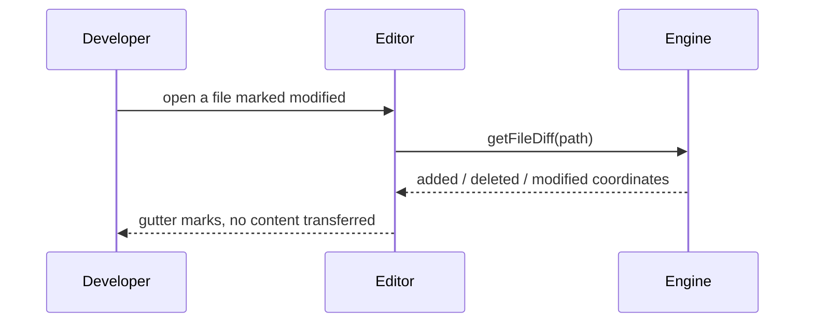

# Architecture: Git Integration

**Branch**: `feature/F011-git-integration` | **Date**: 2026-09-26 | **Plan**: [plan.md](./plan.md)

**Input**: Implementation plan from `/specs/009-git-integration/plan.md`

## Architectural Overview

Git runs on the engine and nowhere else; the client holds a projection of what git said and
draws it. Four parts on the engine — a watch that notices, a coalescer that decides when to look,
a subprocess adapter that asks git, and a pager that hands the answer over in frame-sized pieces
— and two on the client: an accumulator that turns those pieces back into one update, and the
surfaces that read the result.

The architectural idea a reader most needs to hold is that **the unit of work is the whole
update, not the message**. The engine's answer may span several frames, and the client's
replacement of a workspace's git state commits only when the last of them lands. Every other
shape here — the snapshot the pager slices, the accumulator that can discard — exists to make
that true.

The second idea, smaller but load-bearing: the git watch is a *separate service* from the
workspace watcher, so that git's two watched files cannot become workspace file events through
any code path at all.

## System Context



The developer changes the repository through tools this feature does not provide — their own
terminal, which F010 gives them on the same host. This feature only observes.

## Component Architecture



| Component | Responsibility | Entities owned |
|---|---|---|
| `GitWatch` | Watch `HEAD` and `index` in the resolved git directory; report that something changed, nothing more | none |
| `StatusCoalescer` | Decide *when* to ask git: 100 ms trailing edge, at most one run in flight and one scheduled | none |
| `Git` port + `GitCli` adapter | Ask git for status and for a file's diff; parse the answers | `GitState`, `BranchPosition`, `FileDiff` (produces) |
| `StatusPager` | Hold one computed snapshot and serve it in pages of ≤1000 against an opaque cursor | `StatusUpdate` (serves) |
| `StatusAccumulator` | Gather pages into one update and commit or discard it as a whole | `StatusUpdate` (consumes) |
| SQLite projection | Hold git state per (workspace, path) | `GitState`, `BranchPosition` |
| Tree marker / status bar / gutter | Read the projection and draw; issue nothing | none |

## Deployment Topology



No new runtime unit. This feature adds threads inside the existing engine process and tables
inside the existing client database; nothing new is deployed, started or supervised.

## Data Flow

**A change on the host becoming a coloured row:**

```mermaid
sequenceDiagram
    participant R as Repository
    participant W as GitWatch
    participant C as StatusCoalescer
    participant G as git
    participant P as StatusPager
    participant A as StatusAccumulator
    participant T as Tree

    R->>W: index written
    W->>C: something changed
    Note over C: 100 ms trailing edge;<br/>collapse the burst
    C->>G: status --porcelain=v2 -z --branch
    G-->>C: branch + entries
    C->>P: snapshot
    P-->>A: onStatusUpdate (page 1, next_cursor)
    Note over A: accumulate; do NOT apply
    A->>P: getStatus(cursor)
    P-->>A: page 2 (no cursor)
    Note over A: commit as one transaction
    A->>T: replaced state
    T-->>T: render from projection, zero requests
```

**Opening a modified file:**



## Cross-Cutting Concerns

| Concern | Approach |
|---|---|
| Authentication / authorization | N/A — this feature adds no principal and no permission. It runs with the rights the engine already has, inside a workspace root the engine already contains. |
| Error handling | Three shapes. A workspace that is not a repository, or a host without git, is a **success** with an empty status. A refused path or unknown workspace is a §4.4 code. A git invocation that fails for any other reason is reported to the client as an empty status and recorded in the engine's own diagnostics, so a broken repository costs colour rather than the workspace. |
| Observability | Deliberately almost none. The engine's stderr is an 8 KiB classification buffer, not a log; a status refresh logs nothing on the happy path, because one line per index write would evict the startup diagnostics it exists to carry. Failures to invoke git are logged once per transition into failure, not per attempt. **No path and no branch name is logged** — a branch name can carry a ticket id and a path can carry a customer's name. |
| Configuration | None added. No user-facing setting, no per-workspace git configuration. The exclusion set, the page size and the coalescing window are all fixed in plan.md or inherited from existing decisions. |

## Architectural Decisions

| Decision | Recorded in |
|---|---|
| Ask git via `--porcelain=v2 -z --branch` | research.md, *Asking git for status* |
| Parse by record type, because a rename carries an extra NUL field | research.md, *Parsing `-z` output, and the trap in it* |
| One state per path; conflict wins, then unstaged, then staged | research.md, *One state per path, from two characters* |
| Two watches in the **resolved** git directory, in a separate service | research.md, *Noticing that status changed*; A-GITWATCH |
| 100 ms trailing edge plus one run in flight | research.md, *Keeping a burst from becoming N computations* |
| Page a computed snapshot rather than re-running git per page | research.md, *Paging a status git produces all at once*; A-GITPAGE |
| Diff coordinates from `--unified=0` hunk headers only | research.md, *Diff coordinates without file contents* |
| `(detached)` is a case, not a branch name | research.md, *The branch, and when there is not one* |
| Git state keyed by (workspace, path) | research.md, *Keying git state on the client* |
| Five states to five existing design-system tokens | research.md, *Colouring without inventing colours* |
| No repository and no git degrade identically | research.md, *When there is no git, or no repository* |

## Phase 1 Reconciliation

Checked against [data-model.md](./data-model.md) and [contracts/git-status.md](./contracts/git-status.md),
both written earlier in this planning run.

| Conflict with data-model.md or contracts/ | Action taken |
|---|---|
| `data-model.md` says a `FileDiff` is "not persisted", while the component table gave the gutter component no owned entity and left where a diff lives unstated | Architecture adjusted: the gutter reads a diff per open and holds nothing. The component table now owns no entity for it, which agrees with the data model rather than implying a store |
| `contracts/git-status.md` requires an unknown or expired cursor to be **refused**, which implies the pager holds a snapshot with a lifetime; the first draft of the component table described `StatusPager` as stateless | Architecture adjusted: `StatusPager` owns a snapshot with an explicit lifetime — held while a pull is in progress, discarded when the last page is served or the client goes away. A stateless pager cannot satisfy guarantee 3 (pages describe one snapshot) |
| `data-model.md` models `BranchPosition` as three cases; the flow diagrams initially carried "branch" as a plain string | Diagrams and the component table now say `BranchPosition`. Nothing downstream should see a string that might be `(detached)` |
| No conflict on the transaction boundary | `data-model.md`'s state machine, the contract's "what would be wrong" note and this document's data flow all place the commit at the final page. Consistent by construction, and called out here because it is the one thing three artifacts had to agree on |

No conflicts were deferred.
