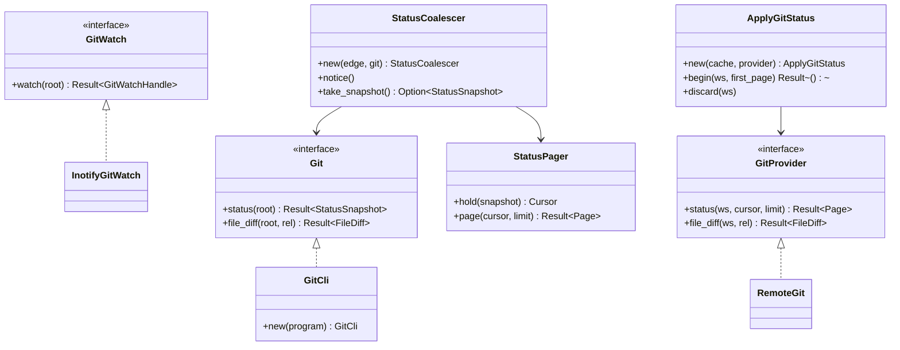
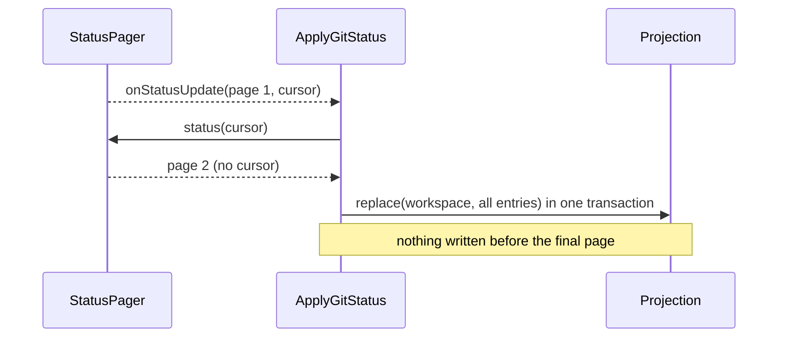

# Design: Git Integration

**Branch**: `feature/F011-git-integration` | **Date**: 2026-09-26 | **Plan**: [plan.md](./plan.md)

**Input**: Implementation plan from `/specs/009-git-integration/plan.md` and system shape from
`/specs/009-git-integration/architecture.md`

Signatures only. Entity fields and validation rules live in
[data-model.md](./data-model.md) and are linked, never copied.

## Module & File Layout

Matches the Structure Decision in [plan.md](./plan.md).

```text
protocol/src/wire.rs                                # GitStatusParams/Result, GitDiffParams/Result
engine/src/
├── application/ports/git.rs                        # the Git port
├── application/use_cases/git_status.rs             # coalescer, snapshot, pager
├── adapters/outbound/git_cli.rs                    # subprocess + porcelain v2 parser
├── adapters/outbound/inotify_watcher.rs            # + the git watch: two watches, its own
│                                                   #   inotify instance, no exclusion set
└── adapters/inbound/rpc.rs                         # dispatch arms (existing file)
client/core/src/
├── application/ports/git_provider.rs               # what the client reaches git through
├── application/use_cases/apply_git_status.rs       # page accumulation, one transaction
├── application/ports/workspace_cache.rs            # + git state read/replace (existing file)
├── adapters/outbound/sqlite/schema.rs              # re-key, version bump (existing file)
├── adapters/outbound/remote_git.rs                 # GitProvider over the transport
└── adapters/inbound/tauri_commands.rs              # git_status, git_file_diff (existing file)
client/ui/lib/
├── git/status.svelte.ts                            # the projection the surfaces read
├── git/marker.ts                                   # state -> token + glyph, pure
├── git/gutter.ts                                   # coordinates -> decorations, pure
├── shell/Window.svelte                             # starts the subscription once (existing)
├── workspace/FileTree.svelte                       # fills the reserved .vcs column (existing)
├── statusbar/StatusBar.svelte                      # branch (existing)
└── editor/EditorPanel.svelte                       # gutter decorations (existing)
tests/e2e/wdio.conf.ts                              # git specs join the live run (existing)
```

## Class & Interface Model



`Git` and `GitWatch` are ports so that parsing and coalescing are testable against captured
output and a fake clock, with no repository and no inotify. `GitProvider` is the client's port
for the same reason F003's `WorkspaceProvider` is one: the consumer must not know whether an
engine is on the other side.

## Interface Contracts

**Engine — the Git port**

```rust
pub trait Git: Send + Sync {
    fn status(&self, root: &ResolvedPath) -> Result<StatusSnapshot, GitFailure>;
    fn file_diff(&self, root: &ResolvedPath, relative: &str) -> Result<FileDiff, GitFailure>;
    /// The directory holding HEAD and index, which is not always `<root>/.git`.
    fn git_dir(&self, root: &ResolvedPath) -> Result<PathBuf, GitFailure>;
}

pub enum GitFailure {
    NotARepository,
    GitUnavailable,
    Failed(String),
}
```

**Engine — watching**

```rust
pub trait GitWatch: Send + Sync {
    fn watch(&self, git_dir: &Path, on_change: Box<dyn Fn() + Send + Sync>)
        -> Result<GitWatchHandle, GitFailure>;
}
```

**Engine — coalescing and paging**

```rust
impl StatusCoalescer {
    pub fn new(edge: Duration, git: Arc<dyn Git>) -> Self;
    pub fn notice(&self);
    pub fn run_due(&self, now: Instant) -> Option<StatusSnapshot>;
}

impl StatusPager {
    pub fn hold(&self, ws: &WorkspaceId, snapshot: StatusSnapshot) -> Cursor;
    pub fn page(&self, ws: &WorkspaceId, cursor: Option<&Cursor>, limit: usize)
        -> Result<Page, PageRefusal>;
}
```

**Client — the provider port**

```rust
#[async_trait]
pub trait GitProvider: Send + Sync {
    async fn status(&self, ws: &WorkspaceId, cursor: Option<&str>, limit: Option<u32>)
        -> ProviderResult<GitPage>;
    async fn file_diff(&self, ws: &WorkspaceId, path: &RelPath)
        -> ProviderResult<FileDiff>;
}
```

**Client — applying an update**

```rust
impl ApplyGitStatus {
    pub fn new(cache: Arc<dyn WorkspaceCache>, provider: Arc<dyn GitProvider>) -> Self;
    /// Accumulates further pages if the first sets a cursor, and commits only when the
    /// final page arrives. Discards on any failure.
    pub async fn apply(&self, ws: &WorkspaceId, first: GitPage) -> Result<(), ApplyFailure>;
}
```

**Webview — pure modules**

```ts
export function markerFor(state: GitState): { token: string; glyph: string };
export function decorationsFor(diff: FileDiff): GutterDecoration[];
```

## Sequence Diagrams

**A burst of index writes producing one status**

```mermaid
sequenceDiagram
    participant I as inotify
    participant W as InotifyGitWatch
    participant C as StatusCoalescer
    participant G as GitCli
    I->>W: index written (x40, over 3 s)
    W->>C: notice() x40
    Note over C: trailing edge 100 ms;<br/>one run in flight
    C->>G: status()
    G-->>C: snapshot A
    Note over C: notices arrived during the run;<br/>exactly one re-run scheduled
    C->>G: status()
    G-->>C: snapshot B
```

**Committing a paged update**



## State Model

`StatusUpdate` is the only entity with a lifecycle; its states and transitions are defined in
[data-model.md](./data-model.md) and are not restated here. The accumulator holds exactly one
in-progress update per workspace, and a new `onStatusUpdate` for a workspace already accumulating
**replaces** the accumulation rather than interleaving with it — the later report describes a
newer repository state, so finishing the older one would commit a picture already known to be out
of date.

The coalescer's own states — idle, waiting on the trailing edge, running, running-with-one-queued
— are internal and carry no persisted form.

## Error Handling & Validation

| Situation | Handling |
|---|---|
| Workspace is not a repository, or git is unavailable | Success with an empty status and no branch. The two are distinguished inside the engine and not on the wire, because the client's behaviour is identical (contracts/git-status.md, guarantee 8) |
| `git` exits non-zero for any other reason | Empty status to the client; logged once on transition into failure, not per attempt |
| A path from git escapes the workspace root | The entry is dropped, not forwarded. Validated again on the client, because a path from a subprocess is untrusted exactly as a path from the wire is (Principle VI) |
| Unknown, expired or cross-workspace cursor | Refused with invalid-params. Never treated as "start from the beginning", which would assemble one picture from two snapshots |
| A page fails to arrive mid-pull | The accumulation is discarded; the previously applied state stays visible (FR-009a) |
| Status names a workspace the client does not hold | Discarded (FR-012) |
| Parse failure on a git record | The whole snapshot is rejected rather than partially applied — a half-parsed status is indistinguishable from a repository where those files are clean |

Validation of the porcelain stream is by record type, because a rename carries an extra
NUL-terminated field; see research.md.

## Persistence Mapping

| Entity (data-model.md) | Owned by | Stored where |
|---|---|---|
| `GitState` | `ApplyGitStatus` writes; the tree reads | Client SQLite, keyed by (workspace, path) |
| `BranchPosition` | `ApplyGitStatus` writes; the status bar reads | Client SQLite, one per workspace |
| `StatusUpdate` | `StatusPager` (engine, transient) and `ApplyGitStatus` (client, transient) | Never persisted — it is the unit of transfer, not of storage |
| `FileDiff` | `EditorPanel` for the life of an open file | Never persisted |

The schema change is a re-key of the table F003 created, plus a branch column per workspace, and
a version bump. No data migration: nothing has ever written a row.

**Cache validity is untouched.** Nothing in this mapping reads or writes the content hashes or
the cached-flag that decide whether a blob is valid (§5.3, FR-010).
