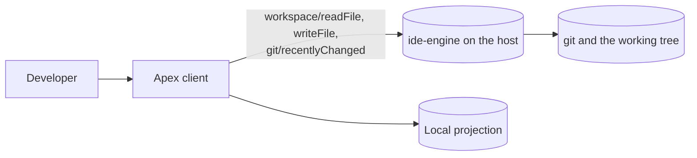
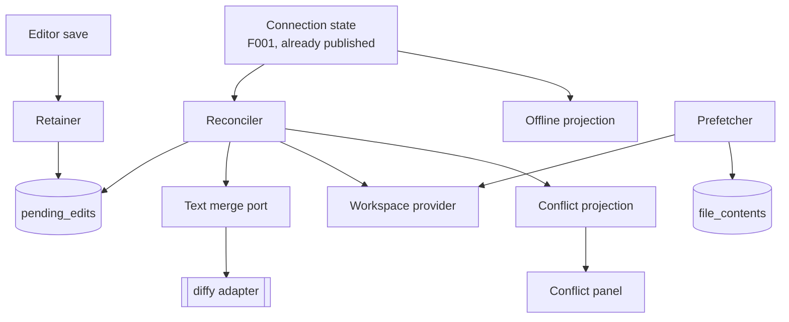
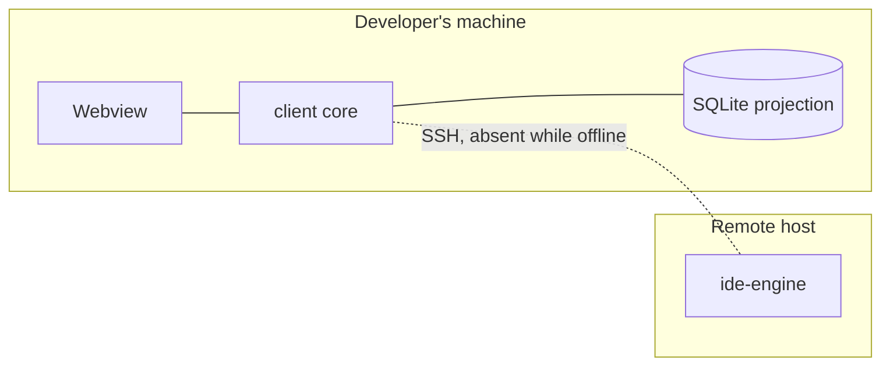
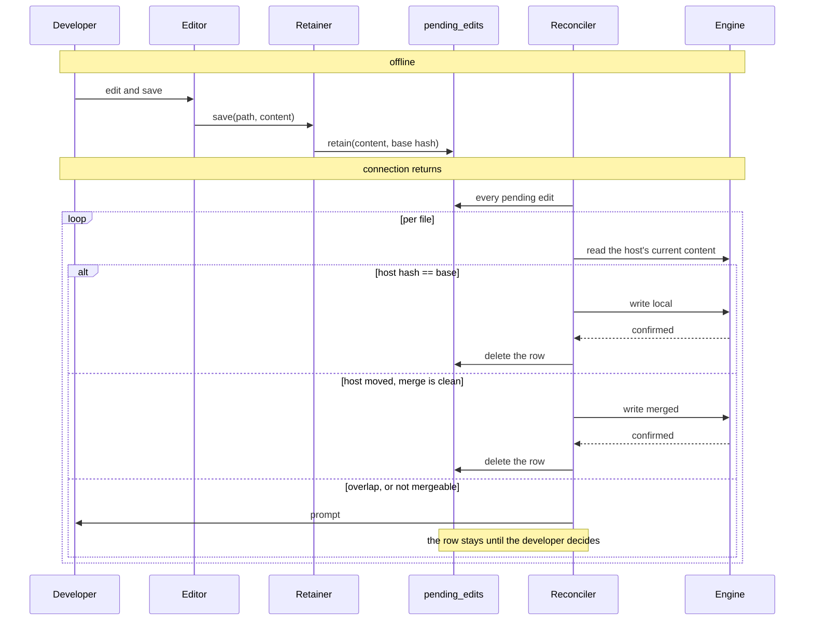

# Architecture: Offline Editing

**Branch**: `feature/F012-offline-editing` | **Date**: 2026-09-27 | **Plan**: [plan.md](./plan.md)

**Input**: Implementation plan from `/specs/010-offline-editing/plan.md`

## Architectural Overview

Almost all of this feature lives on the client, because offline is a statement about the client's
connection and the engine is by definition unreachable when it matters. The engine's whole
contribution is one read-only method that tells the client which files recent commits touched.

Three client components carry it. A **retainer** turns a save made while disconnected into a row
that outlives the process. A **reconciler**, woken by the connection state the client already
publishes, walks those rows on reconnection and decides per file whether to write, to combine, or
to ask. A **prefetcher** fills the cache deliberately while online, and stops rather than evicting.

The one architectural idea worth holding: **the pending edit is the durable fact, and every
outcome is a statement about one attempt on it**. A row is deleted only when the host has
confirmed a write. Everything else — a lost connection, a conflict, a refused stale write — leaves
the row alone, which is what makes "nothing is lost" true by construction rather than by care.

## System Context

## Component Architecture

| Component | Responsibility | Entities owned |
|-----------|----------------|----------------|
| Retainer | Turn a save made while disconnected into a durable row | Pending edit |
| Reconciler | Per file on reconnection: fast-forward, combine, or raise a conflict | Reconciliation outcome |
| Text merge port | Three strings in, an outcome out. Pure | none |
| `diffy` adapter | The only place the merge library is named | none |
| Prefetcher | Cache recent-commit and manifest files, bounded, never evicting | Prefetch candidate |
| Offline projection | What the interface reads to know it is offline and what is held | none |
| Conflict projection | The outstanding conflicts and their three sides | Conflict |

## Deployment Topology

Unchanged from every feature before it. The dotted link is the point: this feature is defined by
what happens when it is not there.

## Data Flow

## Cross-Cutting Concerns

| Concern | Approach |
|---------|----------|
| Authentication / authorization | N/A - the transport authenticates once (§3); nothing here adds an identity or a permission |
| Error handling | A failure at any point in reconciliation leaves the pending edit intact and is reported per file. A failure to retain a save is surfaced while the work is still in the buffer (FR-016) |
| Observability | Per-file reconciliation outcomes are logged and reported to the developer (FR-024). No content is ever logged, for the reason F006 records: a file being edited may hold a credential |
| Configuration | The prefetch commit count and the cache budget; both have defaults and neither is required to be set |

## Architectural Decisions

| Decision | Recorded in |
|----------|-------------|
| `diffy` for the three-way merge, measured against `git merge-file` | research.md, *Three-way merge* |
| A new protocol method for recent-commit paths | research.md, *Recent-commit prefetch needs a protocol method* |
| Pending edits in their own table, keyed by path | research.md, *Where pending edits live* |
| Reconciliation triggered by the published connection state | research.md, *Reconciliation is driven by the connection state* |
| Unmergeable decided by what the client holds, not by sniffing | research.md, *Unmergeable files* |
| Prefetch stops rather than evicts | research.md, *Prefetch stops rather than evicts* |

## Phase 1 Reconciliation

This architecture was authored after `data-model.md` and `contracts/` in the same planning run and
was checked against them.

| Conflict with data-model.md or contracts/ | Action taken |
|-------------------------------------------|--------------|
| The first draft had the reconciler storing the host's content alongside the local one, so a conflict could be rebuilt without a read. `contracts/offline-commands.md` guarantee 2 says the remote side is read when the conflict list is built, precisely so it cannot go stale while the developer decides | Architecture adjusted; the reconciler holds no remote content and `Conflict` stays an in-memory reconstruction |
| The first draft drew the prefetcher writing to `file_contents` directly. `data-model.md` gives that table no new columns and the cache is owned by the existing provider | Architecture adjusted; the prefetcher goes through the workspace provider like any other reader, which is also what makes §4.6's background priority apply to it |
| The component table originally gave the reconciler ownership of `Conflict`. The data model makes the durable fact the `pending_edits` row and the conflict a reconstruction | Table corrected: the reconciler owns the outcome, the conflict projection owns the conflict |

No other conflicts found.
