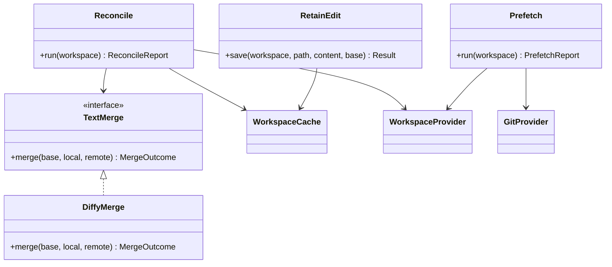
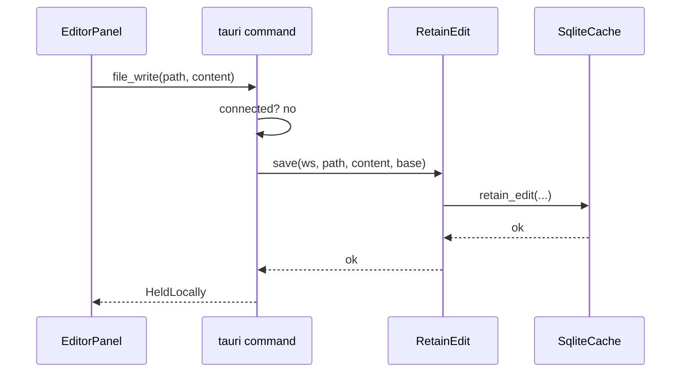
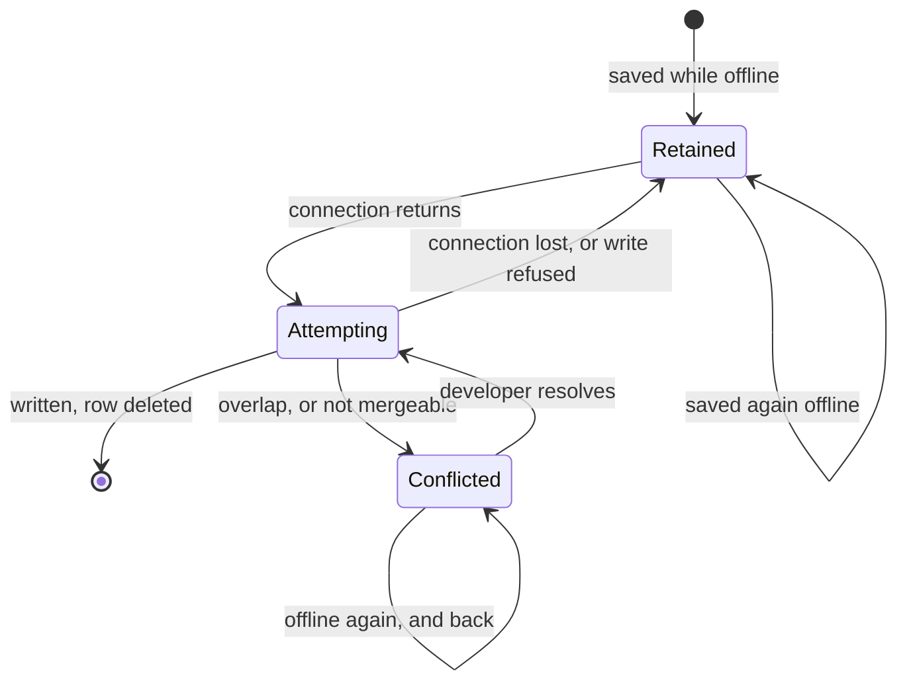

# Design: Offline Editing

**Branch**: `feature/F012-offline-editing` | **Date**: 2026-09-27 | **Plan**: [plan.md](./plan.md)

**Input**: Implementation plan from `/specs/010-offline-editing/plan.md` and system shape from
`/specs/010-offline-editing/architecture.md`

Signatures only. Language and version come from plan.md's Technical Context: Rust 1.75, and
TypeScript 5 with Svelte 5 in the webview.

## Module & File Layout

```text
protocol/src/
└── wire.rs                                  # RecentlyChangedParams, RecentlyChangedResult

engine/src/
├── application/ports/git.rs                 # + recently_changed on the Git trait
├── adapters/outbound/git_cli.rs             # + `git log --name-only --pretty=format:`
└── adapters/inbound/rpc.rs                  # + "git/recentlyChanged" arm

client/core/src/
├── application/
│   ├── ports/
│   │   ├── text_merge.rs                    # TextMerge: three strings in, an outcome out
│   │   └── workspace_cache.rs               # + retain / pending / forget_pending
│   └── use_cases/
│       ├── retain_edit.rs                   # RetainEdit
│       ├── reconcile.rs                     # Reconcile, ReconcileReport
│       └── prefetch.rs                      # Prefetch, PrefetchReport
├── adapters/
│   ├── outbound/
│   │   ├── text_merge.rs                    # DiffyMerge - the ONLY file naming `diffy`
│   │   └── sqlite/{schema.rs,migrate.rs,mod.rs}
│   └── inbound/tauri_commands.rs            # offline_status, conflicts_list, conflict_resolve
└── composition.rs                           # wires Reconcile to the connection state

client/ui/lib/
├── offline/state.svelte.ts                  # OfflineStore
├── offline/conflicts.svelte.ts              # ConflictStore
├── offline/ConflictPanel.svelte
└── editor/EditorPanel.svelte                # writable offline; "held locally"

protocol/tests/recent_wire.rs                 # wire spelling, hand-written JSON
engine/tests/git_recent.rs
client/core/tests/
├── merge_agreement.rs                       # SC-006b: agreement with `git merge-file`
├── merge_confinement.rs                     # `diffy` named in exactly one file
├── retain_edit.rs
├── reconcile.rs
├── prefetch.rs
├── pending_store.rs                         # asserted on a REOPENED store
├── migrate_v4.rs
├── offline_budget.rs                        # SC-007, SC-008
├── reconcile_budget.rs                      # SC-011
└── prefetch_budget.rs                       # SC-009, SC-010a
tests/unit/offline-presentation.test.ts
tests/e2e/{offline-state,offline-reconcile,offline-conflict}.spec.ts
```

## Class & Interface Model



| Type | Kind | Responsibility |
|------|------|----------------|
| `TextMerge` | interface | Decide, purely, whether three versions combine or collide |
| `DiffyMerge` | struct | The only place the merge library is named |
| `MergeOutcome` | enum | `Clean(String)` or `Conflict` — no partial results |
| `RetainEdit` | use case | A save made offline becomes a durable row |
| `Reconcile` | use case | Per file on reconnection: write, combine, or ask |
| `ReconcileReport` | record | What happened to each file, for the developer |
| `Prefetch` | use case | Bounded speculative caching that never evicts |
| `PendingEdit` | record | The durable fact: local content, **base content**, base hash, mergeable. Self-contained, so a merge never depends on a cache entry that may be gone |
| `OfflineStore` | class (TS) | What the interface reads to know it is offline |
| `ConflictStore` | class (TS) | Outstanding conflicts and their three sides |

## Interface Contracts

```text
rust

// --- the merge, pure ---
enum MergeOutcome { Clean(String), Conflict }

trait TextMerge: Send + Sync {
    fn merge(&self, base: &str, local: &str, remote: &str) -> MergeOutcome
        precondition:  all three are valid UTF-8; the caller has established the file is text
        postcondition: Clean holds the combined content; Conflict holds nothing, because a
                       partially merged file is not a thing this feature may produce
        raises:        none - a merge cannot fail, it can only decline
}

// --- retaining a save made offline ---
impl RetainEdit {
    fn save(&self, ws: &WorkspaceId, path: &RelPath, content: &str, base: Option<(&str, &Sha256)>)
        -> CacheResult<()>
        precondition:  the client is not connected; content is what the developer saved; base is
                       the text the client last confirmed with the host and its hash, or None for
                       a file created offline
        postcondition: a pending edit exists for (ws, path). A previous one has its content
                       replaced and its base LEFT ALONE (FR-011c) -- re-deriving the base from
                       the newer local content makes the merge compare local against local
        raises:        CacheError when the store refuses, so the caller can tell the developer
                       while the work is still in the buffer (FR-016)
}

// --- reconciliation ---
struct ReconcileReport { outcomes: Vec<(RelPath, Outcome)> }
enum Outcome { FastForwarded, Merged, Conflicted, NotAttempted, Failed(String) }

impl Reconcile {
    async fn run(&self, ws: &WorkspaceId) -> ReconcileReport
        precondition:  the connection state has just become Connected
        postcondition: every pending edit is attempted once; a row is deleted only where the
                       host confirmed a write; an interruption leaves the rest NotAttempted
        raises:        none - every failure is an Outcome, because a reconciliation that
                       returned Err would lose the per-file detail FR-024 requires
}

// --- prefetch ---
struct PrefetchReport { fetched: usize, stopped_at_budget: bool }

impl Prefetch {
    async fn run(&self, ws: &WorkspaceId) -> PrefetchReport
        precondition:  connected
        postcondition: manifests and recent-commit paths are cached, in that order, until the
                       budget would require an eviction; nothing is evicted
        raises:        none - a partial prefetch is an ordinary outcome (FR-029a)
}

// --- the cache port gains three operations ---
trait WorkspaceCache {
    fn retain_edit(&self, ws: &WorkspaceId, path: &RelPath, edit: &PendingEdit) -> CacheResult<()>
    fn pending_edits(&self, ws: &WorkspaceId) -> CacheResult<Vec<(RelPath, PendingEdit)>>
    fn forget_pending(&self, ws: &WorkspaceId, path: &RelPath) -> CacheResult<()>
        postcondition: forget_pending is called only inside the transaction that commits the
                       host write; alone, it is how work is lost
}
```

```text
typescript

class OfflineStore {
    get connected(): boolean
    get pending(): readonly PendingFile[]
    start(): Promise<void>      // subscribes to the connection state; never re-detects it
    stop(): void
}

class ConflictStore {
    get conflicts(): readonly Conflict[]
    refresh(): Promise<void>
    resolve(path: string, resolution: string): Promise<void>
}
```

## Sequence Diagrams

**A save made while offline**



**Reconnection, one file**

```mermaid
sequenceDiagram
    participant K as Connection state
    participant R as Reconcile
    participant S as SqliteCache
    participant P as WorkspaceProvider
    participant M as TextMerge
    K->>R: Connected
    R->>S: pending_edits(ws)
    Note over R,S: the row carries local content AND the base content
    R->>P: read_file(path)
    P-->>R: remote content + hash
    alt remote hash == base
        R->>P: write_file(path, local, base)
        P-->>R: confirmed
        R->>S: forget_pending(path)
    else
        R->>M: merge(base, local, remote)
        alt Clean(merged)
            R->>P: write_file(path, merged, remote hash)
            P-->>R: confirmed
            R->>S: forget_pending(path)
        else Conflict
            Note over R,S: the row stays; the developer is asked
        end
    end
```

## State Model

The lifecycle belongs to one pending edit.



The transition worth reading twice is `Attempting -> Retained`. A failed attempt returns the edit
to exactly the state it was in, which is why an interrupted reconciliation costs a retry and never
a loss.

## Error Handling & Validation

| Condition | Behavior | Surfaced where |
|-----------|----------|----------------|
| Store refuses a retain | Return the error to the save path | The editor, while the work is still in the buffer (FR-016) |
| Path in a stored row does not validate | Drop the row's use, log once | Log; the file simply has no pending work |
| Host unreachable mid-reconciliation | Remaining files `NotAttempted`, rows kept | Reconciliation report |
| Host refuses a write as stale | Treated as a fresh conflict against the newer remote | Conflict panel |
| File is not held as text | Never merged; always `Conflicted` | Conflict panel (FR-025a) |
| Prefetch would evict | Stop, report `stopped_at_budget` | Log; not an error |
| Merge produces `Conflict` | No write at all for that file | Conflict panel |
| Workspace root gone on reconnect | Every file `Failed`; the tree is not emptied | Reconciliation report. Distinct from "host unreachable": the host answers, the root does not exist |
| One base column set without the other | Treat the row as unmergeable, log once | Log; the file prompts rather than being merged against half a base |

## Persistence Mapping

| Entity (see [data-model.md](./data-model.md)) | Owning type | Notes |
|-----------------------------------------------|-------------|-------|
| Pending edit | `SqliteWorkspaceCache` behind `WorkspaceCache` | One row per `(workspace, path)`; the durable fact. Carries the base **content** as well as its hash, because the merge needs the text and the cache's copy is evictable |
| Reconciliation outcome | `ReconcileReport` | In memory, discarded after it is reported |
| Conflict | `ConflictStore` (webview) | Reconstructed per listing; the remote side is never stored |
| Prefetch candidate | `Prefetch` | In memory; the cache is the only record of what it achieved |
